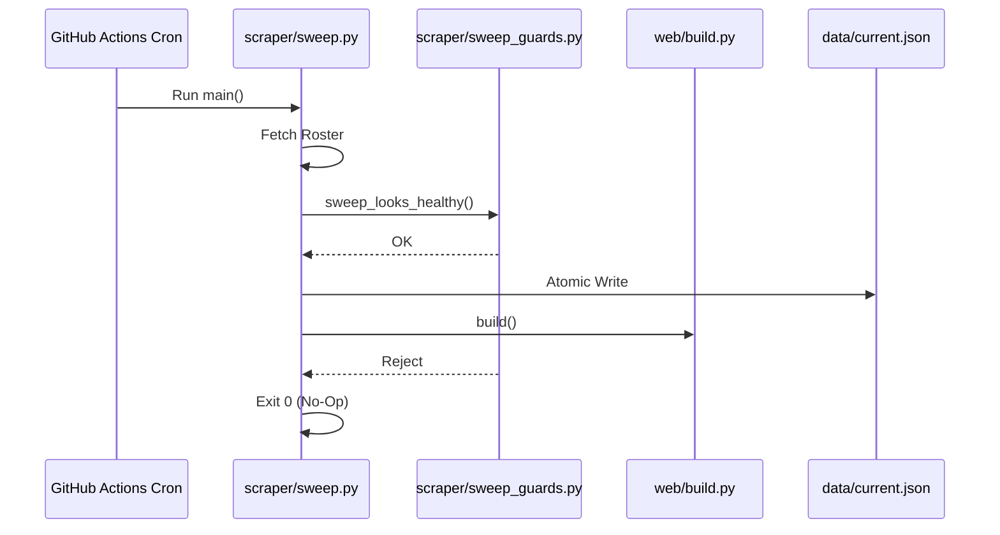
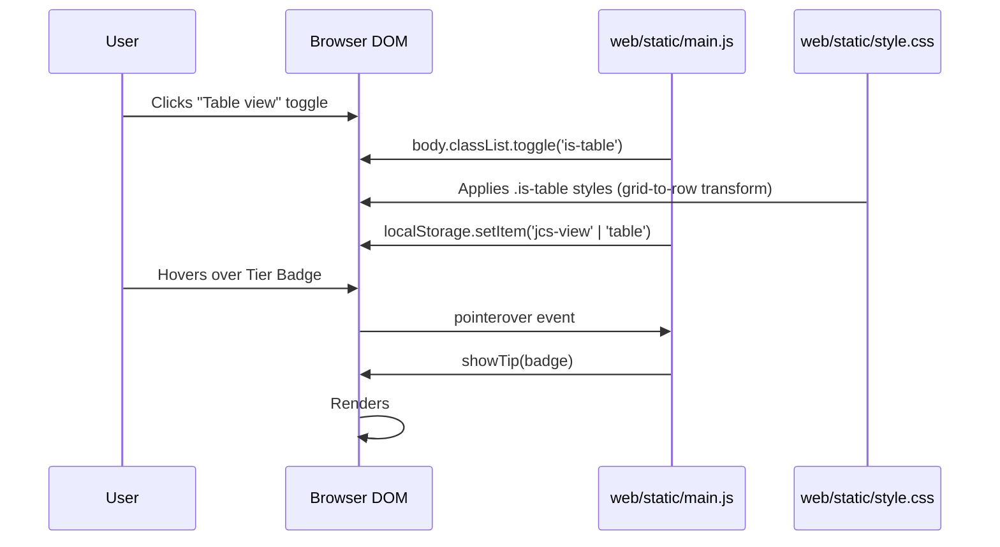
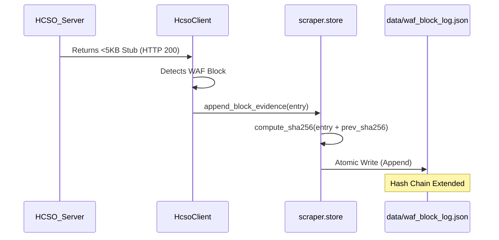
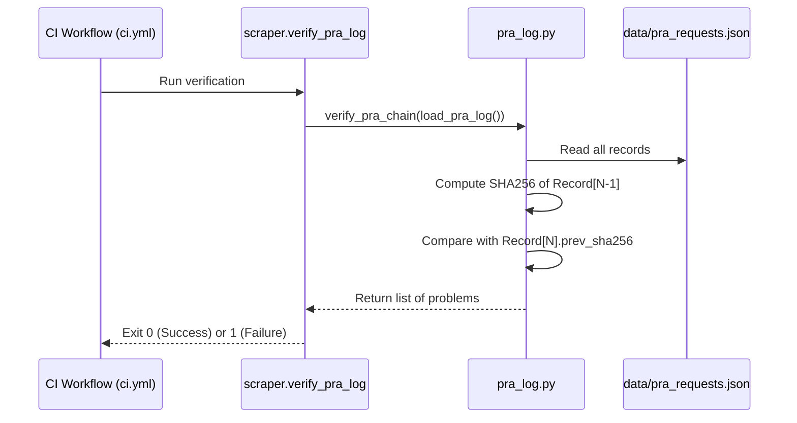

# JCStream-Overview

# JCStream Overview
Relevant source files

- [.claude/skills/jcstream-build-helper-author/SKILL.md](https://github.com/AICincy/HCJC/blob/45034b2a/.claude/skills/jcstream-build-helper-author/SKILL.md?plain=1)
- [CLAUDE.md](https://github.com/AICincy/HCJC/blob/45034b2a/CLAUDE.md?plain=1)
- [README.md](https://github.com/AICincy/HCJC/blob/45034b2a/README.md?plain=1)
- [audit/skills-audit.md](https://github.com/AICincy/HCJC/blob/45034b2a/audit/skills-audit.md?plain=1)
- [audit/skills/jcstream-build-helper-author.md](https://github.com/AICincy/HCJC/blob/45034b2a/audit/skills/jcstream-build-helper-author.md?plain=1)
- [data/history.json](https://github.com/AICincy/HCJC/blob/45034b2a/data/history.json)
- [pyproject.toml](https://github.com/AICincy/HCJC/blob/45034b2a/pyproject.toml)
- [requirements.txt](https://github.com/AICincy/HCJC/blob/45034b2a/requirements.txt)
- [wiki/Contributing.md](https://github.com/AICincy/HCJC/blob/45034b2a/wiki/Contributing.md?plain=1)
- [wiki/Data.md](https://github.com/AICincy/HCJC/blob/45034b2a/wiki/Data.md?plain=1)
- [wiki/Home.md](https://github.com/AICincy/HCJC/blob/45034b2a/wiki/Home.md?plain=1)
- [wiki/Legal.md](https://github.com/AICincy/HCJC/blob/45034b2a/wiki/Legal.md?plain=1)
- [wiki/Operations.md](https://github.com/AICincy/HCJC/blob/45034b2a/wiki/Operations.md?plain=1)
- [wiki/Roadmap.md](https://github.com/AICincy/HCJC/blob/45034b2a/wiki/Roadmap.md?plain=1)
- [wiki/_Sidebar.md](https://github.com/AICincy/HCJC/blob/45034b2a/wiki/_Sidebar.md?plain=1)

JCStream is a near-real-time public-records mirror of the Hamilton County (Ohio) Justice Center inmate roster. It is a static-site project that transforms volatile government data into a structured, searchable, and linkable format while adhering to a strict ethical and legal posture regarding public records [README.md#21-27](https://github.com/AICincy/HCJC/blob/45034b2a/README.md?plain=1#L21-L27)

The system operates as a data pipeline: it scrapes the Hamilton County Sheriff's Office (HCSO) website, pulls supplemental law enforcement feeds from Cincinnati Open Data, and builds a static web interface hosted via GitHub Pages [CLAUDE.md#3-12](https://github.com/AICincy/HCJC/blob/45034b2a/CLAUDE.md?plain=1#L3-L12)

## System Architecture

The project follows a "Flat-File Database" architecture. Instead of a live database server, the system state is persisted as JSON files in the `data/` directory. This allows the entire site to be served as static HTML, ensuring high availability and zero server-side processing costs [wiki/Home.md#29-36](https://github.com/AICincy/HCJC/blob/45034b2a/wiki/Home.md?plain=1#L29-L36)

### Major Subsystems

| Subsystem | Responsibility | Key Entities |
| --- | --- | --- |
| Scraper | Fetches and parses HCSO roster and Open Data feeds. | `scraper/sweep.py`, `scraper/client.py` |
| Data Store | Manages JSON state, changelogs, and atomic writes. | `scraper/store.py`, `data/current.json` |
| Build Engine | Transforms JSON data into static HTML using Jinja2. | `web/build.py`, `web/classify.py` |
| Legal Ops | Manages Public Records Act (PRA) requests and WAF evidence. | `scraper/pra.py`, `data/waf_block_log.json` |

### Data Flow and Code Entity Mapping

The following diagram bridges the functional stages of the pipeline to the specific Python modules and data structures that implement them.

Diagram: Pipeline to Code Entity Mapping

[Flowchart Diagram]

Sources: [CLAUDE.md#3-12](https://github.com/AICincy/HCJC/blob/45034b2a/CLAUDE.md?plain=1#L3-L12)[wiki/Home.md#29-36](https://github.com/AICincy/HCJC/blob/45034b2a/wiki/Home.md?plain=1#L29-L36)[scraper/models.py#101-143](https://github.com/AICincy/HCJC/blob/45034b2a/scraper/models.py#L101-L143)[web/build.py#109-184](https://github.com/AICincy/HCJC/blob/45034b2a/web/build.py#L109-L184)

## Core Principles and Legal Basis

JCStream is built on the authority of the Ohio Public Records Act (ORC § 149.43)[README.md#21-23](https://github.com/AICincy/HCJC/blob/45034b2a/README.md?plain=1#L21-L23) It is designed to be a "mirror," not an archive: when a record is removed from the official HCSO roster, it is removed from JCStream during the next update cycle [README.md#37-40](https://github.com/AICincy/HCJC/blob/45034b2a/README.md?plain=1#L37-L40)

- Presumption of Innocence: Every page carries disclaimers that arrest is not conviction [wiki/Home.md#13-19](https://github.com/AICincy/HCJC/blob/45034b2a/wiki/Home.md?plain=1#L13-L19)
- FCRA Non-Applicability: The site is not a consumer reporting agency and may not be used for background screening [wiki/Home.md#13-19](https://github.com/AICincy/HCJC/blob/45034b2a/wiki/Home.md?plain=1#L13-L19)
- No-Fee Policy: There is never a fee for corrections, sealing, or removals [wiki/Home.md#11](https://github.com/AICincy/HCJC/blob/45034b2a/wiki/Home.md?plain=1#L11-L11)

For a deeper dive into the legal framework, see [Project Purpose and Legal Basis](#1.1).

## Technology Stack

The project is built with Python 3.13 and leverages a minimalist set of dependencies to maintain a fast, auditable build process [pyproject.toml#9-21](https://github.com/AICincy/HCJC/blob/45034b2a/pyproject.toml#L9-L21)

- Networking:`httpx` for asynchronous-capable HTTP requests [pyproject.toml#15](https://github.com/AICincy/HCJC/blob/45034b2a/pyproject.toml#L15-L15)
- Parsing:`selectolax` for high-performance HTML/CSS selector parsing [pyproject.toml#16](https://github.com/AICincy/HCJC/blob/45034b2a/pyproject.toml#L16-L16)
- Data Validation:`pydantic` for strict schema enforcement of inmate records [pyproject.toml#17](https://github.com/AICincy/HCJC/blob/45034b2a/pyproject.toml#L17-L17)
- Templating:`jinja2` for generating the static frontend [pyproject.toml#18](https://github.com/AICincy/HCJC/blob/45034b2a/pyproject.toml#L18-L18)
- Imaging:`Pillow` for downscaling and processing booking photos [pyproject.toml#20](https://github.com/AICincy/HCJC/blob/45034b2a/pyproject.toml#L20-L20)

For details on the project structure, see [Repository Layout and Technology Stack](#1.2).

## Automation and Resilience

The system is fully automated via GitHub Actions, running every 15–30 minutes [CLAUDE.md#3-12](https://github.com/AICincy/HCJC/blob/45034b2a/CLAUDE.md?plain=1#L3-L12) It includes sophisticated "Health Guards" to prevent data corruption. For example, if a sweep returns a roster that is significantly smaller than the previous one (indicating a potential network failure or WAF block), the system refuses to overwrite the "last-good" data [CLAUDE.md#103-106](https://github.com/AICincy/HCJC/blob/45034b2a/CLAUDE.md?plain=1#L103-L106)

Diagram: Automation Orchestration



Sources: [CLAUDE.md#103-106](https://github.com/AICincy/HCJC/blob/45034b2a/CLAUDE.md?plain=1#L103-L106)[wiki/Operations.md#39-46](https://github.com/AICincy/HCJC/blob/45034b2a/wiki/Operations.md?plain=1#L39-L46)[.github/workflows/sweep.yml#1-30](https://github.com/AICincy/HCJC/blob/45034b2a/.github/workflows/sweep.yml#L1-L30)

## Child Pages

For more detailed technical information, please refer to the following sections:

- [Project Purpose and Legal Basis](#1.1) — Detailed explanation of ORC § 149.43, ethical posture, and no-archive policies.
- [Repository Layout and Technology Stack](#1.2) — Breakdown of the directory structure, Python environment, and architectural patterns.

---

# Project-Purpose-and-Legal-Basis

# Project Purpose and Legal Basis
Relevant source files

- [.github/ISSUE_TEMPLATE/bug_report.yml](https://github.com/AICincy/HCJC/blob/45034b2a/.github/ISSUE_TEMPLATE/bug_report.yml)
- [.github/ISSUE_TEMPLATE/feature_request.yml](https://github.com/AICincy/HCJC/blob/45034b2a/.github/ISSUE_TEMPLATE/feature_request.yml)
- [README.md](https://github.com/AICincy/HCJC/blob/45034b2a/README.md?plain=1)
- [SECURITY.md](https://github.com/AICincy/HCJC/blob/45034b2a/SECURITY.md?plain=1)
- [_headers](https://github.com/AICincy/HCJC/blob/45034b2a/_headers)
- [audit/14_hcso_waf.md](https://github.com/AICincy/HCJC/blob/45034b2a/audit/14_hcso_waf.md?plain=1)
- [audit/16_evidence_affidavit.md](https://github.com/AICincy/HCJC/blob/45034b2a/audit/16_evidence_affidavit.md?plain=1)
- [audit/19_counsel_cover_memo.md](https://github.com/AICincy/HCJC/blob/45034b2a/audit/19_counsel_cover_memo.md?plain=1)
- [data/explainers.json](https://github.com/AICincy/HCJC/blob/45034b2a/data/explainers.json)
- [data/surnames.txt](https://github.com/AICincy/HCJC/blob/45034b2a/data/surnames.txt)
- [wiki/Contributing.md](https://github.com/AICincy/HCJC/blob/45034b2a/wiki/Contributing.md?plain=1)
- [wiki/Data.md](https://github.com/AICincy/HCJC/blob/45034b2a/wiki/Data.md?plain=1)
- [wiki/Home.md](https://github.com/AICincy/HCJC/blob/45034b2a/wiki/Home.md?plain=1)
- [wiki/Legal.md](https://github.com/AICincy/HCJC/blob/45034b2a/wiki/Legal.md?plain=1)
- [wiki/Operations.md](https://github.com/AICincy/HCJC/blob/45034b2a/wiki/Operations.md?plain=1)
- [wiki/README.md](https://github.com/AICincy/HCJC/blob/45034b2a/wiki/README.md?plain=1)
- [wiki/Roadmap.md](https://github.com/AICincy/HCJC/blob/45034b2a/wiki/Roadmap.md?plain=1)
- [wiki/_Sidebar.md](https://github.com/AICincy/HCJC/blob/45034b2a/wiki/_Sidebar.md?plain=1)

JCStream is a near-real-time public-records mirror of the Hamilton County (Ohio) Justice Center inmate roster. It is a technical implementation designed to provide a structured, searchable, and linkable interface to data already published by the Hamilton County Sheriff's Office (HCSO) at `hcso.org`[README.md#21-27](https://github.com/AICincy/HCJC/blob/45034b2a/README.md?plain=1#L21-L27)

The project is architected as a static site, rebuilt every ~30 minutes via GitHub Actions, which republishes only the data currently available on the public HCSO roster [README.md#25-36](https://github.com/AICincy/HCJC/blob/45034b2a/README.md?plain=1#L25-L36)

## Legal Authority and Mandate

The project operates under the authority of the Ohio Public Records Act (ORC § 149.43). This statute establishes that the inmate roster is a public record that must be made available by the custodial agency [audit/19_counsel_cover_memo.md#49-51](https://github.com/AICincy/HCJC/blob/45034b2a/audit/19_counsel_cover_memo.md?plain=1#L49-L51)

### Key Legal Postures

- ORC § 149.43(B)(6): The project asserts the right of a requester to choose the medium in which a record is provided, serving as the basis for requests for machine-readable exports [audit/19_counsel_cover_memo.md#52-53](https://github.com/AICincy/HCJC/blob/45034b2a/audit/19_counsel_cover_memo.md?plain=1#L52-L53)
- Presumption of Innocence: Every page and the site footer contain mandatory disclaimers stating that arrest is not conviction and all individuals are presumed innocent [wiki/Home.md#13-19](https://github.com/AICincy/HCJC/blob/45034b2a/wiki/Home.md?plain=1#L13-L19)[wiki/Roadmap.md#32-36](https://github.com/AICincy/HCJC/blob/45034b2a/wiki/Roadmap.md?plain=1#L32-L36)
- FCRA Non-Applicability: JCStream is not a "consumer reporting agency." The data is provided for informational purposes only and must not be used for Fair Credit Reporting Act (FCRA) governed screening [wiki/Home.md#18-19](https://github.com/AICincy/HCJC/blob/45034b2a/wiki/Home.md?plain=1#L18-L19)
- No-Archive Policy: To remain ethically aligned with the "mirror" concept, JCStream maintains no historical archive of released individuals. When a record is removed from the HCSO site, it is removed from JCStream during the next update cycle [README.md#37-40](https://github.com/AICincy/HCJC/blob/45034b2a/README.md?plain=1#L37-L40)[wiki/Home.md#15-16](https://github.com/AICincy/HCJC/blob/45034b2a/wiki/Home.md?plain=1#L15-L16)

## Ethical and Operational Constraints

JCStream follows a "polite scraper" stance and prioritizes transparency over evasion.

| Policy | Implementation |
| --- | --- |
| No Fees | Corrections, sealing requests, and removals are processed via GitHub Issues with no fee [wiki/Home.md#11](https://github.com/AICincy/HCJC/blob/45034b2a/wiki/Home.md?plain=1#L11-L11) |
| Non-Evasion | When HCSO's Web Application Firewall (WAF) blocks the scraper, the system logs the block as legal evidence rather than attempting to bypass it via proxies [README.md#68-85](https://github.com/AICincy/HCJC/blob/45034b2a/README.md?plain=1#L68-L85) |
| No-Index | The site uses `noindex` meta tags and `robots.txt` to prevent search engines from indexing individual inmate names [wiki/Data.md#41-44](https://github.com/AICincy/HCJC/blob/45034b2a/wiki/Data.md?plain=1#L41-L44) |
| PII Minimization | The `anon_changelog.json` expires personally identifiable information (PII) after 7 days [1.1](https://github.com/AICincy/HCJC/blob/45034b2a/1.1) |

## System Data Flow

The following diagram illustrates how the legal mandate for public records is transformed into technical entities within the codebase.

### Natural Language to Code Entity Mapping: Legal Basis

[Flowchart Diagram]

Sources: [README.md#21-40](https://github.com/AICincy/HCJC/blob/45034b2a/README.md?plain=1#L21-L40)[audit/14_hcso_waf.md#68-75](https://github.com/AICincy/HCJC/blob/45034b2a/audit/14_hcso_waf.md?plain=1#L68-L75)[wiki/Home.md#1-20](https://github.com/AICincy/HCJC/blob/45034b2a/wiki/Home.md?plain=1#L1-L20)

## Implementation of Legal Evidence

When HCSO interrupts access (e.g., via HTTP 403 blocks), JCStream captures forensic evidence to support potential actions in mandamus under ORC § 149.43(C) [audit/19_counsel_cover_memo.md#14-16](https://github.com/AICincy/HCJC/blob/45034b2a/audit/19_counsel_cover_memo.md?plain=1#L14-L16)

### The Evidence Chain

1. `data/waf_block_log.json`: An append-only, hash-chained log capturing HTTP status, headers, and body samples [README.md#70-73](https://github.com/AICincy/HCJC/blob/45034b2a/README.md?plain=1#L70-L73)
2. `scraper/verify_block_log.py`: A utility to verify the integrity of the hash chain [README.md#75-78](https://github.com/AICincy/HCJC/blob/45034b2a/README.md?plain=1#L75-L78)
3. `data/egress_evidence.json`: Records the runner's IP address to prove the block is targeting GitHub Actions infrastructure [README.md#80-82](https://github.com/AICincy/HCJC/blob/45034b2a/README.md?plain=1#L80-L82)

### Data Integrity Diagram

[Flowchart Diagram]

Sources: [audit/19_counsel_cover_memo.md#31-41](https://github.com/AICincy/HCJC/blob/45034b2a/audit/19_counsel_cover_memo.md?plain=1#L31-L41)[README.md#70-73](https://github.com/AICincy/HCJC/blob/45034b2a/README.md?plain=1#L70-L73)

## FCRA and Privacy Controls

To ensure the project is not misused as a consumer reporting agency, several technical controls are implemented:

- Search Engine Opt-out: Every page includes `<meta name="robots" content="noindex">`[wiki/Data.md#42](https://github.com/AICincy/HCJC/blob/45034b2a/wiki/Data.md?plain=1#L42-L42)
- Social Media Restrictions: OpenGraph tags are set at the site level only; individual inmate pages do not generate unique social cards [wiki/Data.md#44-45](https://github.com/AICincy/HCJC/blob/45034b2a/wiki/Data.md?plain=1#L44-L45)
- Data Minimization: Photos are deleted from `docs/photos/` as soon as an inmate is no longer present in the `current.json` snapshot [wiki/Data.md#37-38](https://github.com/AICincy/HCJC/blob/45034b2a/wiki/Data.md?plain=1#L37-L38)

Sources: [README.md#1-143](https://github.com/AICincy/HCJC/blob/45034b2a/README.md?plain=1#L1-L143)[audit/14_hcso_waf.md#1-68](https://github.com/AICincy/HCJC/blob/45034b2a/audit/14_hcso_waf.md?plain=1#L1-L68)[audit/19_counsel_cover_memo.md#1-71](https://github.com/AICincy/HCJC/blob/45034b2a/audit/19_counsel_cover_memo.md?plain=1#L1-L71)[wiki/Home.md#1-70](https://github.com/AICincy/HCJC/blob/45034b2a/wiki/Home.md?plain=1#L1-L70)[wiki/Data.md#1-64](https://github.com/AICincy/HCJC/blob/45034b2a/wiki/Data.md?plain=1#L1-L64)

---

# Repository-Layout-and-Technology-Stack

# Repository Layout and Technology Stack
Relevant source files

- [.claude/skills/jcstream-build-helper-author/SKILL.md](https://github.com/AICincy/HCJC/blob/45034b2a/.claude/skills/jcstream-build-helper-author/SKILL.md?plain=1)
- [.gitignore](https://github.com/AICincy/HCJC/blob/45034b2a/.gitignore)
- [CLAUDE.md](https://github.com/AICincy/HCJC/blob/45034b2a/CLAUDE.md?plain=1)
- [CNAME](https://github.com/AICincy/HCJC/blob/45034b2a/CNAME)
- [audit/skills-audit.md](https://github.com/AICincy/HCJC/blob/45034b2a/audit/skills-audit.md?plain=1)
- [audit/skills/jcstream-build-helper-author.md](https://github.com/AICincy/HCJC/blob/45034b2a/audit/skills/jcstream-build-helper-author.md?plain=1)
- [data/history.json](https://github.com/AICincy/HCJC/blob/45034b2a/data/history.json)
- [docs/CNAME](https://github.com/AICincy/HCJC/blob/45034b2a/docs/CNAME)
- [pyproject.toml](https://github.com/AICincy/HCJC/blob/45034b2a/pyproject.toml)
- [requirements.txt](https://github.com/AICincy/HCJC/blob/45034b2a/requirements.txt)
- [web/outputs.py](https://github.com/AICincy/HCJC/blob/45034b2a/web/outputs.py)

This page describes the JCStream directory structure, the Python 3.13 toolchain, and the architectural patterns that enable a low-maintenance, static-site mirror of the Hamilton County Justice Center roster.

## Repository Structure

The repository is organized into distinct functional layers: data acquisition (`scraper/`), data transformation and presentation (`web/`), and the flat-file database (`data/`). The final website is served from `docs/` via GitHub Pages.

| Directory | Responsibility |
| --- | --- |
| `scraper/` | Orchestrates data acquisition from HCSO and Cincinnati Open Data feeds. |
| `web/` | Builds the static site; contains the Jinja2 templates, CSS, and view-model shaping logic. |
| `data/` | The "Flat-File Database" containing JSON roster snapshots, changelogs, and photos. |
| `docs/` | The build output directory served by GitHub Pages. |
| `tests/` | The pytest suite covering parsers, models, and build logic. |
| `.github/` | CI/CD workflows for the 15-minute automated sweep and build pipeline. |
| `scripts/` | Developer utilities for local triage and manual telemetry inspection. |

Sources: `CLAUDE.md:3-12`(), `pyproject.toml:26-30`()

## Technology Stack

JCStream utilizes a modern Python 3.13 toolchain with minimal, pinned dependencies to ensure long-term stability and performance.

### Core Toolchain

- Python 3.13: The primary runtime, utilizing modern features like `datetime.UTC` and advanced typing. [pyproject.toml#9](https://github.com/AICincy/HCJC/blob/45034b2a/pyproject.toml#L9-L9)
- ruff: Fast linting and formatting, targeting Python 3.13. [pyproject.toml#32-45](https://github.com/AICincy/HCJC/blob/45034b2a/pyproject.toml#L32-L45)
- mypy: Static type checking with `check_untyped_defs` enabled to ensure data integrity across the pipeline. [pyproject.toml#47-57](https://github.com/AICincy/HCJC/blob/45034b2a/pyproject.toml#L47-L57)
- pytest: Test runner for the ~140+ test suite. [pyproject.toml#29-30](https://github.com/AICincy/HCJC/blob/45034b2a/pyproject.toml#L29-L30)

### Key Dependencies

- httpx (0.28.1): Asynchronous-ready HTTP client used for fetching the HCSO roster and Open Data feeds. [pyproject.toml#15](https://github.com/AICincy/HCJC/blob/45034b2a/pyproject.toml#L15-L15)
- selectolax (0.4.10): High-performance HTML parsing using the Modest engine (faster than BeautifulSoup). [pyproject.toml#16](https://github.com/AICincy/HCJC/blob/45034b2a/pyproject.toml#L16-L16)
- pydantic (2.13.4): Data validation and settings management using Python type hints. [pyproject.toml#17](https://github.com/AICincy/HCJC/blob/45034b2a/pyproject.toml#L17-L17)
- Jinja2 (3.1.6): Templating engine for generating the static HTML pages. [pyproject.toml#18](https://github.com/AICincy/HCJC/blob/45034b2a/pyproject.toml#L18-L18)
- Pillow (12.2.0): Image processing for downscaling and normalizing inmate mugshots. [pyproject.toml#20](https://github.com/AICincy/HCJC/blob/45034b2a/pyproject.toml#L20-L20)
- defusedxml (0.7.1): Safe XML parsing for feed generation. [pyproject.toml#19](https://github.com/AICincy/HCJC/blob/45034b2a/pyproject.toml#L19-L19)

Sources: `pyproject.toml:1-24`(), `requirements.txt:1-8`()

## Architecture Pattern: Static-Site / Flat-File Database

JCStream follows a "GitOps" architecture where the state of the system is stored entirely in version-controlled JSON files. There is no traditional RDBMS (like PostgreSQL or SQLite).

### Data Flow Overview

The system operates in a linear pipeline:

1. Scrape: `scraper/sweep.py` fetches raw data and updates `data/current.json`.
2. Transform: `web/build.py` reads `data/` and uses `web/shape.py` and `web/classify.py` to prepare view-models.
3. Render: Jinja2 templates in `web/templates/` are rendered into HTML files in `docs/`.
4. Publish: GitHub Actions commits the changes, and GitHub Pages serves the `docs/` folder.

### System Entity Mapping

The following diagram bridges the natural language concepts to the specific code entities that implement them.

System Architecture and Data Flow

[Flowchart Diagram]

Sources: `CLAUDE.md:3-12`(), `web/build.py:109-184`(), `web/outputs.py:56-76`()

### Code-to-Disk Mapping

The repository uses specific Pydantic models to define the schema of the JSON files stored in `data/`.

Data Entity Mapping

[Class Diagram]

Sources: `scraper/models.py:27-143`(), `web/outputs.py:60-70`()

## Key Implementation Details

### Build Orchestration

The `web/build.py` script acts as the primary orchestrator for the frontend. It registers Python helpers as Jinja2 globals, allowing complex logic (like ORC classification or bond percentile calculation) to be used directly within templates. [web/build.py#109-184](https://github.com/AICincy/HCJC/blob/45034b2a/web/build.py#L109-L184)[.claude/skills/jcstream-build-helper-author/SKILL.md#10-26](https://github.com/AICincy/HCJC/blob/45034b2a/.claude/skills/jcstream-build-helper-author/SKILL.md?plain=1#L10-L26)

### Static Outputs

Beyond HTML, the system generates several machine-readable and protocol-level files to support the "no-archive" and "no-fee" policy:

- search.json: A compact index for client-side search. [web/outputs.py#56-76](https://github.com/AICincy/HCJC/blob/45034b2a/web/outputs.py#L56-L76)
- SHA256SUMS: Tamper-evidence for data files. [web/outputs.py#140-152](https://github.com/AICincy/HCJC/blob/45034b2a/web/outputs.py#L140-L152)
- robots.txt: Explicit instructions for crawlers to avoid indexing. [web/outputs.py#102-110](https://github.com/AICincy/HCJC/blob/45034b2a/web/outputs.py#L102-L110)
- security.txt: Contact information for data removal or security concerns. [web/outputs.py#114-123](https://github.com/AICincy/HCJC/blob/45034b2a/web/outputs.py#L114-L123)

Sources: `web/outputs.py:1-152`()

---

# Scraper-Pipeline

# Scraper Pipeline
Relevant source files

- [.claude/skills/jcstream-build-helper-author/SKILL.md](https://github.com/AICincy/HCJC/blob/45034b2a/.claude/skills/jcstream-build-helper-author/SKILL.md?plain=1)
- [.github/ISSUE_TEMPLATE/waf-block.yml](https://github.com/AICincy/HCJC/blob/45034b2a/.github/ISSUE_TEMPLATE/waf-block.yml)
- [CLAUDE.md](https://github.com/AICincy/HCJC/blob/45034b2a/CLAUDE.md?plain=1)
- [audit/skills-audit.md](https://github.com/AICincy/HCJC/blob/45034b2a/audit/skills-audit.md?plain=1)
- [audit/skills/jcstream-build-helper-author.md](https://github.com/AICincy/HCJC/blob/45034b2a/audit/skills/jcstream-build-helper-author.md?plain=1)
- [scraper/client.py](https://github.com/AICincy/HCJC/blob/45034b2a/scraper/client.py)
- [scraper/parsers.py](https://github.com/AICincy/HCJC/blob/45034b2a/scraper/parsers.py)
- [scraper/store.py](https://github.com/AICincy/HCJC/blob/45034b2a/scraper/store.py)
- [scraper/sweep.py](https://github.com/AICincy/HCJC/blob/45034b2a/scraper/sweep.py)
- [scraper/verify_block_log.py](https://github.com/AICincy/HCJC/blob/45034b2a/scraper/verify_block_log.py)
- [tests/test_build.py](https://github.com/AICincy/HCJC/blob/45034b2a/tests/test_build.py)
- [tests/test_case_classify.py](https://github.com/AICincy/HCJC/blob/45034b2a/tests/test_case_classify.py)
- [tests/test_client.py](https://github.com/AICincy/HCJC/blob/45034b2a/tests/test_client.py)
- [tests/test_parsers.py](https://github.com/AICincy/HCJC/blob/45034b2a/tests/test_parsers.py)
- [tests/test_pra_send.py](https://github.com/AICincy/HCJC/blob/45034b2a/tests/test_pra_send.py)
- [tests/test_shape.py](https://github.com/AICincy/HCJC/blob/45034b2a/tests/test_shape.py)
- [tests/test_store.py](https://github.com/AICincy/HCJC/blob/45034b2a/tests/test_store.py)
- [tests/test_sweep.py](https://github.com/AICincy/HCJC/blob/45034b2a/tests/test_sweep.py)

The data-acquisition layer is responsible for mirroring the Hamilton County Sheriff's Office (HCSO) inmate roster. It operates as a high-fidelity ETL (Extract, Transform, Load) process that fetches raw HTML from public search portals, parses it into structured Pydantic models, and persists it to a flat-file JSON database.

The pipeline is designed with a "do-not-evade" posture regarding Web Application Firewalls (WAFs). Instead of attempting to bypass blocks, the system documents them as evidence of public records access denial [scraper/sweep.py#116-118](https://github.com/AICincy/HCJC/blob/45034b2a/scraper/sweep.py#L116-L118)

## System Architecture

The scraper is orchestrated by `scraper/sweep.py` and relies on several specialized modules to handle networking, parsing, and data integrity.

### Data Flow Overview

[Flowchart Diagram]

Sources:[scraper/sweep.py#1-16](https://github.com/AICincy/HCJC/blob/45034b2a/scraper/sweep.py#L1-L16)[scraper/client.py#1-10](https://github.com/AICincy/HCJC/blob/45034b2a/scraper/client.py#L1-L10)[scraper/store.py#1-7](https://github.com/AICincy/HCJC/blob/45034b2a/scraper/store.py#L1-L7)

## Component Overview

### [Sweep Orchestrator](#2.1)

The `sweep` module is the entry point for data acquisition. It performs a "surname crawl" by searching for every letter from A to Z to ensure total roster coverage [scraper/sweep.py#5-6](https://github.com/AICincy/HCJC/blob/45034b2a/scraper/sweep.py#L5-L6) It manages a `ThreadPoolExecutor` to fetch inmate details in parallel while respecting a global wall-clock hard cap of 22 minutes to ensure clean partial writes before GitHub Actions timeouts [scraper/sweep.py#75-82](https://github.com/AICincy/HCJC/blob/45034b2a/scraper/sweep.py#L75-L82)

- Key Entity:`scraper.sweep.run()`
- For details, see [Sweep Orchestrator](#2.1).

### [HCSO HTTP Client and WAF Handling](#2.2)

The `HcsoClient` is a polite, thread-safe wrapper around `httpx`. It enforces a mandatory `crawl_delay` (default 0.5s) to stay under WAF burst-rate heuristics [scraper/client.py#30-33](https://github.com/AICincy/HCJC/blob/45034b2a/scraper/client.py#L30-L33) It implements exponential backoff for 5xx errors and honors `Retry-After` headers for 429 Rate Limit responses [scraper/client.py#135-150](https://github.com/AICincy/HCJC/blob/45034b2a/scraper/client.py#L135-L150)

- Key Entity:`scraper.client.HcsoClient`
- For details, see [HCSO HTTP Client and WAF Handling](#2.2).

### [HTML Parsers and Data Models](#2.3)

The system uses `selectolax` for high-performance HTML parsing. It employs a tiered fallback strategy for extracting names and photos, ensuring that minor changes to the HCSO website layout do not break the pipeline [scraper/parsers.py#151-163](https://github.com/AICincy/HCJC/blob/45034b2a/scraper/parsers.py#L151-L163) Data is validated using Pydantic models defined in `scraper/models.py`.

- Key Entities:`scraper.parsers.parse_detail_page`, `scraper.models.Inmate`
- For details, see [HTML Parsers and Data Models](#2.3).

### [Roster Safety Guards and Store](#2.4)

Before updating the "canonical" roster in `data/current.json`, the system runs a series of health checks. It refuses to overwrite good data if the new sweep appears degraded (e.g., the population count drops by >50% or too many network requests fail) [scraper/sweep_guards.py#55-59](https://github.com/AICincy/HCJC/blob/45034b2a/scraper/sweep_guards.py#L55-L59) All writes to the filesystem are atomic via temporary file renames [scraper/store.py#51-61](https://github.com/AICincy/HCJC/blob/45034b2a/scraper/store.py#L51-L61)

- Key Entities:`scraper.sweep_guards.sweep_looks_healthy`, `scraper.store.diff`
- For details, see [Roster Safety Guards and Store](#2.4).

## Core Data Entities

The following diagram maps the relationship between the primary data structures used during the scraping process.

[Class Diagram]

Sources:[scraper/models.py#13-27](https://github.com/AICincy/HCJC/blob/45034b2a/scraper/models.py#L13-L27)[scraper/store.py#22-28](https://github.com/AICincy/HCJC/blob/45034b2a/scraper/store.py#L22-L28)[scraper/store.py#40-44](https://github.com/AICincy/HCJC/blob/45034b2a/scraper/store.py#L40-L44)

## Execution Safety

The pipeline includes several "watchdog" mechanisms to ensure data quality:

1. Detail Watchdog: Monitors the success rate of name and photo extraction during a sweep; if the parser starts failing to find names in a large sample, the write is blocked [scraper/sweep_guards.py#56](https://github.com/AICincy/HCJC/blob/45034b2a/scraper/sweep_guards.py#L56-L56)[tests/test_sweep.py#159-162](https://github.com/AICincy/HCJC/blob/45034b2a/tests/test_sweep.py#L159-L162)
2. Wall-Clock Cap: Prevents the scraper from running indefinitely and being killed by the CI runner, which would prevent the changelog from being saved [scraper/sweep.py#82](https://github.com/AICincy/HCJC/blob/45034b2a/scraper/sweep.py#L82-L82)
3. Atomic Writes: Ensures `data/current.json` and `data/changelog.json` are never left in a half-written state [scraper/store.py#51-61](https://github.com/AICincy/HCJC/blob/45034b2a/scraper/store.py#L51-L61)

Sources:[scraper/sweep.py#75-82](https://github.com/AICincy/HCJC/blob/45034b2a/scraper/sweep.py#L75-L82)[scraper/store.py#51-61](https://github.com/AICincy/HCJC/blob/45034b2a/scraper/store.py#L51-L61)[scraper/sweep_guards.py#52-60](https://github.com/AICincy/HCJC/blob/45034b2a/scraper/sweep_guards.py#L52-L60)

---

# Sweep-Orchestrator

# Sweep Orchestrator
Relevant source files

- [.claude/skills/jcstream-build-helper-author/SKILL.md](https://github.com/AICincy/HCJC/blob/45034b2a/.claude/skills/jcstream-build-helper-author/SKILL.md?plain=1)
- [CLAUDE.md](https://github.com/AICincy/HCJC/blob/45034b2a/CLAUDE.md?plain=1)
- [audit/skills-audit.md](https://github.com/AICincy/HCJC/blob/45034b2a/audit/skills-audit.md?plain=1)
- [audit/skills/jcstream-build-helper-author.md](https://github.com/AICincy/HCJC/blob/45034b2a/audit/skills/jcstream-build-helper-author.md?plain=1)
- [scraper/parsers.py](https://github.com/AICincy/HCJC/blob/45034b2a/scraper/parsers.py)
- [scraper/store.py](https://github.com/AICincy/HCJC/blob/45034b2a/scraper/store.py)
- [scraper/sweep.py](https://github.com/AICincy/HCJC/blob/45034b2a/scraper/sweep.py)
- [scraper/sweep_guards.py](https://github.com/AICincy/HCJC/blob/45034b2a/scraper/sweep_guards.py)
- [scraper/verify_block_log.py](https://github.com/AICincy/HCJC/blob/45034b2a/scraper/verify_block_log.py)
- [tests/test_parsers.py](https://github.com/AICincy/HCJC/blob/45034b2a/tests/test_parsers.py)
- [tests/test_pra_send.py](https://github.com/AICincy/HCJC/blob/45034b2a/tests/test_pra_send.py)
- [tests/test_store.py](https://github.com/AICincy/HCJC/blob/45034b2a/tests/test_store.py)
- [tests/test_sweep.py](https://github.com/AICincy/HCJC/blob/45034b2a/tests/test_sweep.py)

The Sweep Orchestrator is the central coordination layer of the JCStream scraper pipeline. Contained within `scraper/sweep.py`, it manages the lifecycle of a data acquisition cycle: from performing substring searches on the HCSO inmate roster to parallelized detail fetching, photo processing, and atomic persistence of the resulting datasets.

## Entrypoints and Lifecycle

The orchestrator provides two primary entrypoints: `main()` for CLI invocation and `run()` for programmatic execution within the GitHub Actions workflow.

### The `run()` Function

The `run()` function encapsulates the full execution logic. It initializes the `HcsoClient`, manages the surname-crawl loop, and handles the finalization of data to disk. It is designed with a "partial-success" philosophy: if the HCSO front-end is slow or partially failing, the orchestrator attempts to produce a clean partial roster rather than losing all progress.

- Wall-clock Cap: The detail-fetch loop monitors elapsed time. If execution exceeds `SWEEP_WALLCLOCK_HARD_CAP_S` (22 minutes), the loop bails to allow sufficient time for site building and git commits within the 50-minute GitHub Action limit `<FileRef file-url="https://github.com/AICincy/HCJC/blob/45034b2a/scraper/sweep.py#L75-L82" min=75 max=82 file-path="scraper/sweep.py">Hii</FileRef>`.
- Freshness Gate: To prevent redundant processing, the orchestrator checks the `generated_utc` timestamp in `data/current.json`. If the file is newer than `MIN_SWEEP_INTERVAL_S` (20 minutes), the sweep exits early `<FileRef file-url="https://github.com/AICincy/HCJC/blob/45034b2a/scraper/sweep.py#L171-L573" min=171 max=573 file-path="scraper/sweep.py">Hii</FileRef>`.

### The `main()` CLI

The `main()` function handles argument parsing, including flags for concurrency, detail age limits, and proxy configuration `<FileRef file-url="https://github.com/AICincy/HCJC/blob/45034b2a/scraper/sweep.py#L596-L641" min=596 max=641 file-path="scraper/sweep.py">Hii</FileRef>`.

Sweep Execution Data Flow

## Surname-Crawl Loop (A–Z Search)

Because the HCSO search interface does not provide a "view all" option, the orchestrator performs a substring search using `data/surnames.txt` (containing letters A–Z) `<FileRef file-url="https://github.com/AICincy/HCJC/blob/45034b2a/scraper/sweep.py#L97-L580" min=97 max=580 file-path="scraper/sweep.py">Hii</FileRef>`.

1. Search Execution: For each letter, the `HcsoClient` performs a POST request to the search endpoint `<FileRef file-url="https://github.com/AICincy/HCJC/blob/45034b2a/scraper/sweep.py#L199-L215" min=199 max=215 file-path="scraper/sweep.py">Hii</FileRef>`.
2. Parsing: `parse_list_page` extracts `ListRow` objects from the resulting HTML table `<FileRef file-url="https://github.com/AICincy/HCJC/blob/45034b2a/scraper/parsers.py#L49-L75" min=49 max=75 file-path="scraper/parsers.py">Hii</FileRef>`.
3. Deduplication: Since a substring search for "S" might return names found in other searches, the orchestrator maintains a set of seen inmate IDs to ensure each individual is processed only once per cycle `<FileRef file-url="https://github.com/AICincy/HCJC/blob/45034b2a/scraper/sweep.py#L217-L224" min=217 max=224 file-path="scraper/sweep.py">Hii</FileRef>`.

Code Entity Mapping: List Sweep

## Parallel Detail Fetching

After identifying the active roster population, the orchestrator fetches full details for inmates requiring updates.

### Logic and Threading

- Refresh Heuristic: An inmate is fetched if they are new to the roster or if their existing record in `data/current.json` is older than the configured `--max-detail-age-hours``<FileRef file-url="https://github.com/AICincy/HCJC/blob/45034b2a/scraper/sweep.py#L7-L246" min=7 max=246 file-path="scraper/sweep.py">Hii</FileRef>`.
- ThreadPoolExecutor: Fetches are parallelized using a `ThreadPoolExecutor` with a default concurrency of 4 to balance speed against WAF pressure `<FileRef file-url="https://github.com/AICincy/HCJC/blob/45034b2a/scraper/sweep.py#L30-L285" min=30 max=285 file-path="scraper/sweep.py">Hii</FileRef>`.
- _fetch_one: This internal helper manages the per-inmate lifecycle: fetching HTML, parsing bio/charges, and downloading/downscaling the booking photo via `downscale_and_save``<FileRef file-url="https://github.com/AICincy/HCJC/blob/45034b2a/scraper/sweep.py#L307-L355" min=307 max=355 file-path="scraper/sweep.py">Hii</FileRef>`.

### WAF Backoff

The `WafBackoffTracker` provides thread-safe coordination for handling HTTP 429 or 403 responses. It implements an exponential backoff (starting at 2s, capping at 30s) that all worker threads respect to avoid exacerbating blocks `<FileRef file-url="https://github.com/AICincy/HCJC/blob/45034b2a/scraper/sweep.py#L174-L196" min=174 max=196 file-path="scraper/sweep.py">Hii</FileRef>`.

Sources: `<FileRef file-url="https://github.com/AICincy/HCJC/blob/45034b2a/scraper/sweep.py#L174-L355" min=174 max=355 file-path="scraper/sweep.py">Hii</FileRef>`, `<FileRef file-url="https://github.com/AICincy/HCJC/blob/45034b2a/scraper/photos.py#L39-L39" min=39  file-path="scraper/photos.py">Hii</FileRef>`

## Health Guards and Safety Gates

The orchestrator employs several "health heuristics" to prevent a degraded or blocked sweep from overwriting the live roster with empty data.

- Sweep Health Heuristic: The `sweep_looks_healthy` function rejects the cycle if more than 10% of surname searches failed or if the total population shrank by more than 50% compared to the previous cycle `<FileRef file-url="https://github.com/AICincy/HCJC/blob/45034b2a/scraper/sweep_guards.py#L74-L87" min=74 max=87 file-path="scraper/sweep_guards.py">Hii</FileRef>`.
- Detail Watchdog: `check_detail_watchdog` monitors the success rate of name and photo extraction. If the name-parsing rate drops below 60% over a large sample (100+), it triggers a hard block, refusing to write the roster to disk `<FileRef file-url="https://github.com/AICincy/HCJC/blob/45034b2a/scraper/sweep_guards.py#L90-L127" min=90 max=127 file-path="scraper/sweep_guards.py">Hii</FileRef>`.
- Photo Prune Safety: To prevent accidental mass-deletion of photos during a partial sweep, the system refuses to prune photos if more than 50% of the local photo cache would be deleted in a single cycle `<FileRef file-url="https://github.com/AICincy/HCJC/blob/45034b2a/scraper/sweep_guards.py#L130-L151" min=130 max=151 file-path="scraper/sweep_guards.py">Hii</FileRef>`.

Sources: `<FileRef file-url="https://github.com/AICincy/HCJC/blob/45034b2a/scraper/sweep_guards.py#L74-L151" min=74 max=151 file-path="scraper/sweep_guards.py">Hii</FileRef>`, `<FileRef file-url="https://github.com/AICincy/HCJC/blob/45034b2a/scraper/sweep.py#L52-L60" min=52 max=60 file-path="scraper/sweep.py">Hii</FileRef>`

## Atomic Persistence and Changelogs

Data is persisted using atomic writes to prevent file corruption if the process is interrupted.

### Current Roster and Changelog

- Atomic Writes: The `_atomic_write_text` function writes to a `.tmp` file before using `os.replace()` to ensure the final JSON is complete and valid `<FileRef file-url="https://github.com/AICincy/HCJC/blob/45034b2a/scraper/store.py#L51-L61" min=51 max=61 file-path="scraper/store.py">Hii</FileRef>`.
- Diffing: The `diff()` function compares the previous and current rosters to identify `booked`, `released`, and `updated` events. It ignores spurious charge reordering to keep the changelog clean `<FileRef file-url="https://github.com/AICincy/HCJC/blob/45034b2a/scraper/store.py#L31-L61" min=31 max=61 file-path="scraper/store.py">Hii</FileRef>`.
- Changelog: New events are appended to `data/changelog.json`, which is capped at 10,000 entries to maintain performance while providing significant historical context `<FileRef file-url="https://github.com/AICincy/HCJC/blob/45034b2a/scraper/store.py#L42-L51" min=42 max=51 file-path="scraper/store.py">Hii</FileRef>`.

### Anonymized Changelog and PII Expiry

The `data/anon_changelog.json` serves as a long-term, PII-minimized record of jail activity.

- PII Expiry: After 7 days, events are anonymized: names and inmate numbers are removed, leaving only the event type, date, and charge severity/category `<FileRef file-url="https://github.com/AICincy/HCJC/blob/45034b2a/scraper/sweep.py#L70-L73" min=70 max=73 file-path="scraper/sweep.py">Hii</FileRef>`.
- Compaction: Entries older than 365 days are compacted into monthly summaries (grouped by month, event, tier, and category) to bound the file size while preserving statistical trends `<FileRef file-url="https://github.com/AICincy/HCJC/blob/45034b2a/scraper/store.py#L107-L118" min=107 max=118 file-path="scraper/store.py">Hii</FileRef>`.

Code Entity Mapping: Persistence

Sources: `<FileRef file-url="https://github.com/AICincy/HCJC/blob/45034b2a/scraper/sweep.py#L67-L73" min=67 max=73 file-path="scraper/sweep.py">Hii</FileRef>`, `<FileRef file-url="https://github.com/AICincy/HCJC/blob/45034b2a/scraper/store.py#L42-L118" min=42 max=118 file-path="scraper/store.py">Hii</FileRef>`

---

# HCSO-HTTP-Client-and-WAF-Handling

# HCSO HTTP Client and WAF Handling
Relevant source files

- [.github/ISSUE_TEMPLATE/waf-block.yml](https://github.com/AICincy/HCJC/blob/45034b2a/.github/ISSUE_TEMPLATE/waf-block.yml)
- [audit/14_hcso_waf.md](https://github.com/AICincy/HCJC/blob/45034b2a/audit/14_hcso_waf.md?plain=1)
- [audit/16_evidence_affidavit.md](https://github.com/AICincy/HCJC/blob/45034b2a/audit/16_evidence_affidavit.md?plain=1)
- [audit/17_mandamus_petition.md](https://github.com/AICincy/HCJC/blob/45034b2a/audit/17_mandamus_petition.md?plain=1)
- [audit/18_offplatform_capture.md](https://github.com/AICincy/HCJC/blob/45034b2a/audit/18_offplatform_capture.md?plain=1)
- [audit/19_counsel_cover_memo.md](https://github.com/AICincy/HCJC/blob/45034b2a/audit/19_counsel_cover_memo.md?plain=1)
- [data/waf_block_log.json](https://github.com/AICincy/HCJC/blob/45034b2a/data/waf_block_log.json)
- [scraper/client.py](https://github.com/AICincy/HCJC/blob/45034b2a/scraper/client.py)
- [scraper/egress_ip.py](https://github.com/AICincy/HCJC/blob/45034b2a/scraper/egress_ip.py)
- [scraper/freeze_alert.py](https://github.com/AICincy/HCJC/blob/45034b2a/scraper/freeze_alert.py)
- [scraper/parsers.py](https://github.com/AICincy/HCJC/blob/45034b2a/scraper/parsers.py)
- [scraper/store.py](https://github.com/AICincy/HCJC/blob/45034b2a/scraper/store.py)
- [scraper/sweep.py](https://github.com/AICincy/HCJC/blob/45034b2a/scraper/sweep.py)
- [scraper/verify_block_log.py](https://github.com/AICincy/HCJC/blob/45034b2a/scraper/verify_block_log.py)
- [tests/test_build.py](https://github.com/AICincy/HCJC/blob/45034b2a/tests/test_build.py)
- [tests/test_case_classify.py](https://github.com/AICincy/HCJC/blob/45034b2a/tests/test_case_classify.py)
- [tests/test_client.py](https://github.com/AICincy/HCJC/blob/45034b2a/tests/test_client.py)
- [tests/test_egress_ip.py](https://github.com/AICincy/HCJC/blob/45034b2a/tests/test_egress_ip.py)
- [tests/test_freeze_alert.py](https://github.com/AICincy/HCJC/blob/45034b2a/tests/test_freeze_alert.py)
- [tests/test_parsers.py](https://github.com/AICincy/HCJC/blob/45034b2a/tests/test_parsers.py)
- [tests/test_pra_send.py](https://github.com/AICincy/HCJC/blob/45034b2a/tests/test_pra_send.py)
- [tests/test_shape.py](https://github.com/AICincy/HCJC/blob/45034b2a/tests/test_shape.py)
- [tests/test_store.py](https://github.com/AICincy/HCJC/blob/45034b2a/tests/test_store.py)
- [tests/test_sweep.py](https://github.com/AICincy/HCJC/blob/45034b2a/tests/test_sweep.py)
- [web/templates/data.html](https://github.com/AICincy/HCJC/blob/45034b2a/web/templates/data.html)
- [web/templates/index.html](https://github.com/AICincy/HCJC/blob/45034b2a/web/templates/index.html)

The JCStream scraper is designed with a "polite but persistent" posture. It implements strict crawl delays and concurrency limits to respect the Hamilton County Sheriff's Office (HCSO) infrastructure while maintaining a robust evidence chain when the HCSO Web Application Firewall (WAF) interrupts public access.

## HTTP Client Implementation

The `HcsoClient` class in `scraper/client.py` serves as the specialized transport layer for all interactions with `hcso.org`. It wraps `httpx.Client` to provide domain-specific safety features.

### Parallelism and Politeness

To avoid triggering burst-rate heuristics in the HCSO WAF, the client enforces two primary constraints:

1. Concurrency Limit: Fixed at `DEFAULT_CONCURRENCY = 16`[scraper/client.py#42](https://github.com/AICincy/HCJC/blob/45034b2a/scraper/client.py#L42-L42) This ensures the scraper does not overwhelm the upstream Nginx/WordPress stack.
2. Crawl Delay: A mandatory `DEFAULT_CRAWL_DELAY = 0.5` seconds [scraper/client.py#30](https://github.com/AICincy/HCJC/blob/45034b2a/scraper/client.py#L30-L30) is enforced between requests.

The crawl delay is implemented using a thread-safe `_sleep_for_crawl_delay` method that uses a `threading.Lock` to serialize request gating across concurrent workers [scraper/client.py#104-113](https://github.com/AICincy/HCJC/blob/45034b2a/scraper/client.py#L104-L113)

### Retry and Backoff Logic

The client implements a custom retry envelope in `get_response`[scraper/client.py#126-154](https://github.com/AICincy/HCJC/blob/45034b2a/scraper/client.py#L126-L154):

- 429 Too Many Requests: Honors the `Retry-After` header, parsing both integer seconds and HTTP-date formats [scraper/client.py#136-137](https://github.com/AICincy/HCJC/blob/45034b2a/scraper/client.py#L136-L137) This is capped at `RETRY_AFTER_CAP_S = 30.0`[scraper/client.py#38](https://github.com/AICincy/HCJC/blob/45034b2a/scraper/client.py#L38-L38) to prevent an upstream error from hanging the GitHub Actions runner indefinitely.
- 5xx Server Errors: Implements exponential backoff with jitter. The delay is calculated as `base * (2^attempt)` plus a random jitter fraction [scraper/client.py#143-146](https://github.com/AICincy/HCJC/blob/45034b2a/scraper/client.py#L143-L146)

### Egress Proxy Configuration

When a GitHub Actions runner IP is blocked, the operator can set the `JCSTREAM_HTTP_PROXY` environment variable. The `make_client()` factory reads this value and configures the `httpx.HTTPTransport` to route HCSO traffic through an external egress [scraper/client.py#73-79](https://github.com/AICincy/HCJC/blob/45034b2a/scraper/client.py#L73-L79)[scraper/client.py#186-193](https://github.com/AICincy/HCJC/blob/45034b2a/scraper/client.py#L186-L193)

Sources:[scraper/client.py#1-193](https://github.com/AICincy/HCJC/blob/45034b2a/scraper/client.py#L1-L193)[scraper/sweep.py#36](https://github.com/AICincy/HCJC/blob/45034b2a/scraper/sweep.py#L36-L36)

---

## WAF Detection and Backoff

HCSO's WAF often returns a `200 OK` status with a truncated body (<5 KB) instead of a standard `403` or `429` error [audit/14_hcso_waf.md#17](https://github.com/AICincy/HCJC/blob/45034b2a/audit/14_hcso_waf.md?plain=1#L17-L17) The system uses a heuristic detection and a thread-shared backoff tracker to mitigate this.

### WafBackoffTracker

The `WafBackoffTracker`[scraper/sweep.py#175-207](https://github.com/AICincy/HCJC/blob/45034b2a/scraper/sweep.py#L175-L207) manages a "streak" of blocked responses.

- Observation: When a response is detected as WAF-blocked (via `_looks_like_waf_block`[scraper/sweep.py#408-422](https://github.com/AICincy/HCJC/blob/45034b2a/scraper/sweep.py#L408-L422)), the tracker increments a streak counter.
- Backoff Calculation: It returns a sleep duration that grows exponentially with the streak, capped at 30 seconds [scraper/sweep.py#184-185](https://github.com/AICincy/HCJC/blob/45034b2a/scraper/sweep.py#L184-L185)
- Reset: Any successful, non-blocked response resets the streak to zero [scraper/sweep.py#206-207](https://github.com/AICincy/HCJC/blob/45034b2a/scraper/sweep.py#L206-L207)

### Data Flow: Request to Response Handling

The following diagram illustrates how a single fetch interacts with the WAF handling logic.

Fetch and Backoff Flow

[Flowchart Diagram]

Sources:[scraper/sweep.py#175-207](https://github.com/AICincy/HCJC/blob/45034b2a/scraper/sweep.py#L175-L207)[scraper/sweep.py#408-440](https://github.com/AICincy/HCJC/blob/45034b2a/scraper/sweep.py#L408-L440)[audit/14_hcso_waf.md#31](https://github.com/AICincy/HCJC/blob/45034b2a/audit/14_hcso_waf.md?plain=1#L31-L31)

---

## WAF Evidence Chain

JCStream maintains a durable, tamper-evident audit trail of access interruptions in `data/waf_block_log.json`. This serves as legal evidence for ORC § 149.43 compliance [scraper/store.py#64-69](https://github.com/AICincy/HCJC/blob/45034b2a/scraper/store.py#L64-L69)

### The Hash Chain

Each entry in the log is cryptographically linked to the previous entry using a SHA-256 hash chain [scraper/store.py#113-118](https://github.com/AICincy/HCJC/blob/45034b2a/scraper/store.py#L113-L118)

- Record Structure: Contains timestamps, failure fractions, HTTP status counts, and a `block_sample` (forensic snapshot of the WAF response) [scraper/sweep.py#103-112](https://github.com/AICincy/HCJC/blob/45034b2a/scraper/sweep.py#L103-L112)
- Verification: The `verify_block_chain` function [scraper/store.py#138-156](https://github.com/AICincy/HCJC/blob/45034b2a/scraper/store.py#L138-L156) validates that every `prev_sha256` field matches the hash of the preceding record. This is checked automatically in CI via `scraper/verify_block_log.py`.

### Egress IP Snapshots

On a detected block, the system can snapshot the runner's egress IP against GitHub's published IP ranges [scraper/sweep.py#150-165](https://github.com/AICincy/HCJC/blob/45034b2a/scraper/sweep.py#L150-L165)

- Entity: `scraper/egress_ip.py` fetches the current IP and compares it to the GitHub Actions CIDR list.
- Storage: Results are written to `data/egress_evidence.json`.

### Freeze Alerts

If the roster remains "frozen" (degraded) beyond a threshold, `scraper/freeze_alert.py` triggers a GitHub Issue to notify maintainers [scraper/sweep.py#119-132](https://github.com/AICincy/HCJC/blob/45034b2a/scraper/sweep.py#L119-L132)

### Evidence Chain Architecture

This diagram maps the evidence entities to their respective code definitions and data files.

Evidence Chain Entities

[Flowchart Diagram]

Sources:[scraper/store.py#113-156](https://github.com/AICincy/HCJC/blob/45034b2a/scraper/store.py#L113-L156)[scraper/sweep.py#103-132](https://github.com/AICincy/HCJC/blob/45034b2a/scraper/sweep.py#L103-L132)[scraper/sweep.py#150-165](https://github.com/AICincy/HCJC/blob/45034b2a/scraper/sweep.py#L150-L165)[data/waf_block_log.json#1](https://github.com/AICincy/HCJC/blob/45034b2a/data/waf_block_log.json#L1-L1)

---

## Roster Safety Guards

To prevent a WAF-induced "empty" roster from overwriting the live data, the system implements health checks in `scraper/sweep_guards.py`.

- `sweep_looks_healthy`: Compares the current inmate count against the previous count. If the roster drops by more than 50% (`SWEEP_MIN_ROSTER_FRACTION`) or if too many surname fetches failed, the sweep is rejected [scraper/sweep_guards.py#52-60](https://github.com/AICincy/HCJC/blob/45034b2a/scraper/sweep_guards.py#L52-L60)
- `check_detail_watchdog`: Monitors the success rate of individual inmate detail fetches. If the parser fails to find a name or photo in a large enough sample, it raises a warning or blocks the write [tests/test_sweep.py#125-162](https://github.com/AICincy/HCJC/blob/45034b2a/tests/test_sweep.py#L125-L162)
- `prune_photos`: Refuses to delete photos if the number of deletions exceeds `PHOTO_PRUNE_MAX_FRACTION` (e.g., 20%), protecting the photo cache during degraded sweeps [tests/test_sweep.py#101-110](https://github.com/AICincy/HCJC/blob/45034b2a/tests/test_sweep.py#L101-L110)

Sources:[scraper/sweep.py#52-60](https://github.com/AICincy/HCJC/blob/45034b2a/scraper/sweep.py#L52-L60)[tests/test_sweep.py#75-110](https://github.com/AICincy/HCJC/blob/45034b2a/tests/test_sweep.py#L75-L110)[audit/14_hcso_waf.md#29-30](https://github.com/AICincy/HCJC/blob/45034b2a/audit/14_hcso_waf.md?plain=1#L29-L30)

---

# HTML-Parsers-and-Data-Models

# HTML Parsers and Data Models
Relevant source files

- [.claude/skills/jcstream-build-helper-author/SKILL.md](https://github.com/AICincy/HCJC/blob/45034b2a/.claude/skills/jcstream-build-helper-author/SKILL.md?plain=1)
- [CLAUDE.md](https://github.com/AICincy/HCJC/blob/45034b2a/CLAUDE.md?plain=1)
- [audit/skills-audit.md](https://github.com/AICincy/HCJC/blob/45034b2a/audit/skills-audit.md?plain=1)
- [audit/skills/jcstream-build-helper-author.md](https://github.com/AICincy/HCJC/blob/45034b2a/audit/skills/jcstream-build-helper-author.md?plain=1)
- [scraper/models.py](https://github.com/AICincy/HCJC/blob/45034b2a/scraper/models.py)
- [scraper/parsers.py](https://github.com/AICincy/HCJC/blob/45034b2a/scraper/parsers.py)
- [scraper/photos.py](https://github.com/AICincy/HCJC/blob/45034b2a/scraper/photos.py)
- [scraper/store.py](https://github.com/AICincy/HCJC/blob/45034b2a/scraper/store.py)
- [scraper/sweep.py](https://github.com/AICincy/HCJC/blob/45034b2a/scraper/sweep.py)
- [scraper/verify_block_log.py](https://github.com/AICincy/HCJC/blob/45034b2a/scraper/verify_block_log.py)
- [tests/test_cra_boundary.py](https://github.com/AICincy/HCJC/blob/45034b2a/tests/test_cra_boundary.py)
- [tests/test_match.py](https://github.com/AICincy/HCJC/blob/45034b2a/tests/test_match.py)
- [tests/test_models.py](https://github.com/AICincy/HCJC/blob/45034b2a/tests/test_models.py)
- [tests/test_parsers.py](https://github.com/AICincy/HCJC/blob/45034b2a/tests/test_parsers.py)
- [tests/test_pra_send.py](https://github.com/AICincy/HCJC/blob/45034b2a/tests/test_pra_send.py)
- [tests/test_store.py](https://github.com/AICincy/HCJC/blob/45034b2a/tests/test_store.py)
- [tests/test_sweep.py](https://github.com/AICincy/HCJC/blob/45034b2a/tests/test_sweep.py)

This page documents the technical implementation of the JCStream data layer, specifically how raw HTML from the Hamilton County Sheriff's Office (HCSO) is transformed into structured Pydantic models, persisted as JSON, and how booking photos are processed.

## Data Models (scraper/models.py)

JCStream uses Pydantic v2 to enforce strict schema validation on all inmate records. This prevents malformed data from HCSO (or parser regressions) from corrupting the `data/current.json` "flat-file database."

### Key Models

| Model | Purpose | Key Fields |
| --- | --- | --- |
| `Inmate` | A person currently in custody. | `inmate_number`, `booking_number`, `charges`, `photo_filename`, `first_seen_utc` |
| `Charge` | A specific criminal charge. | `orc_code`, `description`, `bond_amount`, `court_date`, `municipal_case` |
| `ListRow` | Shallow record from search results. | `inmate_number`, `last_name`, `first_name`, `admit_date` |
| `Snapshot` | The root object for `current.json`. | `schema_version`, `generated_utc`, `inmate_count`, `inmates` |
| `ChangeEvent` | A diff entry in `changelog.json`. | `event` (booked/released/updated), `timestamp_utc`, `note` |

### Invariants and Validation

The `Snapshot` model enforces data integrity via a `model_validator`[scraper/models.py#153-174](https://github.com/AICincy/HCJC/blob/45034b2a/scraper/models.py#L153-L174):

1. Count Match: `inmate_count` must exactly match the length of the `inmates` list.
2. Unique IDs: Every `inmate_number` in a snapshot must be unique.
3. Date Shaping: HCSO date fields are normalized; sentinels like "NA" or "TBD" are permitted, but malformed strings trigger a `ValueError`[scraper/models.py#24-33](https://github.com/AICincy/HCJC/blob/45034b2a/scraper/models.py#L24-L33)

Sources:[scraper/models.py#36-174](https://github.com/AICincy/HCJC/blob/45034b2a/scraper/models.py#L36-L174)

---

## HTML Parsers (scraper/parsers.py)

The parsing logic uses the `selectolax` library for high-performance CSS selector-based extraction.

### List Page Parsing (`parse_list_page`)

Iterates through the HCSO search result table. It extracts the `inmate_number` from the detail link using a regex that supports both query-string (`?id=`) and path-permalink (`/inmate-detail/`) formats [scraper/parsers.py#20](https://github.com/AICincy/HCJC/blob/45034b2a/scraper/parsers.py#L20-L20)[scraper/parsers.py#78-84](https://github.com/AICincy/HCJC/blob/45034b2a/scraper/parsers.py#L78-L84)

### Detail Page Parsing (`parse_detail_page`)

Extracts comprehensive bio and charge data.

#### Tiered Name Fallback Strategy

Because HCSO frequently changes heading structures, `_parse_name` employs a 5-tier fallback [scraper/parsers.py#146-177](https://github.com/AICincy/HCJC/blob/45034b2a/scraper/parsers.py#L146-L177):

1. Heading Tags: `h1/h2/h3` containing a comma and all-caps text (stripping "Inmate:" prefixes).
2. OpenGraph: `meta[property="og:title"]`.
3. Container Text: Any text node with a "LAST, FIRST" shape.
4. Labeled Cells: Table cells labeled "Name" or "Full Name".
5. Document Title: The `<title>` tag.

#### Charge Extraction

The parser identifies the correct charges table by looking for specific headers: "Description", "ORC Code", "Bond Amount", and "Court Date" [scraper/parsers.py#33](https://github.com/AICincy/HCJC/blob/45034b2a/scraper/parsers.py#L33-L33) If high-value labels are missing, the parser emits a warning to signal potential HTML drift [scraper/parsers.py#31-46](https://github.com/AICincy/HCJC/blob/45034b2a/scraper/parsers.py#L31-L46)

### Photo Extraction and Fallback

The `_extract_photo` function primarily looks for a `274px` width style hook [scraper/parsers.py#108-111](https://github.com/AICincy/HCJC/blob/45034b2a/scraper/parsers.py#L108-L111) If this hook drifts, it uses a JPEG Start-of-Image (SOI) fallback: it scans `` tags for Base64 data starting with `\xff\xd8\xff`[scraper/parsers.py#29](https://github.com/AICincy/HCJC/blob/45034b2a/scraper/parsers.py#L29-L29)

Sources:[scraper/parsers.py#1-177](https://github.com/AICincy/HCJC/blob/45034b2a/scraper/parsers.py#L1-L177)[tests/test_parsers.py#1-190](https://github.com/AICincy/HCJC/blob/45034b2a/tests/test_parsers.py#L1-L190)

---

## Photo Processing (scraper/photos.py)

Mugshots are processed to balance visibility with storage efficiency.

1. `downscale_and_save`: Receives raw bytes, uses the `Pillow` library to resize the image to a standard width (keeping aspect ratio), and saves it as a JPEG to `data/photos/`.
2. `prune_photos`: To prevent the repository from bloating, this function deletes photos of inmates no longer in the `current.json` roster.
3. Safety Guard: A fraction-based guard in `scraper/sweep_guards.py` prevents mass-deletion of photos if a sweep returns an unexpectedly small roster (e.g., during a WAF block) [scraper/sweep_guards.py#53-60](https://github.com/AICincy/HCJC/blob/45034b2a/scraper/sweep_guards.py#L53-L60)

Sources:[scraper/photos.py#1-50](https://github.com/AICincy/HCJC/blob/45034b2a/scraper/photos.py#L1-L50)[scraper/sweep.py#101-112](https://github.com/AICincy/HCJC/blob/45034b2a/scraper/sweep.py#L101-L112)

---

## System Data Flow Diagram

The following diagram illustrates how raw HCSO data is transformed into the persisted models.

### Data Transformation Pipeline

[Flowchart Diagram]

Sources:[scraper/parsers.py#49-130](https://github.com/AICincy/HCJC/blob/45034b2a/scraper/parsers.py#L49-L130)[scraper/models.py#36-135](https://github.com/AICincy/HCJC/blob/45034b2a/scraper/models.py#L36-L135)[scraper/sweep.py#65-73](https://github.com/AICincy/HCJC/blob/45034b2a/scraper/sweep.py#L65-L73)

---

## Persistence and Diffing (scraper/store.py)

The `store.py` module handles atomic writes and detects changes between sweep cycles.

### Atomic Writes

To prevent corruption during GitHub Action runner cancellations, the system uses `_atomic_write_text`[scraper/store.py#51-61](https://github.com/AICincy/HCJC/blob/45034b2a/scraper/store.py#L51-L61) It writes to a `.tmp` file and performs an `os.replace`, which is atomic on POSIX systems.

### Roster Diffing

The `diff()` function compares the `previous` roster against the `current` roster to generate `ChangeEvent` objects [scraper/store.py#40-44](https://github.com/AICincy/HCJC/blob/45034b2a/scraper/store.py#L40-L44)

- Booked: Inmate in `current` but not `previous`.
- Released: Inmate in `previous` but not `current`.
- Updated: Inmate in both, but "materially changed."

Material Change Detection: The system ignores charge reordering. It compares charges by canonical content to avoid spurious "updated" events if HCSO simply reshuffles the display order [tests/test_store.py#52-61](https://github.com/AICincy/HCJC/blob/45034b2a/tests/test_store.py#L52-L61)

### Hash-Chained Evidence Logs

For legal auditing, `WAF_BLOCK_LOG_PATH` and `pra_requests.json` use a hash-chaining mechanism. Each new record includes the `prev_sha256` of the prior record [scraper/store.py#113-136](https://github.com/AICincy/HCJC/blob/45034b2a/scraper/store.py#L113-L136) This allows `verify_block_chain` to detect if any records were deleted or tampered with in the middle of the file [scraper/store.py#138-157](https://github.com/AICincy/HCJC/blob/45034b2a/scraper/store.py#L138-L157)

Sources:[scraper/store.py#1-187](https://github.com/AICincy/HCJC/blob/45034b2a/scraper/store.py#L1-L187)[tests/test_store.py#31-62](https://github.com/AICincy/HCJC/blob/45034b2a/tests/test_store.py#L31-L62)

---

# Roster-Safety-Guards-and-Store

# Roster Safety Guards and Store
Relevant source files

- [.claude/skills/jcstream-build-helper-author/SKILL.md](https://github.com/AICincy/HCJC/blob/45034b2a/.claude/skills/jcstream-build-helper-author/SKILL.md?plain=1)
- [CLAUDE.md](https://github.com/AICincy/HCJC/blob/45034b2a/CLAUDE.md?plain=1)
- [audit/skills-audit.md](https://github.com/AICincy/HCJC/blob/45034b2a/audit/skills-audit.md?plain=1)
- [audit/skills/jcstream-build-helper-author.md](https://github.com/AICincy/HCJC/blob/45034b2a/audit/skills/jcstream-build-helper-author.md?plain=1)
- [scraper/freeze_alert.py](https://github.com/AICincy/HCJC/blob/45034b2a/scraper/freeze_alert.py)
- [scraper/parsers.py](https://github.com/AICincy/HCJC/blob/45034b2a/scraper/parsers.py)
- [scraper/store.py](https://github.com/AICincy/HCJC/blob/45034b2a/scraper/store.py)
- [scraper/sweep.py](https://github.com/AICincy/HCJC/blob/45034b2a/scraper/sweep.py)
- [scraper/sweep_guards.py](https://github.com/AICincy/HCJC/blob/45034b2a/scraper/sweep_guards.py)
- [scraper/verify_block_log.py](https://github.com/AICincy/HCJC/blob/45034b2a/scraper/verify_block_log.py)
- [tests/test_freeze_alert.py](https://github.com/AICincy/HCJC/blob/45034b2a/tests/test_freeze_alert.py)
- [tests/test_parsers.py](https://github.com/AICincy/HCJC/blob/45034b2a/tests/test_parsers.py)
- [tests/test_pra_send.py](https://github.com/AICincy/HCJC/blob/45034b2a/tests/test_pra_send.py)
- [tests/test_store.py](https://github.com/AICincy/HCJC/blob/45034b2a/tests/test_store.py)
- [tests/test_sweep.py](https://github.com/AICincy/HCJC/blob/45034b2a/tests/test_sweep.py)

This page details the mechanisms JCStream uses to persist inmate data and the safety heuristics that prevent a corrupted or degraded scrape from becoming the "canonical" roster. The system follows a "do-not-evade" posture: when the Hamilton County Sheriff's Office (HCSO) website is unreachable or blocked by a Web Application Firewall (WAF), the system documents the denial of access rather than attempting to bypass it with a partial or incorrect dataset.

## Data Persistence and Store

The `scraper/store.py` module manages the lifecycle of the flat-file database. It handles atomic writes to ensure data integrity during process crashes and implements a hash-chained audit log for access denials.

### Atomic Writes and Persistence

To prevent data corruption during GitHub Actions runner cancellations or OOM (Out-of-Memory) events, all JSON updates use an atomic write pattern [scraper/store.py#51-61](https://github.com/AICincy/HCJC/blob/45034b2a/scraper/store.py#L51-L61)

1. Data is serialized to a `.tmp` file.
2. `os.replace` is called to atomically swap the temporary file with the target path (e.g., `data/current.json`).

### Snapshot Management

The system distinguishes between "forgiving" and "strict" loading of the current roster:

- `load_current`: Used by the site builder (`web/build.py`). If the file is corrupt or has a schema mismatch, it returns an empty dictionary to prevent the website build from failing entirely [scraper/store.py#159-175](https://github.com/AICincy/HCJC/blob/45034b2a/scraper/store.py#L159-L175)
- `load_current_or_raise`: Used by the scraper orchestrator. It raises a `SnapshotCorruptError` if the file exists but is unreadable or has a future `schema_version`[scraper/store.py#178-200](https://github.com/AICincy/HCJC/blob/45034b2a/scraper/store.py#L178-L200) This ensures the scraper does not attempt to calculate a "diff" against corrupted data.

### The Diff Engine

The `diff()` function compares the previous snapshot with the newly scraped data to generate `ChangeEvent` objects [scraper/store.py#203-242](https://github.com/AICincy/HCJC/blob/45034b2a/scraper/store.py#L203-L242)

- Booked: Inmate ID exists in new data but not old.
- Released: Inmate ID exists in old data but not new.
- Updated: Inmate ID exists in both, but "material" fields (charges, names, or booking numbers) have changed.

To prevent spurious "Updated" events caused by HCSO reshuffling the display order of charges, the system compares charges using a canonical representation [tests/test_store.py#52-61](https://github.com/AICincy/HCJC/blob/45034b2a/tests/test_store.py#L52-L61)

Sources: [scraper/store.py#1-242](https://github.com/AICincy/HCJC/blob/45034b2a/scraper/store.py#L1-L242)[tests/test_store.py#31-61](https://github.com/AICincy/HCJC/blob/45034b2a/tests/test_store.py#L31-L61)

---

## Roster Safety Guards

The `scraper/sweep_guards.py` module contains the heuristics that determine if a completed scrape is "healthy" enough to replace the current roster. If these guards fail, the system keeps the old `data/current.json` and records the failure.

### Sweep Health Heuristics

The `sweep_looks_healthy` function evaluates the results of a full surname sweep (A-Z) [scraper/sweep_guards.py#145-173](https://github.com/AICincy/HCJC/blob/45034b2a/scraper/sweep_guards.py#L145-L173)

| Guard | Threshold | Purpose |
| --- | --- | --- |
| `SWEEP_MIN_ROSTER_FRACTION` | 0.50 | Prevents "collapsing" the roster. If the new count is <50% of the old, it is rejected [scraper/sweep_guards.py#28](https://github.com/AICincy/HCJC/blob/45034b2a/scraper/sweep_guards.py#L28-L28) |
| `SWEEP_MIN_SUCCESS_FRACTION` | 0.90 | Rejects the sweep if >10% of surname search requests failed (e.g., due to 429 or 503 errors) [scraper/sweep_guards.py#29](https://github.com/AICincy/HCJC/blob/45034b2a/scraper/sweep_guards.py#L29-L29) |
| `SWEEP_BOOTSTRAP_FLOOR` | 20 | Bypasses fraction checks if the total roster is very small, allowing for initial project bootstrap [scraper/sweep_guards.py#32](https://github.com/AICincy/HCJC/blob/45034b2a/scraper/sweep_guards.py#L32-L32) |

### Detail Watchdog

While `sweep_looks_healthy` checks the list-level results, `check_detail_watchdog` monitors the quality of individual inmate detail pages [scraper/sweep_guards.py#180-234](https://github.com/AICincy/HCJC/blob/45034b2a/scraper/sweep_guards.py#L180-L234)

- Name/Photo Rates: If the scraper successfully fetches a page but fails to parse a name or extract a photo at a rate below the `WARN` or `BLOCK` floors, it signals HTML drift [scraper/sweep_guards.py#44-58](https://github.com/AICincy/HCJC/blob/45034b2a/scraper/sweep_guards.py#L44-L58)
- Block Action: If the sample size is large enough and the name-parsing rate collapses, the watchdog returns `False`, causing the orchestrator to refuse the write [tests/test_sweep.py#159-165](https://github.com/AICincy/HCJC/blob/45034b2a/tests/test_sweep.py#L159-L165)

### Photo Pruning Guard

To prevent mass-deletion of mugshots during a faulty scrape, `prune_photos` will refuse to delete files if more than `PHOTO_PRUNE_MAX_FRACTION` (20%) of the local photo library would be removed in a single cycle [scraper/sweep_guards.py#35-124](https://github.com/AICincy/HCJC/blob/45034b2a/scraper/sweep_guards.py#L35-L124)

Sources: [scraper/sweep_guards.py#20-234](https://github.com/AICincy/HCJC/blob/45034b2a/scraper/sweep_guards.py#L20-L234)[tests/test_sweep.py#75-110](https://github.com/AICincy/HCJC/blob/45034b2a/tests/test_sweep.py#L75-L110)

---

## WAF Block Evidence Chain

When a sweep is rejected due to degradation (typically a WAF block), the system appends a record to `data/waf_block_log.json`. This log serves as a durable audit trail for legal documentation under ORC § 149.43.

### Hash Chaining

Each entry in the block log contains a `prev_sha256` field, creating a cryptographic hash chain [scraper/store.py#113-136](https://github.com/AICincy/HCJC/blob/45034b2a/scraper/store.py#L113-L136) This allows the system to verify that records have not been deleted or altered in the middle of the file.

### Data Flow: Degraded Roster Handling

The following diagram illustrates the logic when a sweep encounters a WAF block or failure.

Sweep Health Decision Flow

[Flowchart Diagram]

Sources: [scraper/sweep.py#103-133](https://github.com/AICincy/HCJC/blob/45034b2a/scraper/sweep.py#L103-L133)[scraper/store.py#113-136](https://github.com/AICincy/HCJC/blob/45034b2a/scraper/store.py#L113-L136)[scraper/freeze_alert.py#30-74](https://github.com/AICincy/HCJC/blob/45034b2a/scraper/freeze_alert.py#L30-L74)

---

## Staleness Monitoring

Because the system "freezes" the roster on failure, the data can become stale. The `scraper/freeze_alert.py` module monitors the `generated_utc` field in the last-good `current.json`.

### Freeze Alarms

- Threshold: `ROSTER_STALE_ALARM_HOURS` is set to 6 hours [scraper/sweep_guards.py#38](https://github.com/AICincy/HCJC/blob/45034b2a/scraper/sweep_guards.py#L38-L38)
- Action: If the roster has not updated within this window, the system emits a GitHub Actions `::error` annotation and opens a GitHub Issue titled "Roster frozen: HCSO sweep is not updating current.json" [scraper/freeze_alert.py#30-91](https://github.com/AICincy/HCJC/blob/45034b2a/scraper/freeze_alert.py#L30-L91)
- Deduplication: The alert system checks the GitHub API for existing open issues with the same title before creating a new one to avoid spamming [scraper/freeze_alert.py#49-57](https://github.com/AICincy/HCJC/blob/45034b2a/scraper/freeze_alert.py#L49-L57)

Entity Mapping: Safety Logic to Code

[Flowchart Diagram]

Sources: [scraper/sweep_guards.py#73-100](https://github.com/AICincy/HCJC/blob/45034b2a/scraper/sweep_guards.py#L73-L100)[scraper/freeze_alert.py#77-110](https://github.com/AICincy/HCJC/blob/45034b2a/scraper/freeze_alert.py#L77-L110)[scraper/store.py#51-156](https://github.com/AICincy/HCJC/blob/45034b2a/scraper/store.py#L51-L156)

---

# Cincinnati-Open-Data-Integration

# Cincinnati Open Data Integration
Relevant source files

- [.claude/skills/jcstream-scraper-author/SKILL.md](https://github.com/AICincy/HCJC/blob/45034b2a/.claude/skills/jcstream-scraper-author/SKILL.md?plain=1)
- [.github/workflows/ci.yml](https://github.com/AICincy/HCJC/blob/45034b2a/.github/workflows/ci.yml)
- [.github/workflows/codeql.yml](https://github.com/AICincy/HCJC/blob/45034b2a/.github/workflows/codeql.yml)
- [.github/workflows/ingest_case_data.yml](https://github.com/AICincy/HCJC/blob/45034b2a/.github/workflows/ingest_case_data.yml)
- [.github/workflows/pra_daily.yml](https://github.com/AICincy/HCJC/blob/45034b2a/.github/workflows/pra_daily.yml)
- [.github/workflows/refresh_caselaw.yml](https://github.com/AICincy/HCJC/blob/45034b2a/.github/workflows/refresh_caselaw.yml)
- [.github/workflows/sweep.yml](https://github.com/AICincy/HCJC/blob/45034b2a/.github/workflows/sweep.yml)
- [data/cfs_pdi_recent.json](https://github.com/AICincy/HCJC/blob/45034b2a/data/cfs_pdi_recent.json)
- [docs/data/SHA256SUMS](https://github.com/AICincy/HCJC/blob/45034b2a/docs/data/SHA256SUMS)
- [docs/data/cfs_pdi_recent.json](https://github.com/AICincy/HCJC/blob/45034b2a/docs/data/cfs_pdi_recent.json)
- [scraper/cfs.py](https://github.com/AICincy/HCJC/blob/45034b2a/scraper/cfs.py)
- [scraper/cfs_pdi.py](https://github.com/AICincy/HCJC/blob/45034b2a/scraper/cfs_pdi.py)
- [scraper/cincy_open.py](https://github.com/AICincy/HCJC/blob/45034b2a/scraper/cincy_open.py)
- [scraper/open_data_feeds.py](https://github.com/AICincy/HCJC/blob/45034b2a/scraper/open_data_feeds.py)
- [scraper/shootings.py](https://github.com/AICincy/HCJC/blob/45034b2a/scraper/shootings.py)
- [tests/test_cincy_open.py](https://github.com/AICincy/HCJC/blob/45034b2a/tests/test_cincy_open.py)

This section provides an overview of how JCStream integrates secondary data feeds from the Cincinnati Open Data portal (powered by Socrata). These feeds enrich the core Hamilton County Justice Center roster with context from local law enforcement activity, including police dispatch calls, reported shootings, and use-of-force incidents.

While the primary inmate roster is scraped directly from the HCSO website, these open data feeds are consumed via the Socrata Open Data API (SODA). They are used for the [Dispatch-to-Arrest Correlation](#3.3) engine and are exposed as flat-file JSON assets in the `data/` directory.

### Integration Architecture

The integration is built on a tiered architecture:

1. Generic Client: A dataset-agnostic SODA client that handles URL construction and HTTP transport.
2. Orchestrator: A registry-based puller that manages cache windows and differential-stability serialization.
3. Specialized Scrapers: Dedicated modules for high-complexity feeds requiring specific filtering or column fallbacks.

Sources:[scraper/cincy_open.py#1-25](https://github.com/AICincy/HCJC/blob/45034b2a/scraper/cincy_open.py#L1-L25)[scraper/open_data_feeds.py#1-17](https://github.com/AICincy/HCJC/blob/45034b2a/scraper/open_data_feeds.py#L1-L17)[scraper/cfs.py#1-6](https://github.com/AICincy/HCJC/blob/45034b2a/scraper/cfs.py#L1-L6)

---

## Socrata Client and Feed Orchestration {#3.1}

The `scraper/cincy_open.py` module provides the low-level `query()` function [scraper/cincy_open.py#140-148](https://github.com/AICincy/HCJC/blob/45034b2a/scraper/cincy_open.py#L140-L148) which interacts with the Cincinnati SODA endpoint. To maintain a stable Git history and efficient diffs, the system uses a custom serialization pattern in `dumps_rows_per_line()`[scraper/cincy_open.py#95-111](https://github.com/AICincy/HCJC/blob/45034b2a/scraper/cincy_open.py#L95-L111) This ensures each JSON row is written to a single line with sorted keys, allowing the repository to track individual record changes over time.

The `scraper/open_data_feeds.py` module acts as the central orchestrator. It defines a `FeedSpec` dataclass [scraper/open_data_feeds.py#42-65](https://github.com/AICincy/HCJC/blob/45034b2a/scraper/open_data_feeds.py#L42-L65) and a `FEEDS` registry [scraper/open_data_feeds.py#73-129](https://github.com/AICincy/HCJC/blob/45034b2a/scraper/open_data_feeds.py#L73-L129) This allows adding new supplemental feeds (like Traffic Stops or CCA Complaints) with a single line of configuration.

Key Features:

- Cache Management: The `recently_refreshed()` function [scraper/cincy_open.py#30-52](https://github.com/AICincy/HCJC/blob/45034b2a/scraper/cincy_open.py#L30-L52) prevents redundant API calls by checking the `generated_utc` timestamp in existing files.
- Safety Guards: `warn_on_row_drop()`[scraper/cincy_open.py#70-93](https://github.com/AICincy/HCJC/blob/45034b2a/scraper/cincy_open.py#L70-L93) detects potential feed collapses by comparing new row counts against the `prev_row_count()`[scraper/cincy_open.py#55-68](https://github.com/AICincy/HCJC/blob/45034b2a/scraper/cincy_open.py#L55-L68)

For details, see [Socrata Client and Feed Orchestration](#3.1).

Sources:[scraper/cincy_open.py#30-111](https://github.com/AICincy/HCJC/blob/45034b2a/scraper/cincy_open.py#L30-L111)[scraper/open_data_feeds.py#42-129](https://github.com/AICincy/HCJC/blob/45034b2a/scraper/open_data_feeds.py#L42-L129)

---

## Specialized Feed Scrapers {#3.2}

While many datasets are supplemental, four primary feeds require specialized handling logic:

| Module | Dataset ID | Description | Key Logic |
| --- | --- | --- | --- |
| `scraper/cfs.py` | `qiik-bpks` | CPD/CFD Calls For Service | Filters for `ARREST_DISPOSITIONS` (ARR, CIT, 301) [scraper/cfs.py#26-39](https://github.com/AICincy/HCJC/blob/45034b2a/scraper/cfs.py#L26-L39) |
| `scraper/cfs_pdi.py` | `gexm-h6bt` | PDI Police CFS | Provides deep historical context for CPD dispatch [scraper/cfs_pdi.py#1-10](https://github.com/AICincy/HCJC/blob/45034b2a/scraper/cfs_pdi.py#L1-L10) |
| `scraper/shootings.py` | `sfea-4ksu` | Reported Shootings | Uses `where_candidates` to handle Socrata column renames [scraper/shootings.py#31-50](https://github.com/AICincy/HCJC/blob/45034b2a/scraper/shootings.py#L31-L50) |
| `scraper/open_data_feeds.py` | Various | Supplemental Feeds | Registry for Use of Force, Traffic Stops, and STARS crime data [scraper/open_data_feeds.py#73-129](https://github.com/AICincy/HCJC/blob/45034b2a/scraper/open_data_feeds.py#L73-L129) |

These scrapers are executed as part of the primary `.github/workflows/sweep.yml` pipeline [sweep.yml#90-106](https://github.com/AICincy/HCJC/blob/45034b2a/sweep.yml#L90-L106)

For details, see [Specialized Feed Scrapers](#3.2).

Sources:[scraper/cfs.py#25-39](https://github.com/AICincy/HCJC/blob/45034b2a/scraper/cfs.py#L25-L39)[scraper/shootings.py#31-50](https://github.com/AICincy/HCJC/blob/45034b2a/scraper/shootings.py#L31-L50)[.github/workflows/sweep.yml#90-106](https://github.com/AICincy/HCJC/blob/45034b2a/.github/workflows/sweep.yml#L90-L106)

---

## Dispatch-to-Arrest Correlation {#3.3}

The `scraper/correlate.py` module performs probabilistic matching between the HCSO inmate roster and the Cincinnati Open Data CFS feeds. This is a "researcher-mode" tool designed to help associate specific police dispatches with subsequent jail bookings.

The correlation logic uses a time-window approach and textual overlap (e.g., matching offense descriptions or locations) to generate a confidence score. To preserve privacy, the resulting `data/dispatch_correlations.json` does not store PII; it only contains joined keys and block-level address indicators.

For details, see [Dispatch-to-Arrest Correlation](#3.3).

Sources:[.github/workflows/sweep.yml#112-114](https://github.com/AICincy/HCJC/blob/45034b2a/.github/workflows/sweep.yml#L112-L114)[scraper/correlate.py](https://github.com/AICincy/HCJC/blob/45034b2a/scraper/correlate.py)

---

## Automation and Verification

The Open Data integration is fully automated via GitHub Actions. The `sweep.yml` workflow manages the daily refresh cycle, while the `ci.yml` workflow verifies the integrity of the data files.

[Flowchart Diagram]

Sources:[.github/workflows/sweep.yml#87-106](https://github.com/AICincy/HCJC/blob/45034b2a/.github/workflows/sweep.yml#L87-L106)[.github/workflows/ci.yml#31-39](https://github.com/AICincy/HCJC/blob/45034b2a/.github/workflows/ci.yml#L31-L39)[tests/test_cincy_open.py#1-17](https://github.com/AICincy/HCJC/blob/45034b2a/tests/test_cincy_open.py#L1-L17)

---

# Socrata-Client-and-Feed-Orchestration

# Socrata Client and Feed Orchestration
Relevant source files

- [.claude/skills/jcstream-scraper-author/SKILL.md](https://github.com/AICincy/HCJC/blob/45034b2a/.claude/skills/jcstream-scraper-author/SKILL.md?plain=1)
- [data/cfs_pdi_recent.json](https://github.com/AICincy/HCJC/blob/45034b2a/data/cfs_pdi_recent.json)
- [docs/data/SHA256SUMS](https://github.com/AICincy/HCJC/blob/45034b2a/docs/data/SHA256SUMS)
- [docs/data/cfs_pdi_recent.json](https://github.com/AICincy/HCJC/blob/45034b2a/docs/data/cfs_pdi_recent.json)
- [scraper/cfs.py](https://github.com/AICincy/HCJC/blob/45034b2a/scraper/cfs.py)
- [scraper/cfs_pdi.py](https://github.com/AICincy/HCJC/blob/45034b2a/scraper/cfs_pdi.py)
- [scraper/cincy_open.py](https://github.com/AICincy/HCJC/blob/45034b2a/scraper/cincy_open.py)
- [scraper/open_data_feeds.py](https://github.com/AICincy/HCJC/blob/45034b2a/scraper/open_data_feeds.py)
- [scraper/shootings.py](https://github.com/AICincy/HCJC/blob/45034b2a/scraper/shootings.py)
- [tests/test_cincy_open.py](https://github.com/AICincy/HCJC/blob/45034b2a/tests/test_cincy_open.py)

This page documents the integration layer for Cincinnati Open Data, which provides secondary safety and criminal justice datasets to enrich the primary inmate roster. The system utilizes a generic Socrata (SODA) client to interface with the [data.cincinnati-oh.gov](https://data.cincinnati-oh.gov) portal, managed through a registry-based orchestration pattern.

## System Purpose and Data Flow

The Cincinnati Open Data integration serves as an enrichment-only source that operates on the same 30-minute sweep cycle as the main roster scraper [scraper/open_data_feeds.py#4-5](https://github.com/AICincy/HCJC/blob/45034b2a/scraper/open_data_feeds.py#L4-L5) These feeds provide context such as police dispatch calls, reported shootings, and use-of-force incidents.

### High-Level Data Flow

The following diagram illustrates how Socrata data moves from the public portal into the JCStream flat-file database.

Diagram: Socrata Integration Pipeline

[Flowchart Diagram]

Sources: [scraper/cincy_open.py#1-6](https://github.com/AICincy/HCJC/blob/45034b2a/scraper/cincy_open.py#L1-L6)[scraper/open_data_feeds.py#1-17](https://github.com/AICincy/HCJC/blob/45034b2a/scraper/open_data_feeds.py#L1-L17)[scraper/cfs.py#1-6](https://github.com/AICincy/HCJC/blob/45034b2a/scraper/cfs.py#L1-L6)

## Socrata Client (cincy_open.py)

The `scraper/cincy_open.py` module provides a dataset-agnostic wrapper around the Socrata Open Data API (SODA). It handles URL construction, query parameter encoding, and connection management.

### Key Functions

- `make_socrata_client()`: Returns a reusable `httpx.Client` with the project's User-Agent for connection pooling [scraper/cincy_open.py#128-137](https://github.com/AICincy/HCJC/blob/45034b2a/scraper/cincy_open.py#L128-L137)
- `query()`: Executes a SODA query using `$where`, `$order`, `$limit`, and `$select` parameters [scraper/cincy_open.py#140-148](https://github.com/AICincy/HCJC/blob/45034b2a/scraper/cincy_open.py#L140-L148) It specifically ensures that colons in timestamps are not percent-encoded, as required by Socrata [scraper/cincy_open.py#162](https://github.com/AICincy/HCJC/blob/45034b2a/scraper/cincy_open.py#L162-L162)[tests/test_cincy_open.py#31-37](https://github.com/AICincy/HCJC/blob/45034b2a/tests/test_cincy_open.py#L31-L37)
- `recently_refreshed()`: Gathers the `generated_utc` field from an existing local JSON file to determine if a new API pull is necessary based on a `max_age_hours` threshold [scraper/cincy_open.py#30-50](https://github.com/AICincy/HCJC/blob/45034b2a/scraper/cincy_open.py#L30-L50)
- `since_iso()`: Generates a SODA-compatible floating timestamp (YYYY-MM-DDTHH:MM:SS) for time-windowed queries [scraper/cincy_open.py#118-119](https://github.com/AICincy/HCJC/blob/45034b2a/scraper/cincy_open.py#L118-L119)[tests/test_cincy_open.py#24-29](https://github.com/AICincy/HCJC/blob/45034b2a/tests/test_cincy_open.py#L24-L29)

Sources: [scraper/cincy_open.py#26-171](https://github.com/AICincy/HCJC/blob/45034b2a/scraper/cincy_open.py#L26-L171)[tests/test_cincy_open.py#20-37](https://github.com/AICincy/HCJC/blob/45034b2a/tests/test_cincy_open.py#L20-L37)

## Feed Orchestration (open_data_feeds.py)

While specialized feeds have dedicated modules, the `scraper/open_data_feeds.py` module acts as a central registry for supplemental datasets that do not require custom parsing logic.

### FeedSpec Registry

New feeds are added to the `FEEDS` registry using the `FeedSpec` dataclass [scraper/open_data_feeds.py#42-65](https://github.com/AICincy/HCJC/blob/45034b2a/scraper/open_data_feeds.py#L42-L65)

| Field | Description |
| --- | --- |
| `dataset_id` | The Socrata 4x4 identifier (e.g., `8us8-wi2w`). |
| `filename` | The target file in the `data/` directory. |
| `days` | The rolling window of data to request. |
| `where_candidates` | A tuple of SoQL `$where` templates to try (for handling column renames). |
| `cache_hours` | TTL for the local file before another pull is attempted. |

Current registered feeds include PDI Use of Force, Traffic Stops, Pedestrian Stops, Crime STARS, and CCA Complaints[scraper/open_data_feeds.py#73-129](https://github.com/AICincy/HCJC/blob/45034b2a/scraper/open_data_feeds.py#L73-L129)

### Orchestration Logic

The `pull_all()` function iterates through the `FEEDS` registry, checking `recently_refreshed()` for each [scraper/open_data_feeds.py#176-183](https://github.com/AICincy/HCJC/blob/45034b2a/scraper/open_data_feeds.py#L176-L183) If a refresh is required, `_pull_one()` attempts to query the dataset, falling back through `where_candidates` if Socrata rejects a specific column name (a common occurrence when datasets are updated) [scraper/open_data_feeds.py#146-167](https://github.com/AICincy/HCJC/blob/45034b2a/scraper/open_data_feeds.py#L146-L167)

Sources: [scraper/open_data_feeds.py#42-173](https://github.com/AICincy/HCJC/blob/45034b2a/scraper/open_data_feeds.py#L42-L173)[.claude/skills/jcstream-scraper-author/SKILL.md#41-50](https://github.com/AICincy/HCJC/blob/45034b2a/.claude/skills/jcstream-scraper-author/SKILL.md?plain=1#L41-L50)

## Differential-Stability Serialization

To keep the project's git history clean and readable, the system uses a specialized serialization pattern in `dumps_rows_per_line()`[scraper/cincy_open.py#95-111](https://github.com/AICincy/HCJC/blob/45034b2a/scraper/cincy_open.py#L95-L111)

1. One Row Per Line: Unlike standard `json.dumps()`, this function puts the envelope metadata on separate lines and then serializes each data row as a single compact line [scraper/cincy_open.py#105-108](https://github.com/AICincy/HCJC/blob/45034b2a/scraper/cincy_open.py#L105-L108)
2. Key Sorting: Dictionary keys within rows are sorted alphabetically [scraper/cincy_open.py#108](https://github.com/AICincy/HCJC/blob/45034b2a/scraper/cincy_open.py#L108-L108)
3. Diff Stability: This ensures that a 30-minute sweep resulting in one new record only creates a single-line diff in the repository, rather than a massive multi-line block [scraper/cincy_open.py#96-99](https://github.com/AICincy/HCJC/blob/45034b2a/scraper/cincy_open.py#L96-L99)

Sources: [scraper/cincy_open.py#95-111](https://github.com/AICincy/HCJC/blob/45034b2a/scraper/cincy_open.py#L95-L111)[tests/test_cincy_open.py#79-92](https://github.com/AICincy/HCJC/blob/45034b2a/tests/test_cincy_open.py#L79-L92)

## Safety Guards and Health Checks

Because enrichment feeds are secondary to the inmate roster, their failure should not block the primary sweep, but collapses must be detected.

### Row Drop Warnings

The `warn_on_row_drop()` function compares the `row_count` of a new pull against the `prev_row_count()` of the existing file [scraper/cincy_open.py#55-71](https://github.com/AICincy/HCJC/blob/45034b2a/scraper/cincy_open.py#L55-L71)

- Threshold: A `WARNING` is logged if the row count drops by more than 50% (`drop_frac=0.5`) [scraper/cincy_open.py#71-72](https://github.com/AICincy/HCJC/blob/45034b2a/scraper/cincy_open.py#L71-L72)
- Noise Filter: The guard is ignored if the previous count was below 50 rows, preventing alerts on rare-event feeds (like CCA complaints) where a small swing is statistically insignificant [scraper/cincy_open.py#83-87](https://github.com/AICincy/HCJC/blob/45034b2a/scraper/cincy_open.py#L83-L87)
- Non-Blocking: Unlike the roster sweep guards, these warnings do not prevent the write; preserving stale data is considered a worse failure mode for enrichment feeds [scraper/cincy_open.py#78-82](https://github.com/AICincy/HCJC/blob/45034b2a/scraper/cincy_open.py#L78-L82)

Diagram: Feed Health and Persistence

[Flowchart Diagram]

Sources: [scraper/cincy_open.py#55-94](https://github.com/AICincy/HCJC/blob/45034b2a/scraper/cincy_open.py#L55-L94)[tests/test_cincy_open.py#61-114](https://github.com/AICincy/HCJC/blob/45034b2a/tests/test_cincy_open.py#L61-L114)

## Specialized Feed Implementations

Three datasets require specialized handling beyond the generic registry:

1. Calls For Service (CFS): `scraper/cfs.py` pulls from `qiik-bpks`. It filters specifically for `ARREST_DISPOSITIONS` (`ARR:%`, `CIT:%`, `301:%`) to isolate high-relevance police activity [scraper/cfs.py#25-39](https://github.com/AICincy/HCJC/blob/45034b2a/scraper/cfs.py#L25-L39)
2. PDI Police CFS: `scraper/cfs_pdi.py` pulls from `gexm-h6bt`. This is the national Police Data Initiative standard feed, used for long-term historical context [scraper/cfs_pdi.py#1-7](https://github.com/AICincy/HCJC/blob/45034b2a/scraper/cfs_pdi.py#L1-L7)
3. Reported Shootings: `scraper/shootings.py` pulls from `sfea-4ksu`. It includes explicit fallback logic for date column renames (e.g., `date_of_occurrence` vs `reported_date`) [scraper/shootings.py#31-40](https://github.com/AICincy/HCJC/blob/45034b2a/scraper/shootings.py#L31-L40)

Sources: [scraper/cfs.py#1-47](https://github.com/AICincy/HCJC/blob/45034b2a/scraper/cfs.py#L1-L47)[scraper/cfs_pdi.py#1-48](https://github.com/AICincy/HCJC/blob/45034b2a/scraper/cfs_pdi.py#L1-L48)[scraper/shootings.py#1-50](https://github.com/AICincy/HCJC/blob/45034b2a/scraper/shootings.py#L1-L50)

---

# Specialized-Feed-Scrapers

# Specialized Feed Scrapers
Relevant source files

- [.claude/skills/jcstream-scraper-author/SKILL.md](https://github.com/AICincy/HCJC/blob/45034b2a/.claude/skills/jcstream-scraper-author/SKILL.md?plain=1)
- [data/cca_complaints_recent.json](https://github.com/AICincy/HCJC/blob/45034b2a/data/cca_complaints_recent.json)
- [data/cfs_pdi_recent.json](https://github.com/AICincy/HCJC/blob/45034b2a/data/cfs_pdi_recent.json)
- [data/cfs_recent.json](https://github.com/AICincy/HCJC/blob/45034b2a/data/cfs_recent.json)
- [data/crime_stars_recent.json](https://github.com/AICincy/HCJC/blob/45034b2a/data/crime_stars_recent.json)
- [data/pedestrian_stops_recent.json](https://github.com/AICincy/HCJC/blob/45034b2a/data/pedestrian_stops_recent.json)
- [data/shootings_recent.json](https://github.com/AICincy/HCJC/blob/45034b2a/data/shootings_recent.json)
- [data/traffic_stops_drivers_recent.json](https://github.com/AICincy/HCJC/blob/45034b2a/data/traffic_stops_drivers_recent.json)
- [data/use_of_force_incidents_recent.json](https://github.com/AICincy/HCJC/blob/45034b2a/data/use_of_force_incidents_recent.json)
- [data/use_of_force_pdi_recent.json](https://github.com/AICincy/HCJC/blob/45034b2a/data/use_of_force_pdi_recent.json)
- [docs/data/SHA256SUMS](https://github.com/AICincy/HCJC/blob/45034b2a/docs/data/SHA256SUMS)
- [docs/data/cca_complaints_recent.json](https://github.com/AICincy/HCJC/blob/45034b2a/docs/data/cca_complaints_recent.json)
- [docs/data/cfs_pdi_recent.json](https://github.com/AICincy/HCJC/blob/45034b2a/docs/data/cfs_pdi_recent.json)
- [docs/data/cfs_recent.json](https://github.com/AICincy/HCJC/blob/45034b2a/docs/data/cfs_recent.json)
- [scraper/cfs.py](https://github.com/AICincy/HCJC/blob/45034b2a/scraper/cfs.py)
- [scraper/cfs_pdi.py](https://github.com/AICincy/HCJC/blob/45034b2a/scraper/cfs_pdi.py)
- [scraper/cincy_open.py](https://github.com/AICincy/HCJC/blob/45034b2a/scraper/cincy_open.py)
- [scraper/open_data_feeds.py](https://github.com/AICincy/HCJC/blob/45034b2a/scraper/open_data_feeds.py)
- [scraper/shootings.py](https://github.com/AICincy/HCJC/blob/45034b2a/scraper/shootings.py)
- [tests/test_cincy_open.py](https://github.com/AICincy/HCJC/blob/45034b2a/tests/test_cincy_open.py)

This page documents the specialized data acquisition layer for Cincinnati Open Data (Socrata) feeds. These scrapers provide enrichment data—such as police dispatch calls, reported shootings, and use-of-force incidents—that are used to provide context for inmate bookings and criminal justice trends.

## System Architecture

The specialized scrapers are built on top of a generic Socrata client. While `scraper/cincy_open.py` handles the low-level HTTP and SODA (Socrata Open Data API) logic, the specialized modules define the specific dataset IDs, filters, and persistence logic required for each feed.

### Code Entity Map: Data Flow

This diagram maps the logical data flow from the Socrata API through the specialized scrapers to the flat-file database in `data/`.

Title: Cincinnati Open Data Pipeline

[Flowchart Diagram]

Sources: [scraper/cincy_open.py#1-6](https://github.com/AICincy/HCJC/blob/45034b2a/scraper/cincy_open.py#L1-L6)[scraper/cfs.py#1-6](https://github.com/AICincy/HCJC/blob/45034b2a/scraper/cfs.py#L1-L6)[scraper/open_data_feeds.py#1-17](https://github.com/AICincy/HCJC/blob/45034b2a/scraper/open_data_feeds.py#L1-L17)

---

## Core Scraper Modules

### 1. Calls For Service (CFS)

The system maintains two distinct views of police and fire dispatch data. Both filter for "High Signal" dispositions that indicate law enforcement action.

- Standard CFS (`scraper/cfs.py`): Pulls from dataset `qiik-bpks`. This dataset covers a rolling 30-day window of both Cincinnati Police (CPD) and Fire (CFD) calls [scraper/cfs.py#1-5](https://github.com/AICincy/HCJC/blob/45034b2a/scraper/cfs.py#L1-L5)
- PDI Police CFS (`scraper/cfs_pdi.py`): Pulls from dataset `gexm-h6bt`. This is the Police Data Initiative-standard feed, containing millions of historical rows [scraper/cfs_pdi.py#1-7](https://github.com/AICincy/HCJC/blob/45034b2a/scraper/cfs_pdi.py#L1-L7)

Both scrapers apply a hard-coded filter for arrest-related dispositions: `ARR:%` (Arrest), `CIT:%` (Citation), and `301:%` (Offense Report) [scraper/cfs.py#26](https://github.com/AICincy/HCJC/blob/45034b2a/scraper/cfs.py#L26-L26)[scraper/cfs_pdi.py#33](https://github.com/AICincy/HCJC/blob/45034b2a/scraper/cfs_pdi.py#L33-L33)

### 2. Reported Shootings (`scraper/shootings.py`)

This scraper targets dataset `sfea-4ksu`. Shootings are considered higher-signal events than generic dispatches and are used by the correlation engine to link bookings to violent incidents [scraper/shootings.py#1-6](https://github.com/AICincy/HCJC/blob/45034b2a/scraper/shootings.py#L1-L6)

Resiliency Feature: The shooting scraper implements a column-rename fallback. If the primary date column (`date_of_occurrence`) is renamed by the city, it automatically attempts to use `reported_date` before falling back to an unfiltered query [scraper/shootings.py#31-50](https://github.com/AICincy/HCJC/blob/45034b2a/scraper/shootings.py#L31-L50)

### 3. Supplemental Feeds (`scraper/open_data_feeds.py`)

To minimize code duplication, a registry-based scraper handles secondary feeds using `FeedSpec` objects [scraper/open_data_feeds.py#42-65](https://github.com/AICincy/HCJC/blob/45034b2a/scraper/open_data_feeds.py#L42-L65)

| Feed Label | Dataset ID | Filename | Cache (Hrs) |
| --- | --- | --- | --- |
| PDI Use of Force | `8us8-wi2w` | `use_of_force_pdi_recent.json` | 24 |
| Use of Force - Incidents | `748b-sht4` | `use_of_force_incidents_recent.json` | 24 |
| Traffic Stops | `w2kv-5pdg` | `traffic_stops_drivers_recent.json` | 12 |
| Pedestrian Stops | `swrz-ak2i` | `pedestrian_stops_recent.json` | 12 |
| Crime STARS | `7aqy-xrv9` | `crime_stars_recent.json` | 12 |
| CCA Complaints | `ii65-eyg6` | `cca_complaints_recent.json` | 24 |

Sources: [scraper/open_data_feeds.py#73-129](https://github.com/AICincy/HCJC/blob/45034b2a/scraper/open_data_feeds.py#L73-L129)[scraper/cfs.py#25-28](https://github.com/AICincy/HCJC/blob/45034b2a/scraper/cfs.py#L25-L28)[scraper/cfs_pdi.py#30-34](https://github.com/AICincy/HCJC/blob/45034b2a/scraper/cfs_pdi.py#L30-L34)[scraper/shootings.py#27-28](https://github.com/AICincy/HCJC/blob/45034b2a/scraper/shootings.py#L27-L28)

---

## Implementation Details

### Differential Stability Serialization

To prevent massive git diffs when only a few rows change, the `dumps_rows_per_line` function in `scraper/cincy_open.py` serializes JSON such that each row occupies exactly one line, and keys within those rows are sorted alphabetically [scraper/cincy_open.py#95-111](https://github.com/AICincy/HCJC/blob/45034b2a/scraper/cincy_open.py#L95-L111)

### Health Guards and Collapse Detection

The system protects against "empty" updates if the Socrata API returns a partial or broken dataset:

1. Sharp Drop Warning: `warn_on_row_drop` compares the new row count against the previous count stored in `data/`. If the count drops by >50%, a `WARNING` is logged to alert maintainers of a possible feed collapse [scraper/cincy_open.py#70-93](https://github.com/AICincy/HCJC/blob/45034b2a/scraper/cincy_open.py#L70-L93)
2. Recent Refresh Gate: To stay within Socrata rate limits and save CI minutes, `recently_refreshed` checks the `generated_utc` field in existing files. If the data is younger than the `cache_hours` defined in the `FeedSpec`, the pull is skipped [scraper/cincy_open.py#30-52](https://github.com/AICincy/HCJC/blob/45034b2a/scraper/cincy_open.py#L30-L52)

### Code Entity Map: Implementation Classes

This diagram shows how the `FeedSpec` configuration interacts with the orchestrator.

Title: Feed Orchestration Logic

[Class Diagram]

Sources: [scraper/open_data_feeds.py#42-65](https://github.com/AICincy/HCJC/blob/45034b2a/scraper/open_data_feeds.py#L42-L65)[scraper/open_data_feeds.py#176-185](https://github.com/AICincy/HCJC/blob/45034b2a/scraper/open_data_feeds.py#L176-L185)[scraper/cincy_open.py#21-171](https://github.com/AICincy/HCJC/blob/45034b2a/scraper/cincy_open.py#L21-L171)

---

## Data Schema (JSON)

All specialized scrapers emit a consistent envelope to simplify the build process:

```
{
  "generated_utc": "2026-06-02T13:41:01Z",
  "dataset_id": "gexm-h6bt",
  "row_count": 3020,
  "rows": [
    { "event_number": "CPD...", "disposition_text": "ARR: ARREST", "...": "..." }
  ]
}
```

Sources: [data/cfs_pdi_recent.json#1-6](https://github.com/AICincy/HCJC/blob/45034b2a/data/cfs_pdi_recent.json#L1-L6)[scraper/open_data_feeds.py#133-138](https://github.com/AICincy/HCJC/blob/45034b2a/scraper/open_data_feeds.py#L133-L138)

---

# Dispatch-to-Arrest-Correlation

# Dispatch-to-Arrest Correlation
Relevant source files

- [data/dispatch_correlations.json](https://github.com/AICincy/HCJC/blob/45034b2a/data/dispatch_correlations.json)
- [docs/.well-known/security.txt](https://github.com/AICincy/HCJC/blob/45034b2a/docs/.well-known/security.txt)
- [docs/dispatches.json](https://github.com/AICincy/HCJC/blob/45034b2a/docs/dispatches.json)
- [docs/inmate/1886245/index.html](https://github.com/AICincy/HCJC/blob/45034b2a/docs/inmate/1886245/index.html)
- [docs/inmate/2036080/index.html](https://github.com/AICincy/HCJC/blob/45034b2a/docs/inmate/2036080/index.html)
- [docs/inmate/2491810/index.html](https://github.com/AICincy/HCJC/blob/45034b2a/docs/inmate/2491810/index.html)
- [docs/inmate/2558886/index.html](https://github.com/AICincy/HCJC/blob/45034b2a/docs/inmate/2558886/index.html)
- [scraper/correlate.py](https://github.com/AICincy/HCJC/blob/45034b2a/scraper/correlate.py)
- [scripts/local_sweep.sh](https://github.com/AICincy/HCJC/blob/45034b2a/scripts/local_sweep.sh)
- [tests/test_correlate.py](https://github.com/AICincy/HCJC/blob/45034b2a/tests/test_correlate.py)
- [tests/test_integration_smoke.py](https://github.com/AICincy/HCJC/blob/45034b2a/tests/test_integration_smoke.py)
- [web/dispatch.py](https://github.com/AICincy/HCJC/blob/45034b2a/web/dispatch.py)
- [web/history.py](https://github.com/AICincy/HCJC/blob/45034b2a/web/history.py)
- [web/pages.py](https://github.com/AICincy/HCJC/blob/45034b2a/web/pages.py)

The `scraper/correlate.py` module implements a researcher-mode probabilistic matching engine. It attempts to link Cincinnati Open Data Calls For Service (CFS) dispatch events with HCSO inmate bookings. This process is designed for high-signal accountability research while strictly maintaining PII-minimization principles by avoiding automated assertions of identity on the public-facing site.

## Overview and Purpose

The correlation engine performs "Phase 11" of the pipeline, acting as a raw data export backdoor for journalists and researchers `<FileRef file-url="https://github.com/AICincy/HCJC/blob/45034b2a/scraper/correlate.py#L1-L33" min=1 max=33 file-path="scraper/correlate.py">Hii</FileRef>`. It identifies candidate pairs of (Inmate, CFS Row) that likely represent the same incident based on temporal proximity and textual similarity between police dispatch notes and jail booking charges.

### Design Principles

- No Public Joins: The system does not publish these correlations on individual inmate pages to avoid false accusations `<FileRef file-url="https://github.com/AICincy/HCJC/blob/45034b2a/scraper/correlate.py#L17-L22" min=17 max=22 file-path="scraper/correlate.py">Hii</FileRef>`.
- PII Minimization: The output file contains no names or full addresses, only public keys (`inmate_number` and `cfs_row_index`) `<FileRef file-url="https://github.com/AICincy/HCJC/blob/45034b2a/scraper/correlate.py#L9-L20" min=9 max=20 file-path="scraper/correlate.py">Hii</FileRef>`.
- Probabilistic, Not Deterministic: Every match is assigned a confidence score (0.0 to 1.0) and is explicitly labeled as a "candidate" `<FileRef file-url="https://github.com/AICincy/HCJC/blob/45034b2a/scraper/correlate.py#L15-L72" min=15 max=72 file-path="scraper/correlate.py">Hii</FileRef>`.

Sources: `<FileRef file-url="https://github.com/AICincy/HCJC/blob/45034b2a/scraper/correlate.py#L1-L33" min=1 max=33 file-path="scraper/correlate.py">Hii</FileRef>`, `<FileRef file-url="https://github.com/AICincy/HCJC/blob/45034b2a/scraper/correlate.py#L65-L72" min=65 max=72 file-path="scraper/correlate.py">Hii</FileRef>`

## Matching Logic and Scoring

The `correlate()` function iterates through the current roster and recent CFS feeds to find matches `<FileRef file-url="https://github.com/AICincy/HCJC/blob/45034b2a/scraper/correlate.py#L143-L151" min=143 max=151 file-path="scraper/correlate.py">Hii</FileRef>`.

### Temporal Matching

The system uses a 60-minute window (`WINDOW_MINUTES`) for scoring `<FileRef file-url="https://github.com/AICincy/HCJC/blob/45034b2a/scraper/correlate.py#L50-L50" min=50  file-path="scraper/correlate.py">Hii</FileRef>`.

1. Date Filter: Pairs must occur on the same day or within 1 day (to account for midnight rollovers) `<FileRef file-url="https://github.com/AICincy/HCJC/blob/45034b2a/scraper/correlate.py#L173-L175" min=173 max=175 file-path="scraper/correlate.py">Hii</FileRef>`.
2. Time Decay: If a specific time is available, the score decays as the difference between `booking_date` and `cfs_dt` increases `<FileRef file-url="https://github.com/AICincy/HCJC/blob/45034b2a/scraper/correlate.py#L184-L187" min=184 max=187 file-path="scraper/correlate.py">Hii</FileRef>`.
3. Heuristic Handling: Socrata often provides date-only strings. The parser `_parse_cfs_dt` uses a `has_time` flag to distinguish between genuine midnight events and date-only defaults `<FileRef file-url="https://github.com/AICincy/HCJC/blob/45034b2a/scraper/correlate.py#L97-L123" min=97 max=123 file-path="scraper/correlate.py">Hii</FileRef>`.

### Textual Overlap

The `_category_overlap()` function provides a textual signal by comparing the inmate's primary charge description with the CFS row's disposition or incident type `<FileRef file-url="https://github.com/AICincy/HCJC/blob/45034b2a/scraper/correlate.py#L126-L141" min=126 max=141 file-path="scraper/correlate.py">Hii</FileRef>`.

- It tokenizes strings and removes common stop-words (e.g., "of", "the", "and") `<FileRef file-url="https://github.com/AICincy/HCJC/blob/45034b2a/scraper/correlate.py#L134-L135" min=134 max=135 file-path="scraper/correlate.py">Hii</FileRef>`.
- It requires tokens to be longer than 3 characters to reduce noise `<FileRef file-url="https://github.com/AICincy/HCJC/blob/45034b2a/scraper/correlate.py#L135-L135" min=135  file-path="scraper/correlate.py">Hii</FileRef>`.

### Confidence Scoring

The final score is a weighted combination of temporal and textual signals.

- Arrest Boost: If the CFS disposition contains "ARR: ARREST", the pair receives a `+0.15` boost (`ARREST_BOOST`) `<FileRef file-url="https://github.com/AICincy/HCJC/blob/45034b2a/scraper/correlate.py#L59-L205" min=59 max=205 file-path="scraper/correlate.py">Hii</FileRef>`.
- Confidence Floor: Any pair with a score below `0.45` (`MIN_CONFIDENCE`) is discarded to maintain a high-signal feed `<FileRef file-url="https://github.com/AICincy/HCJC/blob/45034b2a/scraper/correlate.py#L55-L213" min=55 max=213 file-path="scraper/correlate.py">Hii</FileRef>`.

### System Logic Flow

The following diagram illustrates the transformation from raw data sources to the correlation output.

Correlation Logic Flow

[Flowchart Diagram]

Sources: `<FileRef file-url="https://github.com/AICincy/HCJC/blob/45034b2a/scraper/correlate.py#L44-L62" min=44 max=62 file-path="scraper/correlate.py">Hii</FileRef>`, `<FileRef file-url="https://github.com/AICincy/HCJC/blob/45034b2a/scraper/correlate.py#L97-L141" min=97 max=141 file-path="scraper/correlate.py">Hii</FileRef>`, `<FileRef file-url="https://github.com/AICincy/HCJC/blob/45034b2a/scraper/correlate.py#L143-L217" min=143 max=217 file-path="scraper/correlate.py">Hii</FileRef>`

## Data Schema: dispatch_correlations.json

The output file `data/dispatch_correlations.json` serves as the integration point for researchers. It contains a `pairs` list of identified candidates `<FileRef file-url="https://github.com/AICincy/HCJC/blob/45034b2a/data/dispatch_correlations.json#L7-L211" min=7 max=211 file-path="data/dispatch_correlations.json">Hii</FileRef>`.

| Field | Type | Description |
| --- | --- | --- |
| `inmate_number` | string | Foreign key to `data/current.json``<FileRef file-url="https://github.com/AICincy/HCJC/blob/45034b2a/scraper/correlate.py#L11-L11" min=11 file-path="scraper/correlate.py">Hii</FileRef>` |
| `cfs_source` | string | Identifies source feed (`cfs_recent` or `cfs_pdi_recent`) `<FileRef file-url="https://github.com/AICincy/HCJC/blob/45034b2a/scraper/correlate.py#L12-L12" min=12 file-path="scraper/correlate.py">Hii</FileRef>` |
| `cfs_row_index` | integer | Index of the row in the source feed `<FileRef file-url="https://github.com/AICincy/HCJC/blob/45034b2a/scraper/correlate.py#L12-L12" min=12 file-path="scraper/correlate.py">Hii</FileRef>` |
| `confidence` | float | Probabilistic score (0.45 to 1.0) `<FileRef file-url="https://github.com/AICincy/HCJC/blob/45034b2a/scraper/correlate.py#L15-L15" min=15 file-path="scraper/correlate.py">Hii</FileRef>` |
| `signals` | object | Metadata: `dt_delta_minutes`, `textual_overlap`, `arrest_disposition_boost``<FileRef file-url="https://github.com/AICincy/HCJC/blob/45034b2a/scraper/correlate.py#L14-L14" min=14 file-path="scraper/correlate.py">Hii</FileRef>` |

### Example Schema Snippet

```
{
  "inmate_number": "14163387",
  "cfs_source": "cfs_pdi_recent",
  "cfs_row_index": 1121,
  "confidence": 0.991,
  "signals": {
    "dt_delta_minutes": 4.5,
    "textual_overlap": 1.0,
    "booked_date": "5/21/26",
    "arrest_disposition_boost": false
  }
}
```

Sources: `<FileRef file-url="https://github.com/AICincy/HCJC/blob/45034b2a/data/dispatch_correlations.json#L1-L31" min=1 max=31 file-path="data/dispatch_correlations.json">Hii</FileRef>`, `<FileRef file-url="https://github.com/AICincy/HCJC/blob/45034b2a/scraper/correlate.py#L9-L16" min=9 max=16 file-path="scraper/correlate.py">Hii</FileRef>`

## Implementation Details

### Execution Entrypoint

The module is executed via `run(write=True)` which is called during the main scraper sweep `<FileRef file-url="https://github.com/AICincy/HCJC/blob/45034b2a/scraper/correlate.py#L220-L256" min=220 max=256 file-path="scraper/correlate.py">Hii</FileRef>`. It requires `data/current.json` and at least one CFS feed to be present on disk; it performs no network I/O `<FileRef file-url="https://github.com/AICincy/HCJC/blob/45034b2a/scraper/correlate.py#L31-L232" min=31 max=232 file-path="scraper/correlate.py">Hii</FileRef>`.

### Data Flow to Frontend

While the correlation results are not directly rendered on the main roster, the `web/pages.py` module consumes the correlation data to populate `cfs_matches` in the `inmate.html` template context during the site build `<FileRef file-url="https://github.com/AICincy/HCJC/blob/45034b2a/web/pages.py#L153-L178" min=153 max=178 file-path="web/pages.py">Hii</FileRef>`.

Data Integration Diagram

[Flowchart Diagram]

Sources: `<FileRef file-url="https://github.com/AICincy/HCJC/blob/45034b2a/scraper/correlate.py#L220-L256" min=220 max=256 file-path="scraper/correlate.py">Hii</FileRef>`, `<FileRef file-url="https://github.com/AICincy/HCJC/blob/45034b2a/web/pages.py#L153-L178" min=153 max=178 file-path="web/pages.py">Hii</FileRef>`, `<FileRef file-url="https://github.com/AICincy/HCJC/blob/45034b2a/web/build.py#L35-L45" min=35 max=45 file-path="web/build.py">Hii</FileRef>`

## Testing

Comprehensive testing is implemented in `tests/test_correlate.py`, covering:

- `_parse_cfs_dt`: Verifying `has_time` logic for midnight UTC events `<FileRef file-url="https://github.com/AICincy/HCJC/blob/45034b2a/tests/test_correlate.py#L21-L50" min=21 max=50 file-path="tests/test_correlate.py">Hii</FileRef>`.
- `_category_overlap`: Testing exact and partial textual matches while ensuring stop-words are ignored `<FileRef file-url="https://github.com/AICincy/HCJC/blob/45034b2a/tests/test_correlate.py#L72-L95" min=72 max=95 file-path="tests/test_correlate.py">Hii</FileRef>`.
- `correlate`: End-to-end verification of temporal filtering and the arrest disposition boost `<FileRef file-url="https://github.com/AICincy/HCJC/blob/45034b2a/tests/test_correlate.py#L117-L170" min=117 max=170 file-path="tests/test_correlate.py">Hii</FileRef>`.

Sources: `<FileRef file-url="https://github.com/AICincy/HCJC/blob/45034b2a/tests/test_correlate.py#L1-L180" min=1 max=180 file-path="tests/test_correlate.py">Hii</FileRef>`

---

# Static-Site-Builder

# Static Site Builder
Relevant source files

- [.claude/skills/jcstream-build-helper-author/SKILL.md](https://github.com/AICincy/HCJC/blob/45034b2a/.claude/skills/jcstream-build-helper-author/SKILL.md?plain=1)
- [CLAUDE.md](https://github.com/AICincy/HCJC/blob/45034b2a/CLAUDE.md?plain=1)
- [audit/00_index.md](https://github.com/AICincy/HCJC/blob/45034b2a/audit/00_index.md?plain=1)
- [audit/22_waf_freeze_monitor.md](https://github.com/AICincy/HCJC/blob/45034b2a/audit/22_waf_freeze_monitor.md?plain=1)
- [audit/22a_orc_offenses_currency_audit.md](https://github.com/AICincy/HCJC/blob/45034b2a/audit/22a_orc_offenses_currency_audit.md?plain=1)
- [audit/skills-audit.md](https://github.com/AICincy/HCJC/blob/45034b2a/audit/skills-audit.md?plain=1)
- [audit/skills/jcstream-build-helper-author.md](https://github.com/AICincy/HCJC/blob/45034b2a/audit/skills/jcstream-build-helper-author.md?plain=1)
- [tests/test_orc.py](https://github.com/AICincy/HCJC/blob/45034b2a/tests/test_orc.py)
- [tests/test_statute_url.py](https://github.com/AICincy/HCJC/blob/45034b2a/tests/test_statute_url.py)
- [web/__init__.py](https://github.com/AICincy/HCJC/blob/45034b2a/web/__init__.py)
- [web/build.py](https://github.com/AICincy/HCJC/blob/45034b2a/web/build.py)
- [web/classify.py](https://github.com/AICincy/HCJC/blob/45034b2a/web/classify.py)
- [web/shape.py](https://github.com/AICincy/HCJC/blob/45034b2a/web/shape.py)

The Static Site Builder is the presentation layer of JCStream. It is responsible for transforming raw JSON data and scraped images into a high-performance, accessible, and searchable static website. The builder consumes data from the `data/` directory—including the current inmate roster, historical changelogs, and Cincinnati Open Data feeds—and renders them into the `docs/` directory for hosting on GitHub Pages.

The transformation process is driven by `web/build.py`, which coordinates data loading, view-model shaping, and Jinja2 template rendering.

### System Overview

The build process bridges the gap between raw "Code Entity Space" (Pydantic models and raw JSON) and "Natural Language Space" (the user-facing website).

Build Flow: Data to Static Site

[Flowchart Diagram]

Sources: [web/build.py#110-144](https://github.com/AICincy/HCJC/blob/45034b2a/web/build.py#L110-L144)[web/build.py#199-245](https://github.com/AICincy/HCJC/blob/45034b2a/web/build.py#L199-L245)

### Core Components

#### Build Orchestrator (`web/build.py`)

The `main()` entry point in `web/build.py` executes the `build()` function, which serves as the central controller. It performs the following high-level steps:

1. Input Loading: Loads `Snapshot` and `ChangeEvent` models via `_load_inputs()`.
2. Environment Setup: Initializes the Jinja2 `Environment` and registers a "Template Contract" of helpers from `classify.py` and `shape.py`.
3. Data Preparation: Attaches dispatch candidates to inmates and pre-computes `RosterIndexes` for $O(1)$ lookups.
4. Rendering: Iteratively renders the homepage, individual inmate profile pages, RSS feeds, and the search index.

For details, see [Build Pipeline and Output Files](#4.1).
Sources: [web/build.py#110-144](https://github.com/AICincy/HCJC/blob/45034b2a/web/build.py#L110-L144)[web/build.py#158-197](https://github.com/AICincy/HCJC/blob/45034b2a/web/build.py#L158-L197)[web/build.py#199-245](https://github.com/AICincy/HCJC/blob/45034b2a/web/build.py#L199-L245)

#### Classification and Tiering (`web/classify.py`)

Because the raw HCSO data is often inconsistent, `web/classify.py` provides logic to normalize and rank charges. It implements a multi-stage fallback for determining a charge's "degree" (e.g., F1, M1) using regex patterns, curated ORC lookups from `data/orc_offenses.json`, and venue-based inference. This classification drives the "Severity Ladder" and the color-coding seen throughout the site.

For details, see [ORC Classification and Charge Tiering](#4.2).
Sources: [web/classify.py#22-47](https://github.com/AICincy/HCJC/blob/45034b2a/web/classify.py#L22-L47)[web/classify.py#387-438](https://github.com/AICincy/HCJC/blob/45034b2a/web/classify.py#L387-L438)

#### View-Model Shaping (`web/shape.py`)

To keep templates logic-light, `web/shape.py` transforms raw models into "view-models." This includes:

- RosterIndexes: Pre-indexing the roster by ORC chapter and code to avoid $O(n^2)$ performance bottlenecks during rendering.
- Bond Context: Calculating percentile distributions (p25/p50/p75) for bond amounts relative to peers with the same charge.
- Timeline Markers: Generating a visual custody timeline for inmates with multiple booking events.

For details, see [View-Model Shaping (web/shape.py)](#4.3).
Sources: [web/shape.py#101-134](https://github.com/AICincy/HCJC/blob/45034b2a/web/shape.py#L101-L134)[web/shape.py#229-287](https://github.com/AICincy/HCJC/blob/45034b2a/web/shape.py#L229-L287)[web/shape.py#352-369](https://github.com/AICincy/HCJC/blob/45034b2a/web/shape.py#L352-L369)

### Mapping Code Entities to Site Features

The following diagram maps specific Python functions and data structures to the visual components they generate on the live site.

Feature Mapping: Code to UI

[Flowchart Diagram]

Sources: [web/build.py#141-184](https://github.com/AICincy/HCJC/blob/45034b2a/web/build.py#L141-L184)[web/shape.py#229-287](https://github.com/AICincy/HCJC/blob/45034b2a/web/shape.py#L229-L287)[web/shape.py#621-655](https://github.com/AICincy/HCJC/blob/45034b2a/web/shape.py#L621-L655)

### Template Contract

The builder uses a strict registration pattern to expose Python logic to Jinja2 templates. Every helper function must be registered in the `env.globals` or `env.filters` block within `_build_env()` to be accessible in `.html` files.

| Helper Name | Source Function | Purpose |
| --- | --- | --- |
| `primary_tier` | `web.classify._primary_tier` | Returns the most severe charge level (F, M, etc.) |
| `bond_context` | `web.shape._bond_context` | Provides IQR and peer bond stats for graphs |
| `timeline_markers` | `web.shape._timeline_markers` | Generates collision-detected custody events |
| `dt_fmt` | `web.shape._strftime_nopad` | Portable date formatting (Windows/Linux) |

Sources: [web/build.py#158-197](https://github.com/AICincy/HCJC/blob/45034b2a/web/build.py#L158-L197)[.claude/skills/jcstream-build-helper-author/SKILL.md#10-26](https://github.com/AICincy/HCJC/blob/45034b2a/.claude/skills/jcstream-build-helper-author/SKILL.md?plain=1#L10-L26)

---

# Build-Pipeline-and-Output-Files

# Build Pipeline and Output Files
Relevant source files

- [CNAME](https://github.com/AICincy/HCJC/blob/45034b2a/CNAME)
- [audit/17_mandamus_petition.md](https://github.com/AICincy/HCJC/blob/45034b2a/audit/17_mandamus_petition.md?plain=1)
- [audit/18_offplatform_capture.md](https://github.com/AICincy/HCJC/blob/45034b2a/audit/18_offplatform_capture.md?plain=1)
- [docs/CNAME](https://github.com/AICincy/HCJC/blob/45034b2a/docs/CNAME)
- [scraper/correlate.py](https://github.com/AICincy/HCJC/blob/45034b2a/scraper/correlate.py)
- [scraper/egress_ip.py](https://github.com/AICincy/HCJC/blob/45034b2a/scraper/egress_ip.py)
- [scripts/local_sweep.sh](https://github.com/AICincy/HCJC/blob/45034b2a/scripts/local_sweep.sh)
- [tests/test_correlate.py](https://github.com/AICincy/HCJC/blob/45034b2a/tests/test_correlate.py)
- [tests/test_egress_ip.py](https://github.com/AICincy/HCJC/blob/45034b2a/tests/test_egress_ip.py)
- [tests/test_integration_smoke.py](https://github.com/AICincy/HCJC/blob/45034b2a/tests/test_integration_smoke.py)
- [web/build.py](https://github.com/AICincy/HCJC/blob/45034b2a/web/build.py)
- [web/dispatch.py](https://github.com/AICincy/HCJC/blob/45034b2a/web/dispatch.py)
- [web/history.py](https://github.com/AICincy/HCJC/blob/45034b2a/web/history.py)
- [web/outputs.py](https://github.com/AICincy/HCJC/blob/45034b2a/web/outputs.py)
- [web/pages.py](https://github.com/AICincy/HCJC/blob/45034b2a/web/pages.py)
- [web/shape.py](https://github.com/AICincy/HCJC/blob/45034b2a/web/shape.py)
- [web/templates/data.html](https://github.com/AICincy/HCJC/blob/45034b2a/web/templates/data.html)
- [web/templates/index.html](https://github.com/AICincy/HCJC/blob/45034b2a/web/templates/index.html)

The JCStream build pipeline is a static-site generation process that transforms the flat-file JSON database (collected by the Scraper Pipeline) into a high-performance, accessible, and searchable web interface. The pipeline is designed for atomic deployments to GitHub Pages, where the entire site is rebuilt and committed to the `docs/` directory during each 30-minute sweep cycle.

## Build Orchestration (`web/build.py`)

The `web/build.py` module serves as the primary orchestrator for the site generation. It manages the data flow from raw JSON files to rendered HTML, RSS feeds, and search indexes.

### Key Functions and Execution Flow

| Function | Role |
| --- | --- |
| `main()` | Entry point. Parses CLI arguments (e.g., `--out`) and invokes `build()`. [[web/build.py:228-243]]() |
| `build()` | The master controller. Loads data, initializes the Jinja2 environment, and triggers specific rendering functions. [[web/build.py:246-324]]() |
| `_load_inputs()` | Reads `data/current.json`, `data/changelog.json`, and Cincinnati Open Data feeds. It also triggers dispatch-to-arrest correlation. [[web/build.py:110-144]]() |
| `_build_env()` | Configures the Jinja2 `Environment`. Registers global helpers and filters from `web/classify.py` and `web/shape.py`. [[web/build.py:158-225]]() |
| `_prepare_render_data()` | Aggregates processed data (month groupings, trends, recent events) into an `IndexContext` object for the homepage. [[web/build.py:327-363]]() |

### Build Pipeline Data Flow

This diagram illustrates how the build system transforms raw data into the final site structure.

Build Pipeline Entity Map

[Flowchart Diagram]

Sources:`<FileRef file-url="https://github.com/AICincy/HCJC/blob/45034b2a/web/build.py#L110-L144" min=110 max=144 file-path="web/build.py">Hii</FileRef>`, `<FileRef file-url="https://github.com/AICincy/HCJC/blob/45034b2a/web/shape.py#L101-L134" min=101 max=134 file-path="web/shape.py">Hii</FileRef>`, `<FileRef file-url="https://github.com/AICincy/HCJC/blob/45034b2a/web/pages.py#L103-L127" min=103 max=127 file-path="web/pages.py">Hii</FileRef>`, `<FileRef file-url="https://github.com/AICincy/HCJC/blob/45034b2a/web/pages.py#L153-L187" min=153 max=187 file-path="web/pages.py">Hii</FileRef>`.

## Page Rendering and View-Shaping

The logic for specific pages is decoupled into `web/pages.py`, while `web/shape.py` handles complex data transformations to keep templates logic-free.

### Page Rendering (`web/pages.py`)

- `_render_inmates`: Uses a `ThreadPoolExecutor` to parallelize the rendering of individual inmate profile pages. Each inmate gets a unique directory containing an `index.html` for SEO-friendly URLs (e.g., `/inmate/12345/`). [[web/pages.py:153-187]]()
- `_render_index`: Renders the main roster. It applies filters to Open Data (e.g., showing only the last 30 days of calls for service) and groups data by CPD district. [[web/pages.py#103-127](https://github.com/AICincy/HCJC/blob/45034b2a/[web/pages.py#L103-L127)], [[web/pages.py:51-64]]()
- `_render_feeds`: Generates three RSS 2.0 feeds: `feed.xml` (all activity), `bookings.xml`, and `releases.xml`. [[web/pages.py:189-215]]()

### View-Model Shaping (`web/shape.py`)

To avoid $O(n^2)$ complexity during rendering, the `RosterIndexes` class builds $O(1)$ lookup maps for the roster, indexing inmates by ORC chapter, statute code, and bond amounts. [[web/shape.py:101-134]]()

Other key shaping helpers include:

- `_group_by_month`: Buckets inmates by their booking month for the homepage accordion. [[web/shape.py:200-215]]()
- `_bond_context`: Calculates bond percentiles (p25, p50, p75) for a specific charge code to provide context on whether an inmate's bond is typical. [[web/shape.py:157-187]]()
- `_timeline_markers`: Processes the inmate's status history into a visual timeline. [[web/shape.py:240-260]]()

Sources:`<FileRef file-url="https://github.com/AICincy/HCJC/blob/45034b2a/web/pages.py#L1-L215" min=1 max=215 file-path="web/pages.py">Hii</FileRef>`, `<FileRef file-url="https://github.com/AICincy/HCJC/blob/45034b2a/web/shape.py#L1-L260" min=1 max=260 file-path="web/shape.py">Hii</FileRef>`.

## Generated Output Files

The build process populates the `docs/` directory (aliased as `DEFAULT_OUT`) with the following structure:

| File / Directory | Description |
| --- | --- |
| `index.html` | The main searchable roster and dashboard. |
| `inmate/<id>/` | Individual bento-box profile pages for every person in custody. |
| `stats/` | Roster trends, severity distribution, and KPIs. |
| `data/` | Mirror of the JSON database, including `current.json` and `changelog.json`. |
| `search.json` | A compact index for the frontend type-ahead search. [[web/build.py:366-384]]() |
| `feed.xml` | RSS 2.0 feed of recent booking and release events. |
| `dispatches.json` | Geocoded points for the homepage map (CPD/CFD data). [[web/build.py:407-428]]() |
| `SHA256SUMS` | Manifest of file hashes for tamper-evidence. [[web/build.py:431-443]]() |
| `robots.txt` | Directives for web crawlers. |
| `CNAME` | Custom domain configuration (`www.aretheyinjail.com`). [[docs/CNAME:1]]() |

### Search and Integrity Files

- `search.json`: Contains a minimized array of rows with fields `n` (name), `c` (category), `t` (tier), `b` (booking date), and `id`. This allows the frontend to perform fast client-side filtering without re-downloading the full roster. [[web/build.py:366-384]]()
- `SHA256SUMS`: Generated at the end of the build. It records the hash of every file in the output directory, providing a verifiable audit trail of the site's state at a specific point in time. [[web/build.py:431-443]]()

Sources:`<FileRef file-url="https://github.com/AICincy/HCJC/blob/45034b2a/web/build.py#L87-L88" min=87 max=88 file-path="web/build.py">Hii</FileRef>`, `<FileRef file-url="https://github.com/AICincy/HCJC/blob/45034b2a/web/build.py#L366-L443" min=366 max=443 file-path="web/build.py">Hii</FileRef>`, `<FileRef file-url="https://github.com/AICincy/HCJC/blob/45034b2a/web/templates/data.html#L51-L65" min=51 max=65 file-path="web/templates/data.html">Hii</FileRef>`.

## Dispatch and History Integration

### Dispatch Correlation (`scraper/correlate.py`)

This module probabilisticly matches HCSO bookings to Cincinnati Open Data "Calls for Service" (CFS). It uses a 60-minute temporal window and textual overlap between charge descriptions and dispatch incident types. [[scraper/correlate.py#47-50](https://github.com/AICincy/HCJC/blob/45034b2a/[scraper/correlate.py#L47-L50)], [[scraper/correlate.py:126-140]]()

- Output: `data/dispatch_correlations.json`.
- Safety: It excludes PII (names/full addresses) to maintain researcher-mode anonymity. [[scraper/correlate.py:17-22]]()

### Roster History (`web/history.py`)

Maintains `data/history.json`, which tracks daily counts of inmates, bookings, and releases. This file drives the trend sparklines on the homepage and the detailed charts on the `/stats/` page.

Sources:`<FileRef file-url="https://github.com/AICincy/HCJC/blob/45034b2a/scraper/correlate.py#L1-L140" min=1 max=140 file-path="scraper/correlate.py">Hii</FileRef>`, `<FileRef file-url="https://github.com/AICincy/HCJC/blob/45034b2a/web/templates/data.html#L58-L61" min=58 max=61 file-path="web/templates/data.html">Hii</FileRef>`.

---

# ORC-Classification-and-Charge-Tiering

# ORC Classification and Charge Tiering
Relevant source files

- [audit/00_index.md](https://github.com/AICincy/HCJC/blob/45034b2a/audit/00_index.md?plain=1)
- [audit/22_waf_freeze_monitor.md](https://github.com/AICincy/HCJC/blob/45034b2a/audit/22_waf_freeze_monitor.md?plain=1)
- [audit/22a_orc_offenses_currency_audit.md](https://github.com/AICincy/HCJC/blob/45034b2a/audit/22a_orc_offenses_currency_audit.md?plain=1)
- [data/orc_caselaw.json](https://github.com/AICincy/HCJC/blob/45034b2a/data/orc_caselaw.json)
- [data/orc_offenses.json](https://github.com/AICincy/HCJC/blob/45034b2a/data/orc_offenses.json)
- [data/pra_requests.json](https://github.com/AICincy/HCJC/blob/45034b2a/data/pra_requests.json)
- [docs/data/orc_offenses.json](https://github.com/AICincy/HCJC/blob/45034b2a/docs/data/orc_offenses.json)
- [docs/inmate/14336775/index.html](https://github.com/AICincy/HCJC/blob/45034b2a/docs/inmate/14336775/index.html)
- [docs/inmate/14476166/index.html](https://github.com/AICincy/HCJC/blob/45034b2a/docs/inmate/14476166/index.html)
- [scraper/orc.py](https://github.com/AICincy/HCJC/blob/45034b2a/scraper/orc.py)
- [scripts/__init__.py](https://github.com/AICincy/HCJC/blob/45034b2a/scripts/__init__.py)
- [scripts/refresh_caselaw.py](https://github.com/AICincy/HCJC/blob/45034b2a/scripts/refresh_caselaw.py)
- [scripts/summarize_telemetry.py](https://github.com/AICincy/HCJC/blob/45034b2a/scripts/summarize_telemetry.py)
- [tests/test_classify.py](https://github.com/AICincy/HCJC/blob/45034b2a/tests/test_classify.py)
- [tests/test_epoch_dates.py](https://github.com/AICincy/HCJC/blob/45034b2a/tests/test_epoch_dates.py)
- [tests/test_orc.py](https://github.com/AICincy/HCJC/blob/45034b2a/tests/test_orc.py)
- [tests/test_refresh_caselaw.py](https://github.com/AICincy/HCJC/blob/45034b2a/tests/test_refresh_caselaw.py)
- [tests/test_statute_url.py](https://github.com/AICincy/HCJC/blob/45034b2a/tests/test_statute_url.py)
- [web/__init__.py](https://github.com/AICincy/HCJC/blob/45034b2a/web/__init__.py)
- [web/classify.py](https://github.com/AICincy/HCJC/blob/45034b2a/web/classify.py)

The JCStream system implements a sophisticated classification engine to transform raw, inconsistent data from the Hamilton County Sheriff's Office (HCSO) into structured, prioritized, and human-readable legal information. This subsystem handles the normalization of Ohio Revised Code (ORC) sections, determines the severity of charges ("tiering"), and integrates external appellate case law to provide legal context for inmates' charges.

## Core Classification Logic

The classification engine is primarily contained within `web/classify.py`. It serves as the bridge between raw scraped strings and the "Severity Ladder" visual system used in the frontend.

### Charge Tiering Strategy (`_charge_tier`)

The `_charge_tier()` function determines the severity level of a charge using a multi-stage fallback mechanism. This is necessary because HCSO data often omits the explicit degree (e.g., "F1", "M1") or provides it only as a suffix in a text description.

| Stage | Mechanism | Implementation |
| --- | --- | --- |
| 1. Regex Extraction | Attempts to find a degree suffix (F1-F5, M1-M4, MM) at the end of the description string. | `_DEGREE_RE`[web/classify.py#26](https://github.com/AICincy/HCJC/blob/45034b2a/web/classify.py#L26-L26) |
| 2. JSON Lookup | If no regex match, it looks up the normalized ORC code in the hand-curated offense database. | `data/orc_offenses.json`[web/classify.py#246-248](https://github.com/AICincy/HCJC/blob/45034b2a/web/classify.py#L246-L248) |
| 3. Venue Inference | If still unknown, it infers a "Minor Misdemeanor" (MM) if the charge originates from a Mayor's Court (e.g., "AMBERLEY VILLAGE MAYOR'S COURT"). | `web/classify.py:250-255]() |

### Severity Ranking (`_DEGREE_ORDER`)

The system ranks charges based on a strict hierarchy of severity defined in `_DEGREE_ORDER`. This ranking is used to identify the "Primary Charge" for an inmate, which determines their placement and color-coding on the roster.

1. Felonies:`F1` (Most Serious) → `F2` → `F3` → `F4` → `F5`
2. Misdemeanors:`M1` → `M2` → `M3` → `M4` → `MM` (Least Serious)

Sources: [web/classify.py#33](https://github.com/AICincy/HCJC/blob/45034b2a/web/classify.py#L33-L33)[scraper/orc.py#28](https://github.com/AICincy/HCJC/blob/45034b2a/scraper/orc.py#L28-L28)

### Primary Tier Determination (`_primary_tier`)

When an inmate has multiple charges, `_primary_tier()` calculates the most severe one. It uses the `_DEGREE_ORDER` indices to find the minimum value (highest severity) across all classified charges [web/classify.py#270-283](https://github.com/AICincy/HCJC/blob/45034b2a/web/classify.py#L270-L283)

## Data Flow: From Scrape to Classification

The following diagram illustrates how a raw charge string moves through the system to become a classified entity.

Charge Classification Flow

[Flowchart Diagram]

Sources: [scraper/orc.py#43-47](https://github.com/AICincy/HCJC/blob/45034b2a/scraper/orc.py#L43-L47)[web/classify.py#221-265](https://github.com/AICincy/HCJC/blob/45034b2a/web/classify.py#L221-L265)

## Reference Data and Mapping

The system relies on several internal maps to categorize charges for both the UI and statistical analysis.

### Chapter and Category Mapping

- `_CHAPTER_LABEL`: Maps ORC chapters to broad human-readable groups (e.g., "2925" → "Drugs") [web/classify.py#51-80](https://github.com/AICincy/HCJC/blob/45034b2a/web/classify.py#L51-L80)
- `_OFFENSE_CATEGORY`: Defines the CSS classes and labels used for statistical grouping [web/classify.py#101-128](https://github.com/AICincy/HCJC/blob/45034b2a/web/classify.py#L101-L128)
- `_CLS_RANK`: Provides a secondary priority list to break ties when two charges have the same degree (e.g., Violence is ranked higher than Traffic) [web/classify.py#84-97](https://github.com/AICincy/HCJC/blob/45034b2a/web/classify.py#L84-L97)

### Hamilton County Case Categorization

The `case_category()` function parses Hamilton County Clerk of Courts case numbers to identify the court of origin:

- CRA: Municipal Criminal [web/classify.py#321](https://github.com/AICincy/HCJC/blob/45034b2a/web/classify.py#L321-L321)
- TRD/TRC: Traffic [web/classify.py#323](https://github.com/AICincy/HCJC/blob/45034b2a/web/classify.py#L323-L323)
- CR: Common Pleas (Felony) [web/classify.py#325](https://github.com/AICincy/HCJC/blob/45034b2a/web/classify.py#L325-L325)

## External Integrations

### CourtListener Caselaw Integration

To provide legal context, the system integrates appellate opinions from CourtListener.

- Storage: Data is cached in `data/orc_caselaw.json`[data/orc_caselaw.json#1-4](https://github.com/AICincy/HCJC/blob/45034b2a/data/orc_caselaw.json#L1-L4)
- Refresh Script: `scripts/refresh_caselaw.py` performs a weekly pull of recent Ohio appellate opinions citing the top 30 ORC codes currently on the roster [scripts/refresh_caselaw.py#61-70](https://github.com/AICincy/HCJC/blob/45034b2a/scripts/refresh_caselaw.py#L61-L70)
- Rate Limiting: The script implements exponential backoff on HTTP 429 responses to respect CourtListener's API limits [scripts/refresh_caselaw.py#102-107](https://github.com/AICincy/HCJC/blob/45034b2a/scripts/refresh_caselaw.py#L102-L107)

### Curated Offense Database

`data/orc_offenses.json` is a hand-curated file containing over 50 common ORC sections. Each entry includes a `title` and a default `degree`[data/orc_offenses.json#5-15](https://github.com/AICincy/HCJC/blob/45034b2a/data/orc_offenses.json#L5-L15) This file is audited manually against `codes.ohio.gov` to ensure accuracy [audit/22a_orc_offenses_currency_audit.md#1-10](https://github.com/AICincy/HCJC/blob/45034b2a/audit/22a_orc_offenses_currency_audit.md?plain=1#L1-L10)

Entity Relationship: Statutes and Caselaw

Sources: [data/orc_offenses.json#1-40](https://github.com/AICincy/HCJC/blob/45034b2a/data/orc_offenses.json#L1-L40)[data/orc_caselaw.json#1-30](https://github.com/AICincy/HCJC/blob/45034b2a/data/orc_caselaw.json#L1-L30)

## Key Utility Functions

### `scraper/orc.py`

- `normalize_code(code)`: Strips prefixes like "ORC" or "R.C." and suffixes like "(A)(1)" to return a clean decimal section number (e.g., "2903.11") [scraper/orc.py#43-47](https://github.com/AICincy/HCJC/blob/45034b2a/scraper/orc.py#L43-L47)
- `load_offenses()`: Loads the offense database with an `lru_cache` to prevent redundant disk I/O during large builds [scraper/orc.py#31-41](https://github.com/AICincy/HCJC/blob/45034b2a/scraper/orc.py#L31-L41)

### `web/classify.py`

- `_parse_bond_amount(bond_str)`: Uses regex to extract numeric dollar values from messy bond strings like "$50,000.00 (10%)" [web/classify.py#177-191](https://github.com/AICincy/HCJC/blob/45034b2a/web/classify.py#L177-L191)
- `_parse_book_date(date_str)`: Handles HCSO's use of "1/1/70" as a sentinel for missing data, converting it to `None` to avoid displaying incorrect 50-year-old booking dates [web/classify.py#150-169](https://github.com/AICincy/HCJC/blob/45034b2a/web/classify.py#L150-L169)

Sources: [scraper/orc.py#1-90](https://github.com/AICincy/HCJC/blob/45034b2a/scraper/orc.py#L1-L90)[web/classify.py#1-350](https://github.com/AICincy/HCJC/blob/45034b2a/web/classify.py#L1-L350)

---

# View-Model-Shaping-(web-shape.py)

# View-Model Shaping (web/shape.py)
Relevant source files

- [.github/ISSUE_TEMPLATE/waf-block.yml](https://github.com/AICincy/HCJC/blob/45034b2a/.github/ISSUE_TEMPLATE/waf-block.yml)
- [scraper/client.py](https://github.com/AICincy/HCJC/blob/45034b2a/scraper/client.py)
- [scraper/correlate.py](https://github.com/AICincy/HCJC/blob/45034b2a/scraper/correlate.py)
- [scripts/local_sweep.sh](https://github.com/AICincy/HCJC/blob/45034b2a/scripts/local_sweep.sh)
- [tests/test_build.py](https://github.com/AICincy/HCJC/blob/45034b2a/tests/test_build.py)
- [tests/test_case_classify.py](https://github.com/AICincy/HCJC/blob/45034b2a/tests/test_case_classify.py)
- [tests/test_client.py](https://github.com/AICincy/HCJC/blob/45034b2a/tests/test_client.py)
- [tests/test_correlate.py](https://github.com/AICincy/HCJC/blob/45034b2a/tests/test_correlate.py)
- [tests/test_integration_smoke.py](https://github.com/AICincy/HCJC/blob/45034b2a/tests/test_integration_smoke.py)
- [tests/test_shape.py](https://github.com/AICincy/HCJC/blob/45034b2a/tests/test_shape.py)
- [web/build.py](https://github.com/AICincy/HCJC/blob/45034b2a/web/build.py)
- [web/dispatch.py](https://github.com/AICincy/HCJC/blob/45034b2a/web/dispatch.py)
- [web/history.py](https://github.com/AICincy/HCJC/blob/45034b2a/web/history.py)
- [web/pages.py](https://github.com/AICincy/HCJC/blob/45034b2a/web/pages.py)
- [web/shape.py](https://github.com/AICincy/HCJC/blob/45034b2a/web/shape.py)

The `web/shape.py` module serves as the transformation layer between raw data models and the final view-models consumed by Jinja2 templates. It encapsulates complex logic for statistical distributions, timeline generation, and calendar bucketing, ensuring that templates remain declarative and free of heavy computation [web/shape.py#1-8](https://github.com/AICincy/HCJC/blob/45034b2a/web/shape.py#L1-L8)

## Core Indexing and Performance

To avoid $O(n^2)$ complexity during site generation (e.g., scanning the entire roster for every inmate's "related bookings" section), `web/shape.py` implements a pre-indexing strategy.

### RosterIndexes Class

The `RosterIndexes` class performs a single $O(n)$ pass over the roster to build optimized lookup maps [web/shape.py#101-108](https://github.com/AICincy/HCJC/blob/45034b2a/web/shape.py#L101-L108) It indexes inmates by:

- ORC Chapter: Groups inmates by primary legal category (e.g., "Homicide", "Theft") [web/shape.py#110-117](https://github.com/AICincy/HCJC/blob/45034b2a/web/shape.py#L110-L117)
- ORC Code: Groups inmates by specific statute [web/shape.py#118-122](https://github.com/AICincy/HCJC/blob/45034b2a/web/shape.py#L118-L122)
- Bond Amounts: Stores sorted lists of bond values per statute code to facilitate percentile calculations [web/shape.py#123-133](https://github.com/AICincy/HCJC/blob/45034b2a/web/shape.py#L123-L133)

### Data Flow: Raw Model to View-Model

This diagram illustrates how `web/shape.py` entities transform raw `Snapshot` data into template-ready structures.

View-Model Transformation Pipeline

Sources: [web/shape.py#101-133](https://github.com/AICincy/HCJC/blob/45034b2a/web/shape.py#L101-L133)[web/shape.py#231-255](https://github.com/AICincy/HCJC/blob/45034b2a/web/shape.py#L231-L255)[web/shape.py#440-455](https://github.com/AICincy/HCJC/blob/45034b2a/web/shape.py#L440-L455)

## Bond and Statute Analysis

The system provides comparative context for bonds, allowing users to see where an individual's bond falls relative to others charged under the same statute.

### _bond_context() and Percentiles

This function calculates the percentile distribution for a specific charge [web/shape.py#231-255](https://github.com/AICincy/HCJC/blob/45034b2a/web/shape.py#L231-L255)

- IQR Calculation: It determines the Interquartile Range (IQR) by finding the 25th (p25), 50th (p50/median), and 75th (p75) percentiles [web/shape.py#239-245](https://github.com/AICincy/HCJC/blob/45034b2a/web/shape.py#L239-L245)
- Ordinal Ranking: It assigns an ordinal rank (e.g., "75th") to the inmate's specific bond amount using `_pct_ordinal()`[web/shape.py#252-254](https://github.com/AICincy/HCJC/blob/45034b2a/web/shape.py#L252-L254)

### Statute Similarity

The `similar_by_statute()` helper identifies other inmates currently in custody under the same primary ORC chapter, enabling the "Related Bookings" sidebar on inmate profile pages [web/shape.py#48-71](https://github.com/AICincy/HCJC/blob/45034b2a/web/shape.py#L48-L71)

## Temporal Shaping

### Court Calendar Bucketing

The `_court_calendar()` function organizes the roster into temporal buckets for the `court.html` view [web/shape.py#440-475](https://github.com/AICincy/HCJC/blob/45034b2a/web/shape.py#L440-L475) It iterates through all inmates and their charges, identifying the earliest future court date for each individual [web/shape.py#456-465](https://github.com/AICincy/HCJC/blob/45034b2a/web/shape.py#L456-L465)

- Buckets: `today`, `tomorrow`, `this_week` (next 7 days), and `this_month` (next 30 days) [web/shape.py#440-445](https://github.com/AICincy/HCJC/blob/45034b2a/web/shape.py#L440-L445)
- Sorting: Within each bucket, entries are sorted chronologically by date, then alphabetically by inmate name [web/shape.py#474-475](https://github.com/AICincy/HCJC/blob/45034b2a/web/shape.py#L474-L475)

### Custody Timeline (_timeline_markers)

The timeline generator creates a visual history of an inmate's interactions with the system [web/shape.py#560-595](https://github.com/AICincy/HCJC/blob/45034b2a/web/shape.py#L560-L595)

- Collision Detection: It identifies "clusters" of events that occur close together in time to prevent visual overlap in the UI [web/shape.py#575-585](https://github.com/AICincy/HCJC/blob/45034b2a/web/shape.py#L575-L585)
- Marker Types: Categorizes events into `booked`, `released`, or `updated` (charge/status changes) [web/shape.py#510-530](https://github.com/AICincy/HCJC/blob/45034b2a/web/shape.py#L510-L530)

Timeline Logic Flow

[Flowchart Diagram]

Sources: [web/shape.py#502-535](https://github.com/AICincy/HCJC/blob/45034b2a/web/shape.py#L502-L535)[web/shape.py#560-595](https://github.com/AICincy/HCJC/blob/45034b2a/web/shape.py#L560-L595)

## Template Helper Registration

The "contract" between the Python logic and the Jinja2 templates is defined in `web/build.py` via `_register_template_helpers`. This function exposes `web/shape.py` functions as global variables or filters [web/build.py#160-200](https://github.com/AICincy/HCJC/blob/45034b2a/web/build.py#L160-L200)

| Helper Name | Source Function | Purpose |
| --- | --- | --- |
| `bond_context` | `_bond_context` | Returns percentile/IQR stats for a charge code. |
| `court_calendar` | `_court_calendar` | Buckets the roster for the court schedule page. |
| `timeline_markers` | `_timeline_markers` | Generates collision-aware markers for the custody graph. |
| `group_by_month` | `_group_by_month` | Groups inmates by booking month with tail-compaction logic. |
| `similar_by_statute` | `_similar_by_statute` | Finds inmates with matching ORC chapters. |

Sources: [web/build.py#160-200](https://github.com/AICincy/HCJC/blob/45034b2a/web/build.py#L160-L200)[web/shape.py#6-8](https://github.com/AICincy/HCJC/blob/45034b2a/web/shape.py#L6-L8)

## Tail Compaction (_group_by_month)

To prevent the homepage from becoming excessively long, `_group_by_month` implements "tail compaction" [web/shape.py#620-650](https://github.com/AICincy/HCJC/blob/45034b2a/web/shape.py#L620-L650)

- Logic: It groups inmates by the month of their `booking_date`[web/shape.py#625-630](https://github.com/AICincy/HCJC/blob/45034b2a/web/shape.py#L625-L630)
- Threshold: If a month contains fewer than `_MIN_MONTH_SIZE` inmates, it is merged into the preceding month to maintain a dense UI layout [web/shape.py#635-645](https://github.com/AICincy/HCJC/blob/45034b2a/web/shape.py#L635-L645)

Sources: [web/shape.py#618-650](https://github.com/AICincy/HCJC/blob/45034b2a/web/shape.py#L618-L650)[web/classify.py#21](https://github.com/AICincy/HCJC/blob/45034b2a/web/classify.py#L21-L21)

---

# Frontend-and-Templates

# Frontend and Templates
Relevant source files

- [docs/static/main.js](https://github.com/AICincy/HCJC/blob/45034b2a/docs/static/main.js)
- [docs/static/style.css](https://github.com/AICincy/HCJC/blob/45034b2a/docs/static/style.css)
- [web/static/img/coc-seal-2x.png](https://github.com/AICincy/HCJC/blob/45034b2a/web/static/img/coc-seal-2x.png)
- [web/static/img/coc-seal.png](https://github.com/AICincy/HCJC/blob/45034b2a/web/static/img/coc-seal.png)
- [web/static/img/hcjc-seal-2x.png](https://github.com/AICincy/HCJC/blob/45034b2a/web/static/img/hcjc-seal-2x.png)
- [web/static/img/hcjc-seal.png](https://github.com/AICincy/HCJC/blob/45034b2a/web/static/img/hcjc-seal.png)
- [web/static/main.js](https://github.com/AICincy/HCJC/blob/45034b2a/web/static/main.js)
- [web/static/style.css](https://github.com/AICincy/HCJC/blob/45034b2a/web/static/style.css)
- [web/templates/_card.html](https://github.com/AICincy/HCJC/blob/45034b2a/web/templates/_card.html)
- [web/templates/base.html](https://github.com/AICincy/HCJC/blob/45034b2a/web/templates/base.html)
- [web/templates/court.html](https://github.com/AICincy/HCJC/blob/45034b2a/web/templates/court.html)
- [web/templates/inmate.html](https://github.com/AICincy/HCJC/blob/45034b2a/web/templates/inmate.html)
- [web/templates/stats.html](https://github.com/AICincy/HCJC/blob/45034b2a/web/templates/stats.html)

The JCStream frontend is a high-performance, accessible, and responsive static site generated by the `web/build.py` pipeline. It transforms raw JSON data into a cohesive user experience using the Jinja2 template engine and a custom CSS design system. The architecture prioritizes speed (through `content-visibility` and lazy loading), clarity (via the Severity Ladder), and legal transparency.

## System Architecture

The frontend is built on a "progressive enhancement" philosophy. The site is fully functional with JavaScript disabled, as all data is baked into the HTML during the build process. JavaScript is used exclusively for non-essential enhancements like search filtering, mugshot lightboxes, and view toggling.

### Natural Language to Code Entity Mapping

The following diagram maps high-level frontend concepts to their specific implementations in the codebase.

Frontend Entity Mapping

[Flowchart Diagram]

Sources: [web/static/style.css#40-52](https://github.com/AICincy/HCJC/blob/45034b2a/web/static/style.css#L40-L52)[web/static/main.js#134-152](https://github.com/AICincy/HCJC/blob/45034b2a/web/static/main.js#L134-L152)[web/templates/inmate.html#47-93](https://github.com/AICincy/HCJC/blob/45034b2a/web/templates/inmate.html#L47-L93)

## Template Hierarchy

JCStream uses Jinja2 templates located in `web/templates/` to maintain a consistent structure across the site. The system uses a standard inheritance model where `base.html` defines the shell and sub-pages fill in specific content blocks.

| Template | Role | Key Features |
| --- | --- | --- |
| `base.html` | Root Layout | CSP headers, OG tags, Navigation, Footer. |
| `index.html` | Main Roster | Grouping by month, Search/Filter bar, Card/Table views. |
| `inmate.html` | Detail View | Hero bento-box, Charges table, Severity Ladder, Bond distribution. |
| `stats.html` | Analytics | KPI dashboard, Roster trend sparkline, Severity composition. |
| `court.html` | Calendar | Daily hearing buckets, "Which Court?" reference guide. |
| `_card.html` | Reusable Component | Optimized inmate card used in roster and detail pages. |

For a deep dive into the logic and data structures passed to these templates, see [Jinja2 Templates](#5.1).

Sources: [web/templates/base.html#1-115](https://github.com/AICincy/HCJC/blob/45034b2a/web/templates/base.html#L1-L115)[web/templates/inmate.html#1-110](https://github.com/AICincy/HCJC/blob/45034b2a/web/templates/inmate.html#L1-L110)[web/templates/stats.html#38-65](https://github.com/AICincy/HCJC/blob/45034b2a/web/templates/stats.html#L38-L65)

## Design System and CSS

The visual language of JCStream is defined in `web/static/style.css`. It uses a warm, neutral palette inspired by legal documents and newsprint, utilizing IBM Plex Mono for all typography to emphasize the data-centric nature of the project.

### Visual Encodings

The frontend uses color and typography to signal severity and case type:

- Severity Tiers: Felonies use a dark-red to amber ramp (`--tier-felony-dark` to `--tier-felony-amber`), while misdemeanors use a blue outline (`--tier-misdemeanor`).
- Case Categories: Specific colors are assigned to case types, such as `--case-criminal` (Red), `--case-traffic` (Gold), and `--case-civil` (Blue).

### Performance and Accessibility

- Content Visibility: Uses `content-visibility: auto` on roster cards to minimize layout shift and improve rendering speed for large rosters.
- WCAG 2.2: Color choices like the F4 tier are specifically adjusted (from `#C8602A` to `#D2722E`) to ensure text clears AA contrast ratios.

For details on the implementation of these styles and the accompanying JavaScript, see [CSS Design System and JavaScript](#5.2).

Sources: [web/static/style.css#9-69](https://github.com/AICincy/HCJC/blob/45034b2a/web/static/style.css#L9-L69)[web/static/style.css#43-48](https://github.com/AICincy/HCJC/blob/45034b2a/web/static/style.css#L43-L48)[web/static/style.css#77-86](https://github.com/AICincy/HCJC/blob/45034b2a/web/static/style.css#L77-L86)

## Frontend Interaction Flow

The following diagram illustrates how a user interacts with the frontend and how the system responds using the JavaScript layer.

User Interaction Flow



Sources: [web/static/main.js#109-112](https://github.com/AICincy/HCJC/blob/45034b2a/web/static/main.js#L109-L112)[web/static/main.js#146-150](https://github.com/AICincy/HCJC/blob/45034b2a/web/static/main.js#L146-L150)[web/static/style.css#139-152](https://github.com/AICincy/HCJC/blob/45034b2a/web/static/style.css#L139-L152)

## Sub-Pages

### [Jinja2 Templates](#5.1)

Detailed documentation of the template logic, including the use of `JSON-LD` for SEO, the "Bento-box" hero layout in `inmate.html`, and the reusable `_card.html` component.

### [CSS Design System and JavaScript](#5.2)

Technical specifications for the CSS custom properties, the performance optimization strategies (lazy loading, view-transitions), and the progressive enhancement JavaScript in `main.js`.

---

# Jinja2-Templates

# Jinja2 Templates
Relevant source files

- [audit/17_mandamus_petition.md](https://github.com/AICincy/HCJC/blob/45034b2a/audit/17_mandamus_petition.md?plain=1)
- [audit/18_offplatform_capture.md](https://github.com/AICincy/HCJC/blob/45034b2a/audit/18_offplatform_capture.md?plain=1)
- [docs/static/style.css](https://github.com/AICincy/HCJC/blob/45034b2a/docs/static/style.css)
- [scraper/egress_ip.py](https://github.com/AICincy/HCJC/blob/45034b2a/scraper/egress_ip.py)
- [tests/test_egress_ip.py](https://github.com/AICincy/HCJC/blob/45034b2a/tests/test_egress_ip.py)
- [web/static/img/coc-seal-2x.png](https://github.com/AICincy/HCJC/blob/45034b2a/web/static/img/coc-seal-2x.png)
- [web/static/img/coc-seal.png](https://github.com/AICincy/HCJC/blob/45034b2a/web/static/img/coc-seal.png)
- [web/static/img/hcjc-seal-2x.png](https://github.com/AICincy/HCJC/blob/45034b2a/web/static/img/hcjc-seal-2x.png)
- [web/static/img/hcjc-seal.png](https://github.com/AICincy/HCJC/blob/45034b2a/web/static/img/hcjc-seal.png)
- [web/static/style.css](https://github.com/AICincy/HCJC/blob/45034b2a/web/static/style.css)
- [web/templates/_card.html](https://github.com/AICincy/HCJC/blob/45034b2a/web/templates/_card.html)
- [web/templates/base.html](https://github.com/AICincy/HCJC/blob/45034b2a/web/templates/base.html)
- [web/templates/court.html](https://github.com/AICincy/HCJC/blob/45034b2a/web/templates/court.html)
- [web/templates/data.html](https://github.com/AICincy/HCJC/blob/45034b2a/web/templates/data.html)
- [web/templates/index.html](https://github.com/AICincy/HCJC/blob/45034b2a/web/templates/index.html)
- [web/templates/inmate.html](https://github.com/AICincy/HCJC/blob/45034b2a/web/templates/inmate.html)
- [web/templates/stats.html](https://github.com/AICincy/HCJC/blob/45034b2a/web/templates/stats.html)

This page documents the Jinja2 template architecture used by the JCStream static site builder. The template system is responsible for transforming the raw JSON snapshots and correlated dispatch data into a structured, accessible, and high-performance static website.

## Overview and Architecture

The template system is driven by `web/build.py` and `web/pages.py`, which provide the data context and helper functions to the Jinja2 environment. The system follows a hierarchical inheritance model centered around `base.html`.

### Key Design Principles

- Accessibility: Extensive use of ARIA labels, semantic HTML5 elements, and skip links [web/templates/base.html#37](https://github.com/AICincy/HCJC/blob/45034b2a/web/templates/base.html#L37-L37)
- Performance: Utilization of `content-visibility: auto` and `loading="lazy"` for roster cards [web/templates/_card.html#11](https://github.com/AICincy/HCJC/blob/45034b2a/web/templates/_card.html#L11-L11)
- Legal Transparency: Direct citation of ORC § 149.43 on every page [web/templates/inmate.html#39](https://github.com/AICincy/HCJC/blob/45034b2a/web/templates/inmate.html#L39-L39)
- No-Archive Policy: Meta tags prevent search engine caching to ensure released individuals do not remain indexed [web/templates/base.html#8-11](https://github.com/AICincy/HCJC/blob/45034b2a/web/templates/base.html#L8-L11)

### Template Data Flow

The following diagram illustrates how data flows from the Pydantic models through the shaping layer into the Jinja2 templates.

Data Flow: From Models to HTML

[Flowchart Diagram]

Sources: `web/build.py`, `web/shape.py`, `web/templates/base.html`

---

## Core Templates

### 1. base.html (Shared Layout)

The foundation for all pages. It manages the `<head>`, global navigation, and the standard footer.

- Security & SEO: Implements a strict Content Security Policy (CSP) via meta tags [web/templates/base.html#15](https://github.com/AICincy/HCJC/blob/45034b2a/web/templates/base.html#L15-L15) and sets `noarchive` robots instructions.
- Social Metadata: Configures Open Graph (OG) tags and Twitter cards [web/templates/base.html#22-27](https://github.com/AICincy/HCJC/blob/45034b2a/web/templates/base.html#L22-L27)
- Navigation: Includes a responsive "hamburger" menu and a month-based jump-link bar (`month-nav`) when relevant [web/templates/base.html#68-100](https://github.com/AICincy/HCJC/blob/45034b2a/web/templates/base.html#L68-L100)
- Status Indicator: Displays the current "in custody" count in the masthead [web/templates/base.html#64-66](https://github.com/AICincy/HCJC/blob/45034b2a/web/templates/base.html#L64-L66)

Sources: `web/templates/base.html`

### 2. index.html (Main Roster)

The landing page of the site, providing a searchable and filterable view of the current roster.

- Month Grouping: Inmates are grouped by their booking month using the `by_month` context [web/templates/index.html#82](https://github.com/AICincy/HCJC/blob/45034b2a/web/templates/index.html#L82-L82)
- Interactive Filters: Contains a filter bar for Tiers (Felony/Misdemeanor), Offense Chapters, and a real-time search box [web/templates/index.html#45-68](https://github.com/AICincy/HCJC/blob/45034b2a/web/templates/index.html#L45-L68)
- WAF Notice: Conditionally displays a banner if the roster is stale due to HCSO blocking [web/templates/index.html#13-23](https://github.com/AICincy/HCJC/blob/45034b2a/web/templates/index.html#L13-L23)
- Visual Legend: Provides a color-coded legend for offense categories (e.g., violence, weapons, drugs) [web/templates/index.html#70-80](https://github.com/AICincy/HCJC/blob/45034b2a/web/templates/index.html#L70-L80)

Sources: `web/templates/index.html`

### 3. inmate.html (Detail Page)

A comprehensive "bento-box" style record for a single individual.

- JSON-LD: Injects Schema.org `Person` metadata for structured data consumption [web/templates/inmate.html#18-33](https://github.com/AICincy/HCJC/blob/45034b2a/web/templates/inmate.html#L18-L33)
- Hero Section: Displays the booking photo (if available) alongside key biological and booking data [web/templates/inmate.html#47-93](https://github.com/AICincy/HCJC/blob/45034b2a/web/templates/inmate.html#L47-L93)
- Charges Table: A detailed list of all charges, including ORC codes, degrees (Tiers), bond amounts, and case numbers [web/templates/inmate.html#100-115](https://github.com/AICincy/HCJC/blob/45034b2a/web/templates/inmate.html#L100-L115)
- Contextual Analysis:
- Severity Ladder: Visualizes the person's highest charge relative to the legal spectrum.
- Bond Distribution: Shows where the inmate's bond falls within the current roster's percentiles.
- Statute Context: Lists other inmates currently held under the same primary statute.
- Giscus Comments: Enables public discussion via a GitHub-backed commenting system.

Sources: `web/templates/inmate.html`

### 4. stats.html (KPI Dashboard)

Visualizes institutional trends and roster composition.

- KPI Cards: High-level metrics like "Avg. days in custody" and "Total bond set" [web/templates/stats.html#38-65](https://github.com/AICincy/HCJC/blob/45034b2a/web/templates/stats.html#L38-L65)
- Sparklines: A SVG-based trend line showing roster size fluctuations over the tracked period [web/templates/stats.html#77-80](https://github.com/AICincy/HCJC/blob/45034b2a/web/templates/stats.html#L77-L80)
- Stacked Severity Bar: A CSS-flex-based bar showing the percentage breakdown of the roster by charge degree (F1 through MM) [web/templates/stats.html#103-106](https://github.com/AICincy/HCJC/blob/45034b2a/web/templates/stats.html#L103-L106)
- Stat Bars: Reusable macro for horizontal bar charts showing monthly bookings and common offenses [web/templates/stats.html#25-36](https://github.com/AICincy/HCJC/blob/45034b2a/web/templates/stats.html#L25-L36)

Sources: `web/templates/stats.html`

---

## Reusable Components

### _card.html (Inmate Card)

A partial template used in `index.html` and `court.html` to represent an inmate.

- Content-Visibility: Optimized for rendering thousands of entries by utilizing browser lazy-loading [web/templates/_card.html#11](https://github.com/AICincy/HCJC/blob/45034b2a/web/templates/_card.html#L11-L11)
- Tier Chips: Displays a color-coded corner chip indicating the primary charge severity [web/templates/_card.html#7](https://github.com/AICincy/HCJC/blob/45034b2a/web/templates/_card.html#L7-L7)
- Data Attributes: Includes `data-search` and `data-tier` attributes used by `main.js` for client-side filtering [web/templates/_card.html#5](https://github.com/AICincy/HCJC/blob/45034b2a/web/templates/_card.html#L5-L5)

Sources: `web/templates/_card.html`

---

## Technical Implementation

### Template Helper Mapping

The templates rely on Python helpers registered in `web/shape.py` and `web/classify.py`. The following diagram maps template visual elements to the underlying logic.

Visual Entity to Code Mapping

[Flowchart Diagram]

Sources: `web/shape.py`, `web/classify.py`

### CSS Design System

The templates are styled using `web/static/style.css`, which defines a strict color palette and severity encoding.

| Category | CSS Variable | Usage |
| --- | --- | --- |
| Felony (High) | `--tier-felony-dark` | F1 charges (Dark Red) |
| Felony (Low) | `--tier-felony-amber` | F5 charges (Amber) |
| Misdemeanor | `--tier-misdemeanor` | M1-MM charges (Blue Outline) |
| Criminal | `--case-criminal` | Criminal chapter indicators |
| Traffic | `--case-traffic` | Traffic chapter indicators |

Sources: `web/static/style.css:45-52](), [web/static/style.css#35-38](https://github.com/AICincy/HCJC/blob/45034b2a/web/static/style.css#L35-L38)

### Additional Pages

- court.html: A specialized view grouping the roster by upcoming hearing dates (Today, Tomorrow, This Week) [web/templates/court.html#103-145](https://github.com/AICincy/HCJC/blob/45034b2a/web/templates/court.html#L103-L145)
- data.html: Detailed methodology, authorative source links, and legal disclaimers [web/templates/data.html#20-48](https://github.com/AICincy/HCJC/blob/45034b2a/web/templates/data.html#L20-L48) It also documents the schema of the public JSON files [web/templates/data.html#55-61](https://github.com/AICincy/HCJC/blob/45034b2a/web/templates/data.html#L55-L61)
- statute.html: A directory of all Ohio Revised Code sections currently represented on the roster.

---

# CSS-Design-System-and-JavaScript

# CSS Design System and JavaScript
Relevant source files

- [docs/static/main.js](https://github.com/AICincy/HCJC/blob/45034b2a/docs/static/main.js)
- [docs/static/style.css](https://github.com/AICincy/HCJC/blob/45034b2a/docs/static/style.css)
- [web/static/fonts/jetbrains-mono-400.woff2](https://github.com/AICincy/HCJC/blob/45034b2a/web/static/fonts/jetbrains-mono-400.woff2)
- [web/static/fonts/jetbrains-mono-500.woff2](https://github.com/AICincy/HCJC/blob/45034b2a/web/static/fonts/jetbrains-mono-500.woff2)
- [web/static/fonts/jetbrains-mono-600.woff2](https://github.com/AICincy/HCJC/blob/45034b2a/web/static/fonts/jetbrains-mono-600.woff2)
- [web/static/fonts/plex-sans-400.woff2](https://github.com/AICincy/HCJC/blob/45034b2a/web/static/fonts/plex-sans-400.woff2)
- [web/static/fonts/plex-sans-500.woff2](https://github.com/AICincy/HCJC/blob/45034b2a/web/static/fonts/plex-sans-500.woff2)
- [web/static/fonts/plex-sans-600.woff2](https://github.com/AICincy/HCJC/blob/45034b2a/web/static/fonts/plex-sans-600.woff2)
- [web/static/fonts/plex-sans-700.woff2](https://github.com/AICincy/HCJC/blob/45034b2a/web/static/fonts/plex-sans-700.woff2)
- [web/static/fonts/public-sans-400.woff2](https://github.com/AICincy/HCJC/blob/45034b2a/web/static/fonts/public-sans-400.woff2)
- [web/static/fonts/public-sans-500.woff2](https://github.com/AICincy/HCJC/blob/45034b2a/web/static/fonts/public-sans-500.woff2)
- [web/static/fonts/public-sans-600.woff2](https://github.com/AICincy/HCJC/blob/45034b2a/web/static/fonts/public-sans-600.woff2)
- [web/static/fonts/public-sans-700.woff2](https://github.com/AICincy/HCJC/blob/45034b2a/web/static/fonts/public-sans-700.woff2)
- [web/static/main.js](https://github.com/AICincy/HCJC/blob/45034b2a/web/static/main.js)
- [web/static/style.css](https://github.com/AICincy/HCJC/blob/45034b2a/web/static/style.css)
- [web/static/vendor/leaflet/images/layers-2x.png](https://github.com/AICincy/HCJC/blob/45034b2a/web/static/vendor/leaflet/images/layers-2x.png)
- [web/static/vendor/leaflet/images/layers.png](https://github.com/AICincy/HCJC/blob/45034b2a/web/static/vendor/leaflet/images/layers.png)
- [web/static/vendor/leaflet/images/marker-icon-2x.png](https://github.com/AICincy/HCJC/blob/45034b2a/web/static/vendor/leaflet/images/marker-icon-2x.png)
- [web/static/vendor/leaflet/images/marker-icon.png](https://github.com/AICincy/HCJC/blob/45034b2a/web/static/vendor/leaflet/images/marker-icon.png)
- [web/static/vendor/leaflet/images/marker-shadow.png](https://github.com/AICincy/HCJC/blob/45034b2a/web/static/vendor/leaflet/images/marker-shadow.png)
- [web/static/vendor/leaflet/leaflet.css](https://github.com/AICincy/HCJC/blob/45034b2a/web/static/vendor/leaflet/leaflet.css)
- [web/static/vendor/leaflet/leaflet.js](https://github.com/AICincy/HCJC/blob/45034b2a/web/static/vendor/leaflet/leaflet.js)
- [web/templates/_card.html](https://github.com/AICincy/HCJC/blob/45034b2a/web/templates/_card.html)
- [web/templates/court.html](https://github.com/AICincy/HCJC/blob/45034b2a/web/templates/court.html)
- [web/templates/inmate.html](https://github.com/AICincy/HCJC/blob/45034b2a/web/templates/inmate.html)
- [web/templates/stats.html](https://github.com/AICincy/HCJC/blob/45034b2a/web/templates/stats.html)

The JCStream frontend is a high-performance, accessible, and progressively enhanced interface. It utilizes a custom CSS design system centered around "Severity Encoding" to provide immediate visual context for criminal charges. The system is designed to be fully functional without JavaScript, using `web/static/main.js` only for non-critical UX improvements like type-ahead searching and lightboxes.

## CSS Design System

The styling in `web/static/style.css` follows a single light-theme aesthetic using a warm off-white palette. It prioritizes legibility, WCAG 2.2 compliance, and performance through modern CSS features.

### Custom Property Palette

The system is built on CSS custom properties defined in the `:root` selector. The primary background is a warm off-white (`--bg: #F5F0EB`), and the primary accent is a muted red (`--accent: #B33A2A`) [web/static/style.css#9-38](https://github.com/AICincy/HCJC/blob/45034b2a/web/static/style.css#L9-L38)

### Severity Ladder Encoding

The "Severity Ladder" is the core visual metaphor of the roster. It maps legal charge degrees (Felony 1 through Minor Misdemeanor) to specific visual treatments.

| Tier | CSS Variable | Visual Treatment |
| --- | --- | --- |
| F1 | `--tier-felony-dark` | Darkest red, bold, uppercase, light text [web/static/style.css#45](https://github.com/AICincy/HCJC/blob/45034b2a/web/static/style.css#L45-L45) |
| F2 | `--tier-felony-mid` | Deep red, bold, uppercase, light text [web/static/style.css#46](https://github.com/AICincy/HCJC/blob/45034b2a/web/static/style.css#L46-L46) |
| F3 | `--tier-felony-base` | Accent red, bold, uppercase, light text [web/static/style.css#47](https://github.com/AICincy/HCJC/blob/45034b2a/web/static/style.css#L47-L47) |
| F4 | `--tier-felony-warm` | Burnt orange, bold, uppercase, dark text [web/static/style.css#48](https://github.com/AICincy/HCJC/blob/45034b2a/web/static/style.css#L48-L48) |
| F5 | `--tier-felony-amber` | Amber, bold, uppercase, dark text [web/static/style.css#49](https://github.com/AICincy/HCJC/blob/45034b2a/web/static/style.css#L49-L49) |
| Misd. | `--tier-misdemeanor` | Blue outline, sentence-case [web/static/style.css#52](https://github.com/AICincy/HCJC/blob/45034b2a/web/static/style.css#L52-L52) |

### ORC Chapter Color Classes

Charges are also categorized by their Ohio Revised Code (ORC) chapter, which determines the color of labels and chips:

- Criminal:`--case-criminal` (#B33A2A) [web/static/style.css#35](https://github.com/AICincy/HCJC/blob/45034b2a/web/static/style.css#L35-L35)
- Traffic:`--case-traffic` (#8A5A00) [web/static/style.css#36](https://github.com/AICincy/HCJC/blob/45034b2a/web/static/style.css#L36-L36)
- Civil/Other:`--case-civil` (#2F5E8C) [web/static/style.css#37](https://github.com/AICincy/HCJC/blob/45034b2a/web/static/style.css#L37-L37)

### Performance & Accessibility

- Content Visibility: Uses `content-visibility: auto` on inmate cards to reduce rendering costs for large rosters [web/templates/_card.html#1-21](https://github.com/AICincy/HCJC/blob/45034b2a/web/templates/_card.html#L1-L21)
- View Transitions: Implements `@view-transition { navigation: auto; }` for smooth page changes in supporting browsers [web/static/style.css#77](https://github.com/AICincy/HCJC/blob/45034b2a/web/static/style.css#L77-L77)
- Reduced Motion: Animations and transitions are disabled via `prefers-reduced-motion: reduce`[web/static/style.css#78-86](https://github.com/AICincy/HCJC/blob/45034b2a/web/static/style.css#L78-L86)
- WCAG 2.2: Colors like `--tier-felony-warm` were specifically adjusted to ensure dark text clears AA contrast ratios [web/static/style.css#43-44](https://github.com/AICincy/HCJC/blob/45034b2a/web/static/style.css#L43-L44)

Sources:`web/static/style.css`, `web/templates/_card.html`

---

## JavaScript Progressive Enhancement

The `web/static/main.js` file provides functional enhancements without breaking the core experience for users with JS disabled.

### Key Functions and Modules

- View Toggle: Swaps the roster layout between a grid of cards and a condensed table-like list by toggling the `is-table` class on the `<body>`[web/static/main.js#134-152](https://github.com/AICincy/HCJC/blob/45034b2a/web/static/main.js#L134-L152)
- Shared Lightbox: A custom modal for viewing full-size mugshots. It uses `inert` to trap focus and `encodeURI` for XSS prevention when handling image paths [web/static/main.js#25-80](https://github.com/AICincy/HCJC/blob/45034b2a/web/static/main.js#L25-L80)
- Type-Ahead Search: Filters the DOM based on inmate name or charge type. It uses `requestAnimationFrame` for smooth filtering and handles the visibility of month-group headers [web/static/main.js#155-220](https://github.com/AICincy/HCJC/blob/45034b2a/web/static/main.js#L155-L220)
- Tier Tooltips: Provides detailed charge breakdowns when hovering over severity badges, using `pointerover` and `focusin` events [web/static/main.js#84-121](https://github.com/AICincy/HCJC/blob/45034b2a/web/static/main.js#L84-L121)

### Frontend Data Flow

The following diagram illustrates how JavaScript interacts with the static HTML generated by the build system.

Title: Frontend Interaction Flow

[Flowchart Diagram]

Sources:`web/static/main.js`, `web/templates/index.html`

---

## Assets and Vendor Libraries

### Typography

The site uses a specific font stack to balance the "public record" aesthetic with high readability:

- IBM Plex Mono: The primary typeface for all text, providing a tabular, data-heavy feel [web/static/style.css#4-7](https://github.com/AICincy/HCJC/blob/45034b2a/web/static/style.css#L4-L7)
- Public Sans: Used for specific UI elements [web/static/fonts/public-sans-400.woff2](https://github.com/AICincy/HCJC/blob/45034b2a/web/static/fonts/public-sans-400.woff2)
- JetBrains Mono: Utilized for code blocks and specific data identifiers [web/static/fonts/jetbrains-mono-400.woff2](https://github.com/AICincy/HCJC/blob/45034b2a/web/static/fonts/jetbrains-mono-400.woff2)

### Mapping

The project bundles Leaflet locally in `web/static/vendor/leaflet/` to avoid external CDNs and maintain privacy. It is used on the index and inmate pages to display arrest locations or district distributions.

### Asset Mapping to Code Entities

This diagram bridges the visual assets to the Jinja2 templates that consume them.

Title: Asset and Template Association

[Flowchart Diagram]

Sources:`web/templates/base.html`, `web/templates/inmate.html`, `web/static/style.css`

---

## Technical Implementation Details

### Severity Ladder Logic

The mapping of charges to tiers is handled during the build phase, but the visual rendering is strictly CSS-driven.

| Template Logic | CSS Class | Result |
| --- | --- | --- |
| `primary_tier(inmate)` | `.tier-F1` | Dark Red Background [web/templates/inmate.html#63](https://github.com/AICincy/HCJC/blob/45034b2a/web/templates/inmate.html#L63-L63) |
| `primary_chapter(inmate)` | `.chap-criminal` | Red Label [web/templates/inmate.html#66](https://github.com/AICincy/HCJC/blob/45034b2a/web/templates/inmate.html#L66-L66) |

### Content Visibility

To maintain 60fps scrolling on mobile devices with rosters exceeding 1,500 inmates, the `_card.html` template generates articles with the following attributes:

- `loading="lazy"` on mugshot `` tags [web/templates/_card.html#11](https://github.com/AICincy/HCJC/blob/45034b2a/web/templates/_card.html#L11-L11)
- `decoding="async"` to prevent main-thread image decoding blocks [web/templates/_card.html#11](https://github.com/AICincy/HCJC/blob/45034b2a/web/templates/_card.html#L11-L11)
- Data attributes (`data-name`, `data-search`) to allow the JS filter to operate without reading `innerText`[web/templates/_card.html#5](https://github.com/AICincy/HCJC/blob/45034b2a/web/templates/_card.html#L5-L5)

Sources:`web/templates/inmate.html`, `web/templates/_card.html`, `web/static/style.css`, `web/static/main.js`

---

# Automation-and-CI-CD

# Automation and CI/CD
Relevant source files

- [.github/dependabot.yml](https://github.com/AICincy/HCJC/blob/45034b2a/.github/dependabot.yml)
- [.github/workflows/ci.yml](https://github.com/AICincy/HCJC/blob/45034b2a/.github/workflows/ci.yml)
- [.github/workflows/codeql.yml](https://github.com/AICincy/HCJC/blob/45034b2a/.github/workflows/codeql.yml)
- [.github/workflows/ingest_case_data.yml](https://github.com/AICincy/HCJC/blob/45034b2a/.github/workflows/ingest_case_data.yml)
- [.github/workflows/pra_daily.yml](https://github.com/AICincy/HCJC/blob/45034b2a/.github/workflows/pra_daily.yml)
- [.github/workflows/refresh_caselaw.yml](https://github.com/AICincy/HCJC/blob/45034b2a/.github/workflows/refresh_caselaw.yml)
- [.github/workflows/sweep.yml](https://github.com/AICincy/HCJC/blob/45034b2a/.github/workflows/sweep.yml)

The JCStream pipeline is entirely driven by GitHub Actions. It operates as a self-correcting, scheduled engine that handles data acquisition, legal compliance evidence, static site generation, and automated public records requests. Because the repository serves as its own database, the CI/CD system is responsible for committing data updates back to the `main` branch.

## Pipeline Overview

The automation architecture bridges the gap between the external HCSO inmate roster and the static site hosted on GitHub Pages. It is designed to be resilient to Web Application Firewall (WAF) blocks and upstream data outages.

### System Orchestration Diagram

The following diagram illustrates how GitHub Actions workflows coordinate the various Python modules and data entities.

[Flowchart Diagram]

Sources:[.github/workflows/sweep.yml#1-167](https://github.com/AICincy/HCJC/blob/45034b2a/.github/workflows/sweep.yml#L1-L167)[.github/workflows/ci.yml#1-59](https://github.com/AICincy/HCJC/blob/45034b2a/.github/workflows/ci.yml#L1-L59)[.github/workflows/pra_daily.yml#1-46](https://github.com/AICincy/HCJC/blob/45034b2a/.github/workflows/pra_daily.yml#L1-L46)

---

## Primary Sweep Workflow

The `sweep.yml` workflow is the heartbeat of the project. It runs on a 15-minute cron schedule [.github/workflows/sweep.yml#8](https://github.com/AICincy/HCJC/blob/45034b2a/.github/workflows/sweep.yml#L8-L8) and executes the full data-to-site pipeline.

- Concurrency Control: To prevent race conditions on the flat-file database, the `jcstream-sweep` concurrency group ensures only one sweep runs at a time [.github/workflows/sweep.yml#32-33](https://github.com/AICincy/HCJC/blob/45034b2a/.github/workflows/sweep.yml#L32-L33)
- Data Acquisition: It invokes `scraper.sweep` to crawl the HCSO roster [.github/workflows/sweep.yml#70](https://github.com/AICincy/HCJC/blob/45034b2a/.github/workflows/sweep.yml#L70-L70) It also pulls multiple Cincinnati Open Data feeds (Calls for Service, Shootings, etc.) [.github/workflows/sweep.yml#90-106](https://github.com/AICincy/HCJC/blob/45034b2a/.github/workflows/sweep.yml#L90-L106)
- Safety Guards: A "Roster freeze alarm" (`scraper.freeze_alert`) monitors the age of `current.json` and opens GitHub Issues if the data becomes stale [.github/workflows/sweep.yml#81-85](https://github.com/AICincy/HCJC/blob/45034b2a/.github/workflows/sweep.yml#L81-L85)
- Deployment: After building the site via `web.build`, it uses an atomic "commit-and-rebase" strategy to push changes. If a conflict occurs, it attempts a merge with a `-X ours` strategy to prioritize the runner's fresh data [.github/workflows/sweep.yml#136-143](https://github.com/AICincy/HCJC/blob/45034b2a/.github/workflows/sweep.yml#L136-L143)

For details, see [Primary Sweep Workflow](#6.1).

---

## Supporting Workflows and CI

Beyond the primary sweep, several specialized workflows handle maintenance, legal operations, and code quality.

### Continuous Integration (CI)

The `ci.yml` workflow runs on every push and pull request. It performs standard linting and testing, but also includes critical data integrity checks:

- Evidence Verification: Runs `scraper.verify_block_log` and `scraper.verify_pra_log` to ensure the cryptographic hash chains in the evidence files have not been tampered with [.github/workflows/ci.yml#31-39](https://github.com/AICincy/HCJC/blob/45034b2a/.github/workflows/ci.yml#L31-L39)
- Smoke Tests: Builds the site from empty data and verifies that the `CNAME` file is correctly generated for the custom domain [.github/workflows/ci.yml#40-58](https://github.com/AICincy/HCJC/blob/45034b2a/.github/workflows/ci.yml#L40-L58)

### Legal and Data Maintenance

- PRA Daily: Automates Public Records Act requests via SMTP. It sends daily requests for new capias rosters and booking photos [.github/workflows/pra_daily.yml#26-46](https://github.com/AICincy/HCJC/blob/45034b2a/.github/workflows/pra_daily.yml#L26-L46)
- Case Law Refresh: A weekly workflow that updates `data/orc_caselaw.json` by querying the CourtListener API [.github/workflows/refresh_caselaw.yml#1-22](https://github.com/AICincy/HCJC/blob/45034b2a/.github/workflows/refresh_caselaw.yml#L1-L22)
- Issue-Based Ingestion: The `ingest_case_data.yml` workflow allows contributors to add manual court data by opening GitHub Issues with specific labels [.github/workflows/ingest_case_data.yml#4-17](https://github.com/AICincy/HCJC/blob/45034b2a/.github/workflows/ingest_case_data.yml#L4-L17)

### Workflow to Code Mapping

| Workflow File | Primary Code Entrypoint | Purpose |
| --- | --- | --- |
| `sweep.yml` | `scraper.sweep` | Main data crawl and site deploy |
| `ci.yml` | `pytest` / `verify_block_log` | Code quality and evidence integrity |
| `pra_daily.yml` | `scraper.pra_capias` | Legal automation (Daily emails) |
| `refresh_caselaw.yml` | `scripts/refresh_caselaw.py` | Weekly legal reference update |
| `ingest_case_data.yml` | `scraper.ingest_issue` | Community-driven data ingestion |

For details, see [Supporting Workflows and CI](#6.2).

---

## Dependency Management

The project uses GitHub Dependabot to maintain the security and currency of the stack.

- Actions: Commit-SHA pins are automatically updated weekly [.github/dependabot.yml#4-11](https://github.com/AICincy/HCJC/blob/45034b2a/.github/dependabot.yml#L4-L11)
- Python: Pip dependencies in `requirements.txt` and `pyproject.toml` are monitored for updates [.github/dependabot.yml#24-33](https://github.com/AICincy/HCJC/blob/45034b2a/.github/dependabot.yml#L24-L33)

Sources:[.github/dependabot.yml#1-34](https://github.com/AICincy/HCJC/blob/45034b2a/.github/dependabot.yml#L1-L34)[.github/workflows/codeql.yml#1-104](https://github.com/AICincy/HCJC/blob/45034b2a/.github/workflows/codeql.yml#L1-L104)

---

# Primary-Sweep-Workflow

# Primary Sweep Workflow
Relevant source files

- [.claude/skills/jcstream-build-helper-author/SKILL.md](https://github.com/AICincy/HCJC/blob/45034b2a/.claude/skills/jcstream-build-helper-author/SKILL.md?plain=1)
- [.github/workflows/ci.yml](https://github.com/AICincy/HCJC/blob/45034b2a/.github/workflows/ci.yml)
- [.github/workflows/codeql.yml](https://github.com/AICincy/HCJC/blob/45034b2a/.github/workflows/codeql.yml)
- [.github/workflows/ingest_case_data.yml](https://github.com/AICincy/HCJC/blob/45034b2a/.github/workflows/ingest_case_data.yml)
- [.github/workflows/pra_daily.yml](https://github.com/AICincy/HCJC/blob/45034b2a/.github/workflows/pra_daily.yml)
- [.github/workflows/refresh_caselaw.yml](https://github.com/AICincy/HCJC/blob/45034b2a/.github/workflows/refresh_caselaw.yml)
- [.github/workflows/sweep.yml](https://github.com/AICincy/HCJC/blob/45034b2a/.github/workflows/sweep.yml)
- [CLAUDE.md](https://github.com/AICincy/HCJC/blob/45034b2a/CLAUDE.md?plain=1)
- [audit/skills-audit.md](https://github.com/AICincy/HCJC/blob/45034b2a/audit/skills-audit.md?plain=1)
- [audit/skills/jcstream-build-helper-author.md](https://github.com/AICincy/HCJC/blob/45034b2a/audit/skills/jcstream-build-helper-author.md?plain=1)

The primary sweep workflow is the heart of the JCStream automation engine. It orchestrates the end-to-end pipeline: from fetching raw inmate data from the Hamilton County Sheriff's Office (HCSO) to pulling secondary municipal data feeds, correlating arrests with dispatch records, and finally building and deploying the static site.

## Workflow Configuration and Orchestration

The workflow is defined in `.github/workflows/sweep.yml` and is designed for high-frequency, reliable execution on GitHub Actions runners.

### Schedule and Skip-Gate

The workflow is triggered by a cron schedule every 15 minutes `<FileRef file-url="https://github.com/AICincy/HCJC/blob/45034b2a/.github/workflows/sweep.yml#L8-L8" min=8  file-path=".github/workflows/sweep.yml">Hii</FileRef>`. However, to prevent redundant processing during periods of low system load or runner delay, the underlying scraper implementation in `scraper.sweep` includes a 20-minute skip-gate. If `data/current.json` was generated less than 20 minutes ago, the sweep will no-op `<FileRef file-url="https://github.com/AICincy/HCJC/blob/45034b2a/CLAUDE.md?plain=1#L6-L8" min=6 max=8 file-path="CLAUDE.md">Hii</FileRef>`.

### Concurrency and Safety

To prevent race conditions on the flat-file database (`data/`), the workflow uses a strict concurrency policy:

- Group: `jcstream-sweep``<FileRef file-url="https://github.com/AICincy/HCJC/blob/45034b2a/.github/workflows/sweep.yml#L32-L32" min=32  file-path=".github/workflows/sweep.yml">Hii</FileRef>`.
- Cancel-in-progress: `false``<FileRef file-url="https://github.com/AICincy/HCJC/blob/45034b2a/.github/workflows/sweep.yml#L33-L33" min=33  file-path=".github/workflows/sweep.yml">Hii</FileRef>`.
This configuration ensures that if a sweep is still running when the next cron fires, the new run will wait for the previous one to complete rather than terminating it mid-write.

### Environment Variables

Key variables control the build and networking:

- `JCSTREAM_SITE_BASE_URL`: Set to an empty string `""` for root-relative links on the custom domain `<FileRef file-url="https://github.com/AICincy/HCJC/blob/45034b2a/.github/workflows/sweep.yml#L124-L124" min=124  file-path=".github/workflows/sweep.yml">Hii</FileRef>`.
- `JCSTREAM_CAPTURE_EGRESS`: Set to `"1"` to trigger the capture of the runner's IP address for WAF-block auditing `<FileRef file-url="https://github.com/AICincy/HCJC/blob/45034b2a/.github/workflows/sweep.yml#L66-L66" min=66  file-path=".github/workflows/sweep.yml">Hii</FileRef>`.
- `JCSTREAM_HTTP_PROXY`: An optional secret used to route traffic through an egress proxy if the primary runner IP is blocked by the HCSO WAF `<FileRef file-url="https://github.com/AICincy/HCJC/blob/45034b2a/.github/workflows/sweep.yml#L63-L63" min=63  file-path=".github/workflows/sweep.yml">Hii</FileRef>`.

Sources:`<FileRef file-url="https://github.com/AICincy/HCJC/blob/45034b2a/.github/workflows/sweep.yml#L1-L127" min=1 max=127 file-path=".github/workflows/sweep.yml">Hii</FileRef>`, `<FileRef file-url="https://github.com/AICincy/HCJC/blob/45034b2a/CLAUDE.md?plain=1#L6-L12" min=6 max=12 file-path="CLAUDE.md">Hii</FileRef>`

---

## Execution Pipeline

The workflow follows a multi-phase execution strategy, moving from raw data acquisition to site generation.

### Phase 1: HCSO Inmate Sweep

The `scraper.sweep` module performs a substring-based crawl (A–Z) of the HCSO roster `<FileRef file-url="https://github.com/AICincy/HCJC/blob/45034b2a/CLAUDE.md?plain=1#L97-L98" min=97 max=98 file-path="CLAUDE.md">Hii</FileRef>`. It utilizes a `HcsoClient` with built-in crawl delays and exponential backoff to maintain "polite" scraping behavior.

### Phase 2: Roster Freeze Alarm

The `scraper.freeze_alert` step runs with `if: always()``<FileRef file-url="https://github.com/AICincy/HCJC/blob/45034b2a/.github/workflows/sweep.yml#L82-L82" min=82  file-path=".github/workflows/sweep.yml">Hii</FileRef>`. It checks the age of the last successful roster update. If the roster is older than the configured `ROSTER_STALE_ALARM_HOURS`, it opens a GitHub issue to notify maintainers of a potential WAF block or source failure `<FileRef file-url="https://github.com/AICincy/HCJC/blob/45034b2a/.github/workflows/sweep.yml#L74-L80" min=74 max=80 file-path=".github/workflows/sweep.yml">Hii</FileRef>`.

### Phase 3: Open Data and Correlation

The workflow pulls several feeds from the Cincinnati Open Data portal:

1. Calls for Service (CFS): Last 30 days `<FileRef file-url="https://github.com/AICincy/HCJC/blob/45034b2a/.github/workflows/sweep.yml#L90-L91" min=90 max=91 file-path=".github/workflows/sweep.yml">Hii</FileRef>`.
2. Shootings: Last 30 days `<FileRef file-url="https://github.com/AICincy/HCJC/blob/45034b2a/.github/workflows/sweep.yml#L93-L94" min=93 max=94 file-path=".github/workflows/sweep.yml">Hii</FileRef>`.
3. PDI Police CFS: Specifically for arrest/citation dispositions `<FileRef file-url="https://github.com/AICincy/HCJC/blob/45034b2a/.github/workflows/sweep.yml#L97-L98" min=97 max=98 file-path=".github/workflows/sweep.yml">Hii</FileRef>`.
4. Supplemental Feeds: Handled by `scraper.open_data_feeds``<FileRef file-url="https://github.com/AICincy/HCJC/blob/45034b2a/.github/workflows/sweep.yml#L104-L105" min=104 max=105 file-path=".github/workflows/sweep.yml">Hii</FileRef>`.

After data acquisition, `scraper.correlate` runs to find probabilistic matches between dispatch records and inmate bookings `<FileRef file-url="https://github.com/AICincy/HCJC/blob/45034b2a/.github/workflows/sweep.yml#L112-L113" min=112 max=113 file-path=".github/workflows/sweep.yml">Hii</FileRef>`.

### Phase 4: Static Site Build

The `web.build` module transforms the accumulated JSON data in `data/` into a static site in `docs/``<FileRef file-url="https://github.com/AICincy/HCJC/blob/45034b2a/.github/workflows/sweep.yml#L126-L126" min=126  file-path=".github/workflows/sweep.yml">Hii</FileRef>`.

Sources:`<FileRef file-url="https://github.com/AICincy/HCJC/blob/45034b2a/.github/workflows/sweep.yml#L53-L127" min=53 max=127 file-path=".github/workflows/sweep.yml">Hii</FileRef>`, `<FileRef file-url="https://github.com/AICincy/HCJC/blob/45034b2a/CLAUDE.md?plain=1#L119-L131" min=119 max=131 file-path="CLAUDE.md">Hii</FileRef>`

---

## Data Flow and Entity Mapping

The following diagram illustrates how the GitHub Action workflow steps map to specific Python modules and the data files they produce.

### System Entity Mapping

| Logic Component | Code Entity (Module/File) | Primary Output / Effect |
| --- | --- | --- |
| Orchestrator | `scraper.sweep` | `data/current.json`, `data/changelog.json` |
| WAF Monitor | `scraper.freeze_alert` | GitHub Issue (Alarm) |
| Feed Aggregator | `scraper.open_data_feeds` | `data/cincy_*.json` |
| Correlator | `scraper.correlate` | `data/dispatch_correlations.json` |
| Site Builder | `web.build` | `docs/*.html`, `docs/search.json` |

### Sweep Logic Flow

This diagram shows the transition from Natural Language requirements (e.g., "polite scraping") to the code entities that implement them.

[Flowchart Diagram]

Sources:`<FileRef file-url="https://github.com/AICincy/HCJC/blob/45034b2a/.github/workflows/sweep.yml#L53-L127" min=53 max=127 file-path=".github/workflows/sweep.yml">Hii</FileRef>`, `<FileRef file-url="https://github.com/AICincy/HCJC/blob/45034b2a/.claude/skills/jcstream-build-helper-author/SKILL.md?plain=1#L8-L20" min=8 max=20 file-path=".claude/skills/jcstream-build-helper-author/SKILL.md">Hii</FileRef>`

---

## Commit and Deployment Strategy

The workflow uses an atomic commit-and-rebase strategy to push updates back to the repository.

### Atomic Commit Logic

The workflow stages both the `data/` and `docs/` directories `<FileRef file-url="https://github.com/AICincy/HCJC/blob/45034b2a/.github/workflows/sweep.yml#L132-L132" min=132  file-path=".github/workflows/sweep.yml">Hii</FileRef>`. If changes are detected, it performs a commit with a UTC timestamp `<FileRef file-url="https://github.com/AICincy/HCJC/blob/45034b2a/.github/workflows/sweep.yml#L134-L134" min=134  file-path=".github/workflows/sweep.yml">Hii</FileRef>`.

### Rebase and Merge Strategy

To handle potential conflicts (e.g., if a maintainer manually edited a file or another workflow committed data), the workflow follows this sequence:

1. `git fetch origin main``<FileRef file-url="https://github.com/AICincy/HCJC/blob/45034b2a/.github/workflows/sweep.yml#L135-L135" min=135  file-path=".github/workflows/sweep.yml">Hii</FileRef>`.
2. `git rebase origin/main``<FileRef file-url="https://github.com/AICincy/HCJC/blob/45034b2a/.github/workflows/sweep.yml#L136-L136" min=136  file-path=".github/workflows/sweep.yml">Hii</FileRef>`.
3. If rebase fails, it attempts a merge with a preference for the runner's version: `git merge -X ours origin/main``<FileRef file-url="https://github.com/AICincy/HCJC/blob/45034b2a/.github/workflows/sweep.yml#L139-L139" min=139  file-path=".github/workflows/sweep.yml">Hii</FileRef>`.

### Deployment

Once pushed, the `docs/` folder is uploaded as a GitHub Pages artifact and deployed using `actions/deploy-pages``<FileRef file-url="https://github.com/AICincy/HCJC/blob/45034b2a/.github/workflows/sweep.yml#L152-L156" min=152 max=156 file-path=".github/workflows/sweep.yml">Hii</FileRef>`. A final health check is performed against the live `SITE_URL` to verify the deployment `<FileRef file-url="https://github.com/AICincy/HCJC/blob/45034b2a/.github/workflows/sweep.yml#L158-L167" min=158 max=167 file-path=".github/workflows/sweep.yml">Hii</FileRef>`.

### Workflow Data Flow Diagram

This diagram traces the flow of data through the various jobs and steps of the `sweep.yml` workflow.

[Flowchart Diagram]

Sources:`<FileRef file-url="https://github.com/AICincy/HCJC/blob/45034b2a/.github/workflows/sweep.yml#L128-L167" min=128 max=167 file-path=".github/workflows/sweep.yml">Hii</FileRef>`, `<FileRef file-url="https://github.com/AICincy/HCJC/blob/45034b2a/CLAUDE.md?plain=1#L11-L12" min=11 max=12 file-path="CLAUDE.md">Hii</FileRef>`

---

# Supporting-Workflows-and-CI

# Supporting Workflows and CI
Relevant source files

- [.github/ISSUE_TEMPLATE/case-data.yml](https://github.com/AICincy/HCJC/blob/45034b2a/.github/ISSUE_TEMPLATE/case-data.yml)
- [.github/ISSUE_TEMPLATE/waf-block.yml](https://github.com/AICincy/HCJC/blob/45034b2a/.github/ISSUE_TEMPLATE/waf-block.yml)
- [.github/workflows/ci.yml](https://github.com/AICincy/HCJC/blob/45034b2a/.github/workflows/ci.yml)
- [.github/workflows/codeql.yml](https://github.com/AICincy/HCJC/blob/45034b2a/.github/workflows/codeql.yml)
- [.github/workflows/ingest_case_data.yml](https://github.com/AICincy/HCJC/blob/45034b2a/.github/workflows/ingest_case_data.yml)
- [.github/workflows/pra_daily.yml](https://github.com/AICincy/HCJC/blob/45034b2a/.github/workflows/pra_daily.yml)
- [.github/workflows/refresh_caselaw.yml](https://github.com/AICincy/HCJC/blob/45034b2a/.github/workflows/refresh_caselaw.yml)
- [.github/workflows/sweep.yml](https://github.com/AICincy/HCJC/blob/45034b2a/.github/workflows/sweep.yml)
- [scraper/client.py](https://github.com/AICincy/HCJC/blob/45034b2a/scraper/client.py)
- [scraper/pra.py](https://github.com/AICincy/HCJC/blob/45034b2a/scraper/pra.py)
- [scraper/pra_capias.py](https://github.com/AICincy/HCJC/blob/45034b2a/scraper/pra_capias.py)
- [scraper/pra_log.py](https://github.com/AICincy/HCJC/blob/45034b2a/scraper/pra_log.py)
- [scraper/verify_pra_log.py](https://github.com/AICincy/HCJC/blob/45034b2a/scraper/verify_pra_log.py)
- [tests/test_build.py](https://github.com/AICincy/HCJC/blob/45034b2a/tests/test_build.py)
- [tests/test_case_classify.py](https://github.com/AICincy/HCJC/blob/45034b2a/tests/test_case_classify.py)
- [tests/test_client.py](https://github.com/AICincy/HCJC/blob/45034b2a/tests/test_client.py)
- [tests/test_pra_log.py](https://github.com/AICincy/HCJC/blob/45034b2a/tests/test_pra_log.py)
- [tests/test_shape.py](https://github.com/AICincy/HCJC/blob/45034b2a/tests/test_shape.py)

The JCStream automation layer ensures the reliability, integrity, and legal defensibility of the public records mirror. This system utilizes GitHub Actions to orchestrate data acquisition, site builds, security scanning, and automated Public Records Act (PRA) correspondence.

## Continuous Integration (CI) Pipeline

The primary CI workflow verifies code quality and data integrity on every push and pull request. It ensures that the flat-file database remains consistent and that the hash-chained evidence logs have not been tampered with.

### Integrity Checks and Smoke Tests

The `ci.yml` workflow performs several critical technical verifications:

1. Static Analysis: Runs `ruff` for linting and `mypy` for type checking across the `scraper/` and `web/` packages [.github/workflows/ci.yml#26-29](https://github.com/AICincy/HCJC/blob/45034b2a/.github/workflows/ci.yml#L26-L29)
2. Test Suite: Executes the full `pytest` suite [.github/workflows/ci.yml#30](https://github.com/AICincy/HCJC/blob/45034b2a/.github/workflows/ci.yml#L30-L30)
3. Hash Chain Verification:

- `verify_block_log`: Validates the `prev_sha256` chain in `data/waf_block_log.json`[.github/workflows/ci.yml#31-35](https://github.com/AICincy/HCJC/blob/45034b2a/.github/workflows/ci.yml#L31-L35)
- `verify_pra_log`: Validates the `prev_sha256` chain in `data/pra_requests.json`[.github/workflows/ci.yml#36-39](https://github.com/AICincy/HCJC/blob/45034b2a/.github/workflows/ci.yml#L36-L39)
4. Build Smoke Test: Attempts to build the static site from empty data to catch configuration regressions [.github/workflows/ci.yml#40-45](https://github.com/AICincy/HCJC/blob/45034b2a/.github/workflows/ci.yml#L40-L45)
5. CNAME Persistence: Verifies that the `docs/CNAME` file is correctly generated when the `JCSTREAM_CNAME` environment variable is set, preventing custom domain drops [.github/workflows/ci.yml#47-59](https://github.com/AICincy/HCJC/blob/45034b2a/.github/workflows/ci.yml#L47-L59)

### CI Logic Flow

The following diagram illustrates the CI verification sequence:

Figure 1: CI Verification Logic

[Flowchart Diagram]

Sources: [.github/workflows/ci.yml#12-59](https://github.com/AICincy/HCJC/blob/45034b2a/.github/workflows/ci.yml#L12-L59)[scraper/pra_log.py#73-86](https://github.com/AICincy/HCJC/blob/45034b2a/scraper/pra_log.py#L73-L86)

---

## Automated Legal Operations (PRA)

The system automates the generation and logging of Public Records Act requests via SMTP. This is used both as a fallback for missing data and as a proactive method for obtaining records not available via the HCSO web portal.

### PRA Email Loops

1. Daily Capias Requests: The `pra_daily.yml` workflow triggers `scraper.pra_capias` every morning at 09:00 UTC [.github/workflows/pra_daily.yml#4-7](https://github.com/AICincy/HCJC/blob/45034b2a/.github/workflows/pra_daily.yml#L4-L7) This sends a request to the Clerk of Courts for the daily new-capias roster [.github/workflows/pra_daily.yml#26-34](https://github.com/AICincy/HCJC/blob/45034b2a/.github/workflows/pra_daily.yml#L26-L34)
2. Booking Photo Fallback: If enabled, `scraper.pra` sends requests to HCSO Media Relations for missing booking photos [.github/workflows/pra_daily.yml#36-46](https://github.com/AICincy/HCJC/blob/45034b2a/.github/workflows/pra_daily.yml#L36-L46)

### The PRA Log Chain

To prove compliance with ORC § 149.43(C)(2) for statutory damages, every request is recorded in `data/pra_requests.json` using a tamper-evident hash chain.

- `append_pra_record`: Populates `sent_utc`, `request_id`, and `prev_sha256` (the hash of the previous record) before writing atomically [scraper/pra_log.py#54-70](https://github.com/AICincy/HCJC/blob/45034b2a/scraper/pra_log.py#L54-L70)
- Immutable Fields: The hash is calculated only on immutable fields (`module`, `to`, `subject`, `window_since`, `window_until`, `status`), excluding mutable response notes [scraper/pra_log.py#38-44](https://github.com/AICincy/HCJC/blob/45034b2a/scraper/pra_log.py#L38-L44)

Figure 2: PRA Evidence Chain Entity Association

[Flowchart Diagram]

Sources: [scraper/pra_log.py#1-12](https://github.com/AICincy/HCJC/blob/45034b2a/scraper/pra_log.py#L1-L12)[scraper/pra_log.py#54-86](https://github.com/AICincy/HCJC/blob/45034b2a/scraper/pra_log.py#L54-L86)[.github/workflows/pra_daily.yml#1-46](https://github.com/AICincy/HCJC/blob/45034b2a/.github/workflows/pra_daily.yml#L1-L46)

---

## Secondary Data Workflows

### Weekly Caselaw Refresh

The `refresh-caselaw` workflow runs weekly to pull Ohio appellate case law via the CourtListener API [.github/workflows/refresh_caselaw.yml#1-21](https://github.com/AICincy/HCJC/blob/45034b2a/.github/workflows/refresh_caselaw.yml#L1-L21)

- Purpose: Updates the `data/orc_caselaw.json` cache used to provide legal context on statute pages [.github/workflows/refresh_caselaw.yml#45-48](https://github.com/AICincy/HCJC/blob/45034b2a/.github/workflows/refresh_caselaw.yml#L45-L48)
- Strategy: Separate from the main sweep to avoid CourtListener rate limits (60 req/min) and ensure sweep failures don't impact caselaw availability [.github/workflows/refresh_caselaw.yml#5-12](https://github.com/AICincy/HCJC/blob/45034b2a/.github/workflows/refresh_caselaw.yml#L5-L12)

### Manual Case Data Ingestion

The `ingest-case-data.yml` workflow allows contributors to add missing case details via GitHub Issues.

1. Trigger: Triggered when an issue is labeled `case-data`[.github/workflows/ingest_case_data.yml#17](https://github.com/AICincy/HCJC/blob/45034b2a/.github/workflows/ingest_case_data.yml#L17-L17)
2. Process: `scraper.ingest_issue` parses the `ISSUE_BODY` and updates `data/courtclerk_cases.json`[.github/workflows/ingest_case_data.yml#28-34](https://github.com/AICincy/HCJC/blob/45034b2a/.github/workflows/ingest_case_data.yml#L28-L34)
3. Feedback: The bot automatically comments on the issue once ingestion is complete [.github/workflows/ingest_case_data.yml#48-58](https://github.com/AICincy/HCJC/blob/45034b2a/.github/workflows/ingest_case_data.yml#L48-L58)

---

## Security and Dependency Management

### CodeQL Scanning

The `codeql.yml` workflow performs advanced security analysis on the Python and JavaScript/TypeScript codebases [.github/workflows/codeql.yml#45-51](https://github.com/AICincy/HCJC/blob/45034b2a/.github/workflows/codeql.yml#L45-L51) It runs on a weekly schedule and on every PR to `main`[.github/workflows/codeql.yml#14-20](https://github.com/AICincy/HCJC/blob/45034b2a/.github/workflows/codeql.yml#L14-L20)

### Dependabot

Managed via `.github/dependabot.yml`, the repository automatically checks for updates to:

- pip: Requirements in `requirements.txt`.
- github-actions: Actions used in workflows (e.g., `actions/checkout`, `actions/setup-python`).

---

## Summary of Workflow Schedules

| Workflow | Frequency | Purpose |
| --- | --- | --- |
| `sweep.yml` | Every 15 min | Main data acquisition and site deployment [.github/workflows/sweep.yml#8](https://github.com/AICincy/HCJC/blob/45034b2a/.github/workflows/sweep.yml#L8-L8) |
| `ci.yml` | On Push/PR | Code quality and hash-chain integrity [.github/workflows/ci.yml#3-7](https://github.com/AICincy/HCJC/blob/45034b2a/.github/workflows/ci.yml#L3-L7) |
| `pra_daily.yml` | Daily (09:00 UTC) | Automated PRA email requests [.github/workflows/pra_daily.yml#7](https://github.com/AICincy/HCJC/blob/45034b2a/.github/workflows/pra_daily.yml#L7-L7) |
| `refresh_caselaw.yml` | Weekly (Sun 06:00) | CourtListener appellate data refresh [.github/workflows/refresh_caselaw.yml#21](https://github.com/AICincy/HCJC/blob/45034b2a/.github/workflows/refresh_caselaw.yml#L21-L21) |
| `codeql.yml` | Weekly (Tue 21:38) | Security vulnerability scanning [.github/workflows/codeql.yml#20](https://github.com/AICincy/HCJC/blob/45034b2a/.github/workflows/codeql.yml#L20-L20) |

Sources: [.github/workflows/sweep.yml#1-10](https://github.com/AICincy/HCJC/blob/45034b2a/.github/workflows/sweep.yml#L1-L10)[.github/workflows/ci.yml#1-10](https://github.com/AICincy/HCJC/blob/45034b2a/.github/workflows/ci.yml#L1-L10)[.github/workflows/pra_daily.yml#1-10](https://github.com/AICincy/HCJC/blob/45034b2a/.github/workflows/pra_daily.yml#L1-L10)[.github/workflows/refresh_caselaw.yml#1-22](https://github.com/AICincy/HCJC/blob/45034b2a/.github/workflows/refresh_caselaw.yml#L1-L22)[.github/workflows/codeql.yml#12-21](https://github.com/AICincy/HCJC/blob/45034b2a/.github/workflows/codeql.yml#L12-L21)

---

# Data-Files-and-Schemas

# Data Files and Schemas
Relevant source files

- [data/history.json](https://github.com/AICincy/HCJC/blob/45034b2a/data/history.json)
- [pyproject.toml](https://github.com/AICincy/HCJC/blob/45034b2a/pyproject.toml)
- [requirements.txt](https://github.com/AICincy/HCJC/blob/45034b2a/requirements.txt)
- [wiki/Contributing.md](https://github.com/AICincy/HCJC/blob/45034b2a/wiki/Contributing.md?plain=1)
- [wiki/Data.md](https://github.com/AICincy/HCJC/blob/45034b2a/wiki/Data.md?plain=1)
- [wiki/Home.md](https://github.com/AICincy/HCJC/blob/45034b2a/wiki/Home.md?plain=1)
- [wiki/Legal.md](https://github.com/AICincy/HCJC/blob/45034b2a/wiki/Legal.md?plain=1)
- [wiki/Operations.md](https://github.com/AICincy/HCJC/blob/45034b2a/wiki/Operations.md?plain=1)
- [wiki/Roadmap.md](https://github.com/AICincy/HCJC/blob/45034b2a/wiki/Roadmap.md?plain=1)
- [wiki/_Sidebar.md](https://github.com/AICincy/HCJC/blob/45034b2a/wiki/_Sidebar.md?plain=1)

JCStream operates using a flat-file database architecture. All state—including the current roster, historical trends, and audit logs—is persisted as plain-text files (primarily JSON) within the `data/` directory [wiki/Data.md#3-4](https://github.com/AICincy/HCJC/blob/45034b2a/wiki/Data.md?plain=1#L3-L4) This design enables the system to function as a static site, where the "database" is committed directly to the Git repository, providing a transparent and versioned audit trail of public records [wiki/Home.md#29-35](https://github.com/AICincy/HCJC/blob/45034b2a/wiki/Home.md?plain=1#L29-L35)

## Flat-File Database Overview

The `data/` directory serves as the single source of truth for the `web.build` engine [web/build.py#112-115](https://github.com/AICincy/HCJC/blob/45034b2a/web/build.py#L112-L115) It is divided into core roster data, supplemental open-data feeds, and evidence logs for legal compliance.

### System Data Flow: Scraper to Flat-File

The following diagram illustrates how the scraping entities populate the flat-file database.

Scraper Data Flow Diagram

[Flowchart Diagram]

Sources:[scraper/sweep.py#1-50](https://github.com/AICincy/HCJC/blob/45034b2a/scraper/sweep.py#L1-L50)[scraper/client.py#1-40](https://github.com/AICincy/HCJC/blob/45034b2a/scraper/client.py#L1-L40)[wiki/Data.md#8-21](https://github.com/AICincy/HCJC/blob/45034b2a/wiki/Data.md?plain=1#L8-L21)

## Core Roster and Changelog Files

The core of the system consists of files that track the presence and movement of inmates within the Hamilton County Justice Center. These files are updated every ~30 minutes by the automated sweep workflow [wiki/Operations.md#25-33](https://github.com/AICincy/HCJC/blob/45034b2a/wiki/Operations.md?plain=1#L25-L33)

- `data/current.json`: The authoritative snapshot of the jail at a specific point in time. It contains the full list of `Inmate` objects, including names, booking dates, and charges [wiki/Data.md#12](https://github.com/AICincy/HCJC/blob/45034b2a/wiki/Data.md?plain=1#L12-L12)
- `data/changelog.json`: A rolling log of the last ~500 events (bookings, releases, and record updates) [wiki/Data.md#13](https://github.com/AICincy/HCJC/blob/45034b2a/wiki/Data.md?plain=1#L13-L13)
- `data/history.json`: A time-series file storing daily counts of the roster size and churn (booked/released totals) for the last ~400 days [data/history.json#1](https://github.com/AICincy/HCJC/blob/45034b2a/data/history.json#L1-L1)
- `data/photos/`: A directory containing JPEG booking photos, named by inmate ID. Photos are automatically pruned when an inmate is no longer on the roster [wiki/Data.md#36-38](https://github.com/AICincy/HCJC/blob/45034b2a/wiki/Data.md?plain=1#L36-L38)

For detailed schema definitions of these files, see [Core Roster and Changelog Files (7.1)](https://github.com/AICincy/HCJC/blob/45034b2a/Core Roster and Changelog Files (7.1)).

## Reference and Evidence Files

JCStream maintains several reference files for data enrichment and evidence files to document compliance with the Ohio Public Records Act [wiki/Home.md#3-7](https://github.com/AICincy/HCJC/blob/45034b2a/wiki/Home.md?plain=1#L3-L7)

### Data Enrichment and Reference

- `data/orc_offenses.json`: A hand-curated mapping of Ohio Revised Code (ORC) sections to titles and severity degrees (F1 through MM) [wiki/Data.md#15](https://github.com/AICincy/HCJC/blob/45034b2a/wiki/Data.md?plain=1#L15-L15)
- `data/orc_caselaw.json`: Indexed appellate opinions used to provide legal context for specific charges [7.2](https://github.com/AICincy/HCJC/blob/45034b2a/7.2)
- `data/courtclerk_cases.json`: Crowdsourced case data ingested from GitHub Issues [wiki/Data.md#20](https://github.com/AICincy/HCJC/blob/45034b2a/wiki/Data.md?plain=1#L20-L20)

### Audit and Evidence Logs

- `data/waf_block_log.json`: A hash-chained log documenting instances where the HCSO Web Application Firewall (WAF) blocked the scraper [7.2](https://github.com/AICincy/HCJC/blob/45034b2a/7.2)
- `data/pra_requests.json`: A log of Public Records Act (PRA) requests sent via the automated email loops [7.2](https://github.com/AICincy/HCJC/blob/45034b2a/7.2)
- `data/SHA256SUMS`: A manifest containing the SHA-256 hashes of all data files to ensure integrity and provide cheap tamper-evidence [wiki/Data.md#21](https://github.com/AICincy/HCJC/blob/45034b2a/wiki/Data.md?plain=1#L21-L21)

For details on enrichment logic and evidence schemas, see [Reference and Evidence Files (7.2)](https://github.com/AICincy/HCJC/blob/45034b2a/Reference and Evidence Files (7.2)).

## Schema to UI Mapping

The following diagram bridges the JSON data structures to the visual components rendered on the static site.

Data-to-UI Mapping Diagram

[Flowchart Diagram]

Sources:[scraper/models.py#1-60](https://github.com/AICincy/HCJC/blob/45034b2a/scraper/models.py#L1-L60)[web/shape.py#1-40](https://github.com/AICincy/HCJC/blob/45034b2a/web/shape.py#L1-L40)[wiki/Roadmap.md#12-29](https://github.com/AICincy/HCJC/blob/45034b2a/wiki/Roadmap.md?plain=1#L12-L29)

## Data Integrity and Security

The "database" integrity is maintained through:

1. Atomic Writes: The scraper writes to temporary files before replacing the canonical JSON files to prevent corruption during crashes [scraper/store.py#1-20](https://github.com/AICincy/HCJC/blob/45034b2a/scraper/store.py#L1-L20)
2. Hash Chaining: Critical logs like the `waf_block_log.json` use hash chaining (where each entry contains the hash of the previous one) to prevent back-dating or deletion of evidence [7.2](https://github.com/AICincy/HCJC/blob/45034b2a/7.2)
3. Manifests: The `SHA256SUMS` file is regenerated every build, providing a secondary layer of verification against the Git commit history [wiki/Data.md#21](https://github.com/AICincy/HCJC/blob/45034b2a/wiki/Data.md?plain=1#L21-L21)

Sources:[wiki/Data.md#1-60](https://github.com/AICincy/HCJC/blob/45034b2a/wiki/Data.md?plain=1#L1-L60)[wiki/Home.md#29-36](https://github.com/AICincy/HCJC/blob/45034b2a/wiki/Home.md?plain=1#L29-L36)[pyproject.toml#15-21](https://github.com/AICincy/HCJC/blob/45034b2a/pyproject.toml#L15-L21)

---

# Core-Roster-and-Changelog-Files

# Core Roster and Changelog Files
Relevant source files

- [scraper/models.py](https://github.com/AICincy/HCJC/blob/45034b2a/scraper/models.py)
- [scraper/parsers.py](https://github.com/AICincy/HCJC/blob/45034b2a/scraper/parsers.py)
- [scraper/store.py](https://github.com/AICincy/HCJC/blob/45034b2a/scraper/store.py)
- [scraper/sweep.py](https://github.com/AICincy/HCJC/blob/45034b2a/scraper/sweep.py)
- [scraper/verify_block_log.py](https://github.com/AICincy/HCJC/blob/45034b2a/scraper/verify_block_log.py)
- [tests/test_cra_boundary.py](https://github.com/AICincy/HCJC/blob/45034b2a/tests/test_cra_boundary.py)
- [tests/test_match.py](https://github.com/AICincy/HCJC/blob/45034b2a/tests/test_match.py)
- [tests/test_models.py](https://github.com/AICincy/HCJC/blob/45034b2a/tests/test_models.py)
- [tests/test_parsers.py](https://github.com/AICincy/HCJC/blob/45034b2a/tests/test_parsers.py)
- [tests/test_pra_send.py](https://github.com/AICincy/HCJC/blob/45034b2a/tests/test_pra_send.py)
- [tests/test_store.py](https://github.com/AICincy/HCJC/blob/45034b2a/tests/test_store.py)
- [tests/test_sweep.py](https://github.com/AICincy/HCJC/blob/45034b2a/tests/test_sweep.py)
- [wiki/Contributing.md](https://github.com/AICincy/HCJC/blob/45034b2a/wiki/Contributing.md?plain=1)
- [wiki/Data.md](https://github.com/AICincy/HCJC/blob/45034b2a/wiki/Data.md?plain=1)
- [wiki/Home.md](https://github.com/AICincy/HCJC/blob/45034b2a/wiki/Home.md?plain=1)
- [wiki/Legal.md](https://github.com/AICincy/HCJC/blob/45034b2a/wiki/Legal.md?plain=1)
- [wiki/Operations.md](https://github.com/AICincy/HCJC/blob/45034b2a/wiki/Operations.md?plain=1)
- [wiki/Roadmap.md](https://github.com/AICincy/HCJC/blob/45034b2a/wiki/Roadmap.md?plain=1)
- [wiki/_Sidebar.md](https://github.com/AICincy/HCJC/blob/45034b2a/wiki/_Sidebar.md?plain=1)

This page documents the flat-file database schema used by JCStream. The system utilizes JSON files in the `data/` directory to maintain the current state of the Hamilton County Justice Center (HCJC) roster, a history of changes, and forensic evidence of data acquisition.

## Purpose and Data Flow

The `data/` directory acts as a version-controlled, flat-file database. The scraper pipeline performs atomic writes to these files, which are then consumed by the static site builder to generate the public-facing website.

### System Data Flow Diagram

The following diagram illustrates how data flows from the HCSO source into the core JSON files and finally to the web build.

Data Persistence Flow

[Flowchart Diagram]

Sources: `<FileRef file-url="https://github.com/AICincy/HCJC/blob/45034b2a/scraper/sweep.py#L1-L16" min=1 max=16 file-path="scraper/sweep.py">Hii</FileRef>`, `<FileRef file-url="https://github.com/AICincy/HCJC/blob/45034b2a/scraper/store.py#L1-L7" min=1 max=7 file-path="scraper/store.py">Hii</FileRef>`, `<FileRef file-url="https://github.com/AICincy/HCJC/blob/45034b2a/web/build.py#L1-L15" min=1 max=15 file-path="web/build.py">Hii</FileRef>`

---

## Current Roster (data/current.json)

The `data/current.json` file is the authoritative snapshot of the inmate population. It is overwritten entirely during every successful sweep.

### Schema: Snapshot Model

The file follows the `Snapshot` Pydantic model:

- `schema_version` (int): Currently `1`. Prevents older code from reading incompatible future formats. `<FileRef file-url="https://github.com/AICincy/HCJC/blob/45034b2a/scraper/models.py#L180-L180" min=180  file-path="scraper/models.py">Hii</FileRef>`
- `generated_utc` (str): ISO 8601 timestamp of the sweep. `<FileRef file-url="https://github.com/AICincy/HCJC/blob/45034b2a/scraper/models.py#L133-L133" min=133  file-path="scraper/models.py">Hii</FileRef>`
- `inmate_count` (int): Total number of inmates in the `inmates` list. `<FileRef file-url="https://github.com/AICincy/HCJC/blob/45034b2a/scraper/models.py#L134-L134" min=134  file-path="scraper/models.py">Hii</FileRef>`
- `inmates` (list[Inmate]): Array of individual inmate objects.

### Inmate Object Detail

Each entry in the `inmates` array contains:

- Identifiers: `inmate_number` (7-8 digit HCSO ID), `booking_number`.
- Demographics: `last_name`, `first_name`, `middle_name`, `date_of_birth`, `sex`, `race`.
- Status: `booking_date`, `projected_release_date`, `holder_status`.
- Charges: A list of `Charge` objects containing ORC codes, descriptions, and bond amounts.
- Metadata: `first_seen_utc`, `last_seen_utc`, and `photo_filename`.

Sources: `<FileRef file-url="https://github.com/AICincy/HCJC/blob/45034b2a/scraper/models.py#L54-L104" min=54 max=104 file-path="scraper/models.py">Hii</FileRef>`, `<FileRef file-url="https://github.com/AICincy/HCJC/blob/45034b2a/scraper/models.py#L124-L174" min=124 max=174 file-path="scraper/models.py">Hii</FileRef>`

---

## Changelog and Anonymization

JCStream maintains two logs of activity: a short-term detailed log and a long-term anonymized log.

### Short-term Changelog (data/changelog.json)

This file stores the last ~10,000 `ChangeEvent` records. `<FileRef file-url="https://github.com/AICincy/HCJC/blob/45034b2a/scraper/store.py#L48-L48" min=48  file-path="scraper/store.py">Hii</FileRef>`

- Events: `booked`, `released`, or `updated`.
- Fields: `inmate_number`, `name`, `timestamp_utc`, and a `note`.
- Purpose: Powers the "Recent Activity" feed on the homepage and RSS feeds.

### Anonymized Changelog (data/anon_changelog.json)

To comply with the no-archive ethic while preserving statistical utility, PII is expired from this log:

- Expiry: After 7 days, names and booking numbers are stripped. `<FileRef file-url="https://github.com/AICincy/HCJC/blob/45034b2a/scraper/sweep.py#L70-L73" min=70 max=73 file-path="scraper/sweep.py">Hii</FileRef>`
- Retention: Only event type, date, charge tier, and category survive for long-term trends.
- Compaction: The file is compacted periodically to manage size while keeping the historical record intact.

Sources: `<FileRef file-url="https://github.com/AICincy/HCJC/blob/45034b2a/scraper/store.py#L41-L48" min=41 max=48 file-path="scraper/store.py">Hii</FileRef>`, `<FileRef file-url="https://github.com/AICincy/HCJC/blob/45034b2a/scraper/sweep.py#L70-L73" min=70 max=73 file-path="scraper/sweep.py">Hii</FileRef>`, `<FileRef file-url="https://github.com/AICincy/HCJC/blob/45034b2a/scraper/models.py#L114-L122" min=114 max=122 file-path="scraper/models.py">Hii</FileRef>`

---

## History and Surnames

### Daily History (data/history.json)

A daily time-series of roster aggregates.

- Schema: `HistoryRecord` (date, count, booked_24h, released_24h). `<FileRef file-url="https://github.com/AICincy/HCJC/blob/45034b2a/scraper/models.py#L183-L195" min=183 max=195 file-path="scraper/models.py">Hii</FileRef>`
- Generation: Appended to by `web/build.py` during the daily build cycle.
- Usage: Drives the sparklines and KPI dashboard on the `/stats/` page.

### Search Strategy (data/surnames.txt)

This file contains the 26 letters of the alphabet (A–Z).

- Implementation: The scraper iterates through these letters to perform substring searches on the HCSO inmate search page. `<FileRef file-url="https://github.com/AICincy/HCJC/blob/45034b2a/scraper/sweep.py#L5-L6" min=5 max=6 file-path="scraper/sweep.py">Hii</FileRef>`
- Warning: This file must remain single letters; expanding to full surnames would break the "substring crawl" logic required to capture the full population. `<FileRef file-url="https://github.com/AICincy/HCJC/blob/45034b2a/wiki/Operations.md?plain=1#L50-L50" min=50  file-path="wiki/Operations.md">Hii</FileRef>`

Sources: `<FileRef file-url="https://github.com/AICincy/HCJC/blob/45034b2a/scraper/models.py#L183-L195" min=183 max=195 file-path="scraper/models.py">Hii</FileRef>`, `<FileRef file-url="https://github.com/AICincy/HCJC/blob/45034b2a/scraper/sweep.py#L5-L6" min=5 max=6 file-path="scraper/sweep.py">Hii</FileRef>`, `<FileRef file-url="https://github.com/AICincy/HCJC/blob/45034b2a/wiki/Operations.md?plain=1#L50-L50" min=50  file-path="wiki/Operations.md">Hii</FileRef>`

---

## Booking Photos (data/photos/)

Mugshots are stored as individual files named by inmate ID (e.g., `data/photos/1234567.jpg`).

### Image Specifications

- Format: JPEG.
- Resolution: 250×312 pixels.
- Processing: The `scraper/photos.py` module handles `downscale_and_save`. `<FileRef file-url="https://github.com/AICincy/HCJC/blob/45034b2a/scraper/sweep.py#L39-L39" min=39  file-path="scraper/sweep.py">Hii</FileRef>`
- Lifecycle: Photos are pruned automatically when an inmate is no longer on the roster, subject to the `PHOTO_PRUNE_MAX_FRACTION` safety guard. `<FileRef file-url="https://github.com/AICincy/HCJC/blob/45034b2a/scraper/sweep_guards.py#L53-L57" min=53 max=57 file-path="scraper/sweep_guards.py">Hii</FileRef>`

### Extraction Logic

The parser uses a tiered strategy to find photos, including a fallback to search for the JPEG Start-of-Image (`_JPEG_SOI`) marker (`\xff\xd8\xff`) within base64 blobs if HTML hooks drift. `<FileRef file-url="https://github.com/AICincy/HCJC/blob/45034b2a/scraper/parsers.py#L27-L29" min=27 max=29 file-path="scraper/parsers.py">Hii</FileRef>`

Sources: `<FileRef file-url="https://github.com/AICincy/HCJC/blob/45034b2a/scraper/parsers.py#L27-L29" min=27 max=29 file-path="scraper/parsers.py">Hii</FileRef>`, `<FileRef file-url="https://github.com/AICincy/HCJC/blob/45034b2a/scraper/sweep.py#L39-L39" min=39  file-path="scraper/sweep.py">Hii</FileRef>`, `<FileRef file-url="https://github.com/AICincy/HCJC/blob/45034b2a/scraper/sweep_guards.py#L53-L57" min=53 max=57 file-path="scraper/sweep_guards.py">Hii</FileRef>`

---

## Code Entity Mapping

The following diagram bridges the JSON file names to the Pydantic models and persistence functions defined in the codebase.

File to Code Entity Mapping

[Class Diagram]

Sources: `<FileRef file-url="https://github.com/AICincy/HCJC/blob/45034b2a/scraper/store.py#L48-L51" min=48 max=51 file-path="scraper/store.py">Hii</FileRef>`, `<FileRef file-url="https://github.com/AICincy/HCJC/blob/45034b2a/scraper/models.py#L124-L195" min=124 max=195 file-path="scraper/models.py">Hii</FileRef>`, `<FileRef file-url="https://github.com/AICincy/HCJC/blob/45034b2a/scraper/sweep.py#L67-L73" min=67 max=73 file-path="scraper/sweep.py">Hii</FileRef>`

---

# Reference-and-Evidence-Files

# Reference and Evidence Files
Relevant source files

- [.github/ISSUE_TEMPLATE/bug_report.yml](https://github.com/AICincy/HCJC/blob/45034b2a/.github/ISSUE_TEMPLATE/bug_report.yml)
- [.github/ISSUE_TEMPLATE/feature_request.yml](https://github.com/AICincy/HCJC/blob/45034b2a/.github/ISSUE_TEMPLATE/feature_request.yml)
- [SECURITY.md](https://github.com/AICincy/HCJC/blob/45034b2a/SECURITY.md?plain=1)
- [_headers](https://github.com/AICincy/HCJC/blob/45034b2a/_headers)
- [data/dispatch_correlations.json](https://github.com/AICincy/HCJC/blob/45034b2a/data/dispatch_correlations.json)
- [data/explainers.json](https://github.com/AICincy/HCJC/blob/45034b2a/data/explainers.json)
- [data/orc_caselaw.json](https://github.com/AICincy/HCJC/blob/45034b2a/data/orc_caselaw.json)
- [data/orc_offenses.json](https://github.com/AICincy/HCJC/blob/45034b2a/data/orc_offenses.json)
- [data/pra_requests.json](https://github.com/AICincy/HCJC/blob/45034b2a/data/pra_requests.json)
- [data/surnames.txt](https://github.com/AICincy/HCJC/blob/45034b2a/data/surnames.txt)
- [data/waf_block_log.json](https://github.com/AICincy/HCJC/blob/45034b2a/data/waf_block_log.json)
- [docs/.well-known/security.txt](https://github.com/AICincy/HCJC/blob/45034b2a/docs/.well-known/security.txt)
- [docs/data/orc_offenses.json](https://github.com/AICincy/HCJC/blob/45034b2a/docs/data/orc_offenses.json)
- [docs/dispatches.json](https://github.com/AICincy/HCJC/blob/45034b2a/docs/dispatches.json)
- [docs/inmate/14336775/index.html](https://github.com/AICincy/HCJC/blob/45034b2a/docs/inmate/14336775/index.html)
- [docs/inmate/14476166/index.html](https://github.com/AICincy/HCJC/blob/45034b2a/docs/inmate/14476166/index.html)
- [docs/inmate/1886245/index.html](https://github.com/AICincy/HCJC/blob/45034b2a/docs/inmate/1886245/index.html)
- [docs/inmate/2036080/index.html](https://github.com/AICincy/HCJC/blob/45034b2a/docs/inmate/2036080/index.html)
- [docs/inmate/2491810/index.html](https://github.com/AICincy/HCJC/blob/45034b2a/docs/inmate/2491810/index.html)
- [docs/inmate/2558886/index.html](https://github.com/AICincy/HCJC/blob/45034b2a/docs/inmate/2558886/index.html)
- [scripts/__init__.py](https://github.com/AICincy/HCJC/blob/45034b2a/scripts/__init__.py)
- [scripts/refresh_caselaw.py](https://github.com/AICincy/HCJC/blob/45034b2a/scripts/refresh_caselaw.py)
- [scripts/summarize_telemetry.py](https://github.com/AICincy/HCJC/blob/45034b2a/scripts/summarize_telemetry.py)
- [tests/test_epoch_dates.py](https://github.com/AICincy/HCJC/blob/45034b2a/tests/test_epoch_dates.py)
- [wiki/README.md](https://github.com/AICincy/HCJC/blob/45034b2a/wiki/README.md?plain=1)

This page documents the auxiliary data files within the `data/` directory that serve as the "flat-file database" for legal reference, plain-English explainers, and forensic evidence of system operations. These files provide the context necessary to transform raw inmate data into a searchable, human-readable public record.

## Legal Reference and Explainers

The system relies on curated and external datasets to categorize charges by severity and provide legal context.

### Ohio Revised Code Offenses (`data/orc_offenses.json`)

This is a hand-curated mapping of common Ohio Revised Code (ORC) sections to their statutory titles and default degrees of severity. It is used by `web/classify.py` to assign "tiers" (e.g., F1, M1) to charges when the source data from HCSO is ambiguous or missing.

- Key Fields:

- `_degree_order`: Defines the ordinal ranking of severity from `F1` (highest) to `MM` (lowest) [data/orc_offenses.json#4](https://github.com/AICincy/HCJC/blob/45034b2a/data/orc_offenses.json#L4-L4)
- `offenses`: A dictionary keyed by normalized ORC code (e.g., "2903.01") containing the `title` and `degree`[data/orc_offenses.json#5-75](https://github.com/AICincy/HCJC/blob/45034b2a/data/orc_offenses.json#L5-L75)

### ORC Caselaw (`data/orc_caselaw.json`)

Contains recent Ohio appellate opinions sourced from the CourtListener REST API. These are indexed by ORC code to provide users with real-world legal interpretations of specific charges.

- Implementation: Refreshed via `scripts/refresh_caselaw.py`, which identifies the top 30 most frequent ORC codes on the current roster and fetches the 3 most recent published opinions for each [scripts/refresh_caselaw.py#61-118](https://github.com/AICincy/HCJC/blob/45034b2a/scripts/refresh_caselaw.py#L61-L118)
- Data Flow:

1. `scripts/refresh_caselaw.py` queries `data/current.json` to find common codes [scripts/refresh_caselaw.py#62-69](https://github.com/AICincy/HCJC/blob/45034b2a/scripts/refresh_caselaw.py#L62-L69)
2. Fetches metadata (case name, court, date, URL) from CourtListener [scripts/refresh_caselaw.py#72-101](https://github.com/AICincy/HCJC/blob/45034b2a/scripts/refresh_caselaw.py#L72-L101)
3. `web/build.py` reads this file to inject links into the statute-specific pages.

### Plain-English Explainers (`data/explainers.json`)

Provides layperson-friendly summaries of complex legal statutes.

- Fields: Includes `plain` (the summary), `tier_meaning` (explanation of the felony/misdemeanor level), `max_term`, and `typical_bond`[data/explainers.json#4-27](https://github.com/AICincy/HCJC/blob/45034b2a/data/explainers.json#L4-L27)

---

## Forensic Evidence and Audit Logs

To maintain transparency and legal defensibility (especially regarding WAF blocks and Public Records Act compliance), the system maintains hash-chained evidence logs.

### WAF Block Log (`data/waf_block_log.json`)

A durable log of every instance where the HCSO Web Application Firewall (WAF) blocks the scraper.

- Structure: Each entry contains a `timestamp_utc`, `event` (blocked/recovered), and a `prev_sha256` hash to create a tamper-evident chain [scraper/models.py](https://github.com/AICincy/HCJC/blob/45034b2a/scraper/models.py)
- Triage: `scripts/summarize_telemetry.py` reads this log to report the "trailing block streak" and total downtime [scripts/summarize_telemetry.py#30-62](https://github.com/AICincy/HCJC/blob/45034b2a/scripts/summarize_telemetry.py#L30-L62)

### PRA Request Log (`data/pra_requests.json`)

Records all automated Public Records Act (PRA) requests sent via SMTP (e.g., for missing booking photos or capias rosters).

- Hash Chaining: Each request includes a `prev_sha256` of the previous log entry [data/pra_requests.json#26-52](https://github.com/AICincy/HCJC/blob/45034b2a/data/pra_requests.json#L26-L52)
- Fields: Tracks `request_id`, `module` (photos/capias), `to`, `subject`, and `status` (sent/failed/dry_run) [data/pra_requests.json#2-14](https://github.com/AICincy/HCJC/blob/45034b2a/data/pra_requests.json#L2-L14)

### Egress Evidence (`data/egress_evidence.json`)

Logs the runner's IP address and compares it against known GitHub Actions CIDR ranges. This is used to prove that blocks are occurring on infrastructure that is functionally identical to successful runs, countering "bad IP" claims.

---

## Integration and Integrity

### Data Flow: Natural Language to Code Entities

The following diagram illustrates how natural language concepts (like a "Charge") are resolved into code entities and supported by reference files.

Title: Charge Resolution and Context Flow

[Flowchart Diagram]

Sources: [data/orc_offenses.json#5](https://github.com/AICincy/HCJC/blob/45034b2a/data/orc_offenses.json#L5-L5)[data/explainers.json#1](https://github.com/AICincy/HCJC/blob/45034b2a/data/explainers.json#L1-L1)[scripts/refresh_caselaw.py#118](https://github.com/AICincy/HCJC/blob/45034b2a/scripts/refresh_caselaw.py#L118-L118)

### Evidence Chain Architecture

The evidence logs use a sequential hash-chaining mechanism to ensure that the audit trail for legal operations remains immutable.

Title: Hash-Chained Evidence Persistence

[Flowchart Diagram]

Sources: [data/pra_requests.json#26](https://github.com/AICincy/HCJC/blob/45034b2a/data/pra_requests.json#L26-L26)[scripts/summarize_telemetry.py#17](https://github.com/AICincy/HCJC/blob/45034b2a/scripts/summarize_telemetry.py#L17-L17)[data/waf_block_log.json](https://github.com/AICincy/HCJC/blob/45034b2a/data/waf_block_log.json)

### Checksums (`data/SHA256SUMS`)

A standard manifest of SHA-256 hashes for all files in the `data/` directory. This is generated at the end of every `web/build.py` run to ensure the integrity of the published dataset.

### Supplemental Feeds

- `data/dispatch_correlations.json`: Probabilistic matches between Cincinnati Open Data "Calls for Service" and inmate bookings [docs/dispatches.json#1](https://github.com/AICincy/HCJC/blob/45034b2a/docs/dispatches.json#L1-L1)
- `data/courtclerk_cases.json`: Supplemental case metadata ingested via GitHub Issue triggers for specific high-interest cases.

Sources: [data/orc_offenses.json#1-75](https://github.com/AICincy/HCJC/blob/45034b2a/data/orc_offenses.json#L1-L75)[data/orc_caselaw.json#1-108](https://github.com/AICincy/HCJC/blob/45034b2a/data/orc_caselaw.json#L1-L108)[data/explainers.json#1-27](https://github.com/AICincy/HCJC/blob/45034b2a/data/explainers.json#L1-L27)[data/pra_requests.json#1-193](https://github.com/AICincy/HCJC/blob/45034b2a/data/pra_requests.json#L1-L193)[scripts/refresh_caselaw.py#1-145](https://github.com/AICincy/HCJC/blob/45034b2a/scripts/refresh_caselaw.py#L1-L145)[scripts/summarize_telemetry.py#1-76](https://github.com/AICincy/HCJC/blob/45034b2a/scripts/summarize_telemetry.py#L1-L76)

---

# Public-Records-Act-(PRA)-and-Legal-Operations

# Public Records Act (PRA) and Legal Operations
Relevant source files

- [audit/14_hcso_waf.md](https://github.com/AICincy/HCJC/blob/45034b2a/audit/14_hcso_waf.md?plain=1)
- [audit/15_pra_149_43B_request.md](https://github.com/AICincy/HCJC/blob/45034b2a/audit/15_pra_149_43B_request.md?plain=1)
- [audit/16_evidence_affidavit.md](https://github.com/AICincy/HCJC/blob/45034b2a/audit/16_evidence_affidavit.md?plain=1)
- [audit/19_counsel_cover_memo.md](https://github.com/AICincy/HCJC/blob/45034b2a/audit/19_counsel_cover_memo.md?plain=1)
- [audit/20_audit_runbook_reconcile.md](https://github.com/AICincy/HCJC/blob/45034b2a/audit/20_audit_runbook_reconcile.md?plain=1)
- [audit/21_nodata_monitor.md](https://github.com/AICincy/HCJC/blob/45034b2a/audit/21_nodata_monitor.md?plain=1)
- [audit/README.md](https://github.com/AICincy/HCJC/blob/45034b2a/audit/README.md?plain=1)
- [scraper/pra.py](https://github.com/AICincy/HCJC/blob/45034b2a/scraper/pra.py)
- [scraper/pra_capias.py](https://github.com/AICincy/HCJC/blob/45034b2a/scraper/pra_capias.py)
- [scraper/pra_log.py](https://github.com/AICincy/HCJC/blob/45034b2a/scraper/pra_log.py)
- [scraper/verify_pra_log.py](https://github.com/AICincy/HCJC/blob/45034b2a/scraper/verify_pra_log.py)
- [tests/test_pra_log.py](https://github.com/AICincy/HCJC/blob/45034b2a/tests/test_pra_log.py)
- [tests/test_summarize_telemetry.py](https://github.com/AICincy/HCJC/blob/45034b2a/tests/test_summarize_telemetry.py)

This section covers the JCStream subsystems dedicated to legal compliance, public records procurement, and the preservation of evidence. JCStream operates under the authority of the Ohio Public Records Act (R.C. 149.43) and maintains a "document-don't-evade" posture when encountering technical barriers from government systems.

## Legal Operations Overview

The legal operations of JCStream are split between automated email loops for data acquisition and a rigorous evidence-chain system for documenting access restrictions (Web Application Firewall blocks).

### System Component Map

The following diagram bridges the legal requirements to the specific code entities that implement them.

Legal Operations: Natural Language to Code Entity Space

Sources:[scraper/pra_log.py#1-12](https://github.com/AICincy/HCJC/blob/45034b2a/scraper/pra_log.py#L1-L12)[scraper/pra_capias.py#1-12](https://github.com/AICincy/HCJC/blob/45034b2a/scraper/pra_capias.py#L1-L12)[audit/19_counsel_cover_memo.md#7-16](https://github.com/AICincy/HCJC/blob/45034b2a/audit/19_counsel_cover_memo.md?plain=1#L7-L16)

---

## 8.1 PRA Email Loops and Capias Requests

JCStream uses automated SMTP loops to request records that are not easily scrapable or to provide a fallback for degraded data feeds. These requests are "electronically transmitted" to trigger the statutory damages provisions of R.C. 149.43(C)(2).

- Capias Requests:`scraper/pra_capias.py` sends daily requests to the Hamilton County Clerk of Courts for new bench warrant filings [scraper/pra_capias.py#1-12](https://github.com/AICincy/HCJC/blob/45034b2a/scraper/pra_capias.py#L1-L12)
- Photo Fallback:`scraper/pra.py` serves as a contingency loop for booking photos if the HCSO inmate-search system stops embedding them [scraper/pra.py#1-10](https://github.com/AICincy/HCJC/blob/45034b2a/scraper/pra.py#L1-L10)
- Hash-Chained Logging: All sent requests are recorded in `data/pra_requests.json` using a tamper-evident SHA-256 hash chain managed by `scraper/pra_log.py`[scraper/pra_log.py#1-7](https://github.com/AICincy/HCJC/blob/45034b2a/scraper/pra_log.py#L1-L7)
- Verification: The `scraper/verify_pra_log.py` utility ensures the integrity of the send log during CI/CD [scraper/verify_pra_log.py#1-8](https://github.com/AICincy/HCJC/blob/45034b2a/scraper/verify_pra_log.py#L1-L8)

For details, see [PRA Email Loops and Capias Requests](#8.1).

Sources:[scraper/pra_base.py](https://github.com/AICincy/HCJC/blob/45034b2a/scraper/pra_base.py)[scraper/pra_log.py#54-70](https://github.com/AICincy/HCJC/blob/45034b2a/scraper/pra_log.py#L54-L70)[scraper/pra_capias.py#33-53](https://github.com/AICincy/HCJC/blob/45034b2a/scraper/pra_capias.py#L33-L53)

---

## 8.2 WAF-Block Evidence and Audit Trail

When the Hamilton County Sheriff's Office (HCSO) Web Application Firewall (WAF) blocks the GitHub Actions runner, JCStream documents the denial rather than attempting to bypass it. This creates a "clean" record for potential mandamus litigation.

- Evidence Collection: The `WafBackoffTracker` in `scraper/client.py` detects truncated 200 OK responses (WAF stubs) [audit/14_hcso_waf.md#17-18](https://github.com/AICincy/HCJC/blob/45034b2a/audit/14_hcso_waf.md?plain=1#L17-L18)
- Hash Chain: Block events are appended to `data/waf_block_log.json` via `append_block_evidence()` in `scraper/store.py`, creating a cryptographically linked chain of denials [audit/19_counsel_cover_memo.md#32-39](https://github.com/AICincy/HCJC/blob/45034b2a/audit/19_counsel_cover_memo.md?plain=1#L32-L39)
- Audit Dossier: The `audit/` directory contains high-level documentation and draft legal filings, including:

- `14_hcso_waf.md`: Technical diagnosis of the WAF behavior [audit/14_hcso_waf.md#1-8](https://github.com/AICincy/HCJC/blob/45034b2a/audit/14_hcso_waf.md?plain=1#L1-L8)
- `15_pra_149_43B_request.md`: A formal request for machine-readable data [audit/15_pra_149_43B_request.md#1-16](https://github.com/AICincy/HCJC/blob/45034b2a/audit/15_pra_149_43B_request.md?plain=1#L1-L16)
- `16_evidence_affidavit.md`: A draft operator affidavit to authenticate the log in court [audit/16_evidence_affidavit.md#1-16](https://github.com/AICincy/HCJC/blob/45034b2a/audit/16_evidence_affidavit.md?plain=1#L1-L16)
- Telemetry:`scripts/summarize_telemetry.py` provides local triage for block streaks [audit/14_hcso_waf.md#31-34](https://github.com/AICincy/HCJC/blob/45034b2a/audit/14_hcso_waf.md?plain=1#L31-L34)

For details, see [WAF-Block Evidence and Audit Trail](#8.2).

Sources:[audit/14_hcso_waf.md](https://github.com/AICincy/HCJC/blob/45034b2a/audit/14_hcso_waf.md?plain=1)[audit/19_counsel_cover_memo.md](https://github.com/AICincy/HCJC/blob/45034b2a/audit/19_counsel_cover_memo.md?plain=1)[audit/README.md](https://github.com/AICincy/HCJC/blob/45034b2a/audit/README.md?plain=1)

---

## Evidence Integrity Workflow

The system is designed to provide "contemporaneous business records" under Ohio Evid.R. 803(6).

Evidence Chain Architecture



Sources:[audit/14_hcso_waf.md#17-23](https://github.com/AICincy/HCJC/blob/45034b2a/audit/14_hcso_waf.md?plain=1#L17-L23)[scraper/pra_log.py#41-45](https://github.com/AICincy/HCJC/blob/45034b2a/scraper/pra_log.py#L41-L45)[audit/19_counsel_cover_memo.md#32-42](https://github.com/AICincy/HCJC/blob/45034b2a/audit/19_counsel_cover_memo.md?plain=1#L32-L42)

### Audit Documentation Summary

| Document | Purpose | Code Reference |
| --- | --- | --- |
| WAF Diagnosis | Analysis of IP-based blocking | `audit/14_hcso_waf.md` |
| Formal Request | R.C. 149.43(B) letter for machine-readable data | `audit/15_pra_149_43B_request.md` |
| Evidence Affidavit | Authentication of the hash-chained logs | `audit/16_evidence_affidavit.md` |
| Mandamus Petition | Draft legal action for access denial | `audit/17_mandamus_petition.md` |
| Counsel Memo | Summary of the evidence dossier for legal review | `audit/19_counsel_cover_memo.md` |

Sources:[audit/README.md#1-31](https://github.com/AICincy/HCJC/blob/45034b2a/audit/README.md?plain=1#L1-L31)[audit/19_counsel_cover_memo.md#18-29](https://github.com/AICincy/HCJC/blob/45034b2a/audit/19_counsel_cover_memo.md?plain=1#L18-L29)

---

# PRA-Email-Loops-and-Capias-Requests

# PRA Email Loops and Capias Requests
Relevant source files

- [.github/workflows/ci.yml](https://github.com/AICincy/HCJC/blob/45034b2a/.github/workflows/ci.yml)
- [.github/workflows/codeql.yml](https://github.com/AICincy/HCJC/blob/45034b2a/.github/workflows/codeql.yml)
- [.github/workflows/ingest_case_data.yml](https://github.com/AICincy/HCJC/blob/45034b2a/.github/workflows/ingest_case_data.yml)
- [.github/workflows/pra_daily.yml](https://github.com/AICincy/HCJC/blob/45034b2a/.github/workflows/pra_daily.yml)
- [.github/workflows/refresh_caselaw.yml](https://github.com/AICincy/HCJC/blob/45034b2a/.github/workflows/refresh_caselaw.yml)
- [.github/workflows/sweep.yml](https://github.com/AICincy/HCJC/blob/45034b2a/.github/workflows/sweep.yml)
- [data/pra_requests.json](https://github.com/AICincy/HCJC/blob/45034b2a/data/pra_requests.json)
- [scraper/pra.py](https://github.com/AICincy/HCJC/blob/45034b2a/scraper/pra.py)
- [scraper/pra_capias.py](https://github.com/AICincy/HCJC/blob/45034b2a/scraper/pra_capias.py)
- [scraper/pra_log.py](https://github.com/AICincy/HCJC/blob/45034b2a/scraper/pra_log.py)
- [scraper/verify_pra_log.py](https://github.com/AICincy/HCJC/blob/45034b2a/scraper/verify_pra_log.py)
- [scripts/__init__.py](https://github.com/AICincy/HCJC/blob/45034b2a/scripts/__init__.py)
- [scripts/refresh_caselaw.py](https://github.com/AICincy/HCJC/blob/45034b2a/scripts/refresh_caselaw.py)
- [scripts/summarize_telemetry.py](https://github.com/AICincy/HCJC/blob/45034b2a/scripts/summarize_telemetry.py)
- [tests/test_epoch_dates.py](https://github.com/AICincy/HCJC/blob/45034b2a/tests/test_epoch_dates.py)
- [tests/test_pra_log.py](https://github.com/AICincy/HCJC/blob/45034b2a/tests/test_pra_log.py)

This subsystem manages automated legal operations through the Ohio Public Records Act (ORC § 149.43). It provides a mechanism for electronic transmission of records requests via SMTP, specifically targeting data that cannot be acquired via web scraping (such as daily capias rosters and booking photo fallbacks). All transmissions are logged in a tamper-evident hash chain to establish a timeline for statutory damages.

### System Architecture and Data Flow

The PRA subsystem is built on a shared logic layer (`pra_base.py`) and specialized modules for different record types. The workflow is orchestrated by GitHub Actions and recorded into a flat-file database.

#### Code Entity to Data Flow Mapping

The following diagram illustrates how the Python modules interact with environment secrets and the persistent log.

PRA System Data Flow

[Flowchart Diagram]

Sources: [scraper/pra_capias.py#1-22](https://github.com/AICincy/HCJC/blob/45034b2a/scraper/pra_capias.py#L1-L22)[scraper/pra_log.py#1-12](https://github.com/AICincy/HCJC/blob/45034b2a/scraper/pra_log.py#L1-L12)[.github/workflows/pra_daily.yml#1-46](https://github.com/AICincy/HCJC/blob/45034b2a/.github/workflows/pra_daily.yml#L1-L46)

---

### Shared SMTP Logic (`scraper/pra_base.py`)

The base module provides a unified interface for environment variable retrieval and SMTP transmission. It enforces a "safe-by-default" posture where missing secrets result in a logged dry-run rather than a process failure.

- `env(key: str)`: Retrieves configuration from environment variables.
- `dry_run_required(from_addr: str)`: Determines if the system should skip the actual SMTP send. A dry-run is triggered if `JCSTREAM_PRA_FROM_EMAIL` or `JCSTREAM_PRA_SMTP_HOST` are missing [scraper/pra_capias.py#72-75](https://github.com/AICincy/HCJC/blob/45034b2a/scraper/pra_capias.py#L72-L75)
- `send_smtp(msg: EmailMessage)`: Handles the `smtplib` connection, including `STARTTLS` and authentication using `JCSTREAM_PRA_SMTP_USER` and `JCSTREAM_PRA_SMTP_PASS`[scraper/pra_base.py](https://github.com/AICincy/HCJC/blob/45034b2a/scraper/pra_base.py)

Sources: [scraper/pra_base.py#1-21](https://github.com/AICincy/HCJC/blob/45034b2a/scraper/pra_base.py#L1-L21)[scraper/pra_capias.py#20-21](https://github.com/AICincy/HCJC/blob/45034b2a/scraper/pra_capias.py#L20-L21)

---

### Capias and Photo Requests

#### Daily Capias Requests (`scraper/pra_capias.py`)

This module requests new capias (bench warrant) filings docketed by the Hamilton County Clerk of Courts.

- Scope: Requests records for the previous 24-hour window [scraper/pra_capias.py#109-111](https://github.com/AICincy/HCJC/blob/45034b2a/scraper/pra_capias.py#L109-L111)
- Template: Uses a standardized legal request citing ORC § 149.43 to request CSV data including case numbers, defendant names, and bond information [scraper/pra_capias.py#33-53](https://github.com/AICincy/HCJC/blob/45034b2a/scraper/pra_capias.py#L33-L53)
- Routing: Directed to `HCAdmin@hamilton-co.org` by default, which serves as the central records intake for the county [scraper/pra_capias.py#25-30](https://github.com/AICincy/HCJC/blob/45034b2a/scraper/pra_capias.py#L25-L30)

#### Booking Photo Fallback (`scraper/pra.py`)

When the primary scraper fails to acquire photos or requires a bulk update, this module generates requests to HCSO Media Relations. It is gated by the `JCSTREAM_PRA_PHOTOS_ENABLED` variable in the daily workflow [.github/workflows/pra_daily.yml#37](https://github.com/AICincy/HCJC/blob/45034b2a/.github/workflows/pra_daily.yml#L37-L37)

Sources: [scraper/pra_capias.py#31-53](https://github.com/AICincy/HCJC/blob/45034b2a/scraper/pra_capias.py#L31-L53)[scraper/pra_capias.py#109-112](https://github.com/AICincy/HCJC/blob/45034b2a/scraper/pra_capias.py#L109-L112)[.github/workflows/pra_daily.yml#26-46](https://github.com/AICincy/HCJC/blob/45034b2a/.github/workflows/pra_daily.yml#L26-L46)

---

### Tamper-Evident Logging (`scraper/pra_log.py`)

Every request event is appended to `data/pra_requests.json`. This log uses a SHA-256 hash chain where each record contains the hash of the preceding record (`prev_sha256`), making it impossible to alter the history without breaking the chain [scraper/pra_log.py#3-7](https://github.com/AICincy/HCJC/blob/45034b2a/scraper/pra_log.py#L3-L7)

| Function | Role |
| --- | --- |
| `append_pra_record()` | Populates `sent_utc`, `request_id`, and `prev_sha256` under a thread lock before atomic write [scraper/pra_log.py#54-70](https://github.com/AICincy/HCJC/blob/45034b2a/scraper/pra_log.py#L54-L70) |
| `_record_sha256()` | Computes a hash of the immutable fields (excluding response notes) [scraper/pra_log.py#41-44](https://github.com/AICincy/HCJC/blob/45034b2a/scraper/pra_log.py#L41-L44) |
| `record_response()` | Allows manual updates to `response_received_utc` and `response_notes` for audit purposes [scraper/pra_log.py#115-137](https://github.com/AICincy/HCJC/blob/45034b2a/scraper/pra_log.py#L115-L137) |
| `verify_pra_chain()` | Re-calculates hashes across the entire file to detect out-of-band edits [scraper/pra_log.py#73-86](https://github.com/AICincy/HCJC/blob/45034b2a/scraper/pra_log.py#L73-L86) |

Record Schema Example

```
{
  "request_id": "pra-20260526-capias-003",
  "sent_utc": "2026-05-26T02:39:01Z",
  "module": "capias",
  "status": "sent",
  "prev_sha256": "8ccd1adb2a05b29753d2d4fcd7651cc0322a6ad3bda135f48c04054eebea833e"
}
```

Sources: [scraper/pra_log.py#26-70](https://github.com/AICincy/HCJC/blob/45034b2a/scraper/pra_log.py#L26-L70)[data/pra_requests.json#29-40](https://github.com/AICincy/HCJC/blob/45034b2a/data/pra_requests.json#L29-L40)

---

### Integrity Verification and CI

The integrity of the PRA log is enforced through automated testing and CI gates.

Log Integrity Verification



- `scraper/verify_pra_log.py`: A CLI wrapper that invokes the verification logic.
- CI Gate: The `ci.yml` workflow executes this verification on every push and pull request to ensure the committed log remains valid [.github/workflows/ci.yml#36-39](https://github.com/AICincy/HCJC/blob/45034b2a/.github/workflows/ci.yml#L36-L39)

Sources: [scraper/pra_log.py#73-86](https://github.com/AICincy/HCJC/blob/45034b2a/scraper/pra_log.py#L73-L86)[scraper/verify_pra_log.py](https://github.com/AICincy/HCJC/blob/45034b2a/scraper/verify_pra_log.py)[.github/workflows/ci.yml#36-39](https://github.com/AICincy/HCJC/blob/45034b2a/.github/workflows/ci.yml#L36-L39)

---

### Configuration and Secrets

The PRA subsystem requires several repository secrets to be active. If these are not provided, the system defaults to `dry_run` status in the log [scraper/pra_capias.py#81](https://github.com/AICincy/HCJC/blob/45034b2a/scraper/pra_capias.py#L81-L81)

| Secret Name | Description |
| --- | --- |
| `JCSTREAM_PRA_SMTP_HOST` | The SMTP server address. |
| `JCSTREAM_PRA_SMTP_PORT` | Port (typically 587 for STARTTLS). |
| `JCSTREAM_PRA_SMTP_USER` | Username for SMTP authentication. |
| `JCSTREAM_PRA_SMTP_PASS` | Password for SMTP authentication. |
| `JCSTREAM_PRA_FROM_EMAIL` | The verified sender address. |
| `JCSTREAM_PRA_TO_CAPIAS_EMAIL` | Destination for capias requests. |

Sources: [.github/workflows/pra_daily.yml#27-33](https://github.com/AICincy/HCJC/blob/45034b2a/.github/workflows/pra_daily.yml#L27-L33)[scraper/pra_capias.py#70-74](https://github.com/AICincy/HCJC/blob/45034b2a/scraper/pra_capias.py#L70-L74)

---

# WAF-Block-Evidence-and-Audit-Trail

# WAF-Block Evidence and Audit Trail
Relevant source files

- [audit/14_hcso_waf.md](https://github.com/AICincy/HCJC/blob/45034b2a/audit/14_hcso_waf.md?plain=1)
- [audit/15_pra_149_43B_request.md](https://github.com/AICincy/HCJC/blob/45034b2a/audit/15_pra_149_43B_request.md?plain=1)
- [audit/16_evidence_affidavit.md](https://github.com/AICincy/HCJC/blob/45034b2a/audit/16_evidence_affidavit.md?plain=1)
- [audit/17_mandamus_petition.md](https://github.com/AICincy/HCJC/blob/45034b2a/audit/17_mandamus_petition.md?plain=1)
- [audit/18_offplatform_capture.md](https://github.com/AICincy/HCJC/blob/45034b2a/audit/18_offplatform_capture.md?plain=1)
- [audit/19_counsel_cover_memo.md](https://github.com/AICincy/HCJC/blob/45034b2a/audit/19_counsel_cover_memo.md?plain=1)
- [audit/20_audit_runbook_reconcile.md](https://github.com/AICincy/HCJC/blob/45034b2a/audit/20_audit_runbook_reconcile.md?plain=1)
- [audit/21_nodata_monitor.md](https://github.com/AICincy/HCJC/blob/45034b2a/audit/21_nodata_monitor.md?plain=1)
- [audit/README.md](https://github.com/AICincy/HCJC/blob/45034b2a/audit/README.md?plain=1)
- [scraper/egress_ip.py](https://github.com/AICincy/HCJC/blob/45034b2a/scraper/egress_ip.py)
- [scraper/parsers.py](https://github.com/AICincy/HCJC/blob/45034b2a/scraper/parsers.py)
- [scraper/store.py](https://github.com/AICincy/HCJC/blob/45034b2a/scraper/store.py)
- [scraper/sweep.py](https://github.com/AICincy/HCJC/blob/45034b2a/scraper/sweep.py)
- [scraper/verify_block_log.py](https://github.com/AICincy/HCJC/blob/45034b2a/scraper/verify_block_log.py)
- [scripts/grep_waf_blocks.sh](https://github.com/AICincy/HCJC/blob/45034b2a/scripts/grep_waf_blocks.sh)
- [scripts/peek_hcso.sh](https://github.com/AICincy/HCJC/blob/45034b2a/scripts/peek_hcso.sh)
- [tests/test_egress_ip.py](https://github.com/AICincy/HCJC/blob/45034b2a/tests/test_egress_ip.py)
- [tests/test_parsers.py](https://github.com/AICincy/HCJC/blob/45034b2a/tests/test_parsers.py)
- [tests/test_pra_send.py](https://github.com/AICincy/HCJC/blob/45034b2a/tests/test_pra_send.py)
- [tests/test_store.py](https://github.com/AICincy/HCJC/blob/45034b2a/tests/test_store.py)
- [tests/test_summarize_telemetry.py](https://github.com/AICincy/HCJC/blob/45034b2a/tests/test_summarize_telemetry.py)
- [tests/test_sweep.py](https://github.com/AICincy/HCJC/blob/45034b2a/tests/test_sweep.py)
- [web/templates/data.html](https://github.com/AICincy/HCJC/blob/45034b2a/web/templates/data.html)
- [web/templates/index.html](https://github.com/AICincy/HCJC/blob/45034b2a/web/templates/index.html)

The JCStream project maintains a "do-not-evade" posture regarding the Hamilton County Sheriff's Office (HCSO) Web Application Firewall (WAF). Rather than attempting to circumvent access restrictions, the system is designed to programmatically document denials of service. This creates a durable, tamper-evident audit trail of public records access interruptions, suitable for use in legal proceedings under the Ohio Public Records Act (ORC § 149.43).

### WAF-Block Detection and Persistence

The scraper detects WAF blocks not by HTTP error codes (as the HCSO WAF often returns a `200 OK` with a truncated body), but by analyzing the content and size of the response [audit/14_hcso_waf.md#17](https://github.com/AICincy/HCJC/blob/45034b2a/audit/14_hcso_waf.md?plain=1#L17-L17) A response is flagged as a block if it is smaller than 5 KB and fails to yield structured inmate data [audit/14_hcso_waf.md#30](https://github.com/AICincy/HCJC/blob/45034b2a/audit/14_hcso_waf.md?plain=1#L30-L30)

When a block is detected, the system:

1. Triggers a Carry-Forward: The `_fetch_one` function returns `None`, causing the orchestrator to retain the last-known good data for that inmate rather than overwriting it with a blank record [scraper/sweep.py#388-390](https://github.com/AICincy/HCJC/blob/45034b2a/scraper/sweep.py#L388-L390)[audit/14_hcso_waf.md#29-30](https://github.com/AICincy/HCJC/blob/45034b2a/audit/14_hcso_waf.md?plain=1#L29-L30)
2. Records Evidence: The `_record_block_evidence` function appends a forensic snapshot to `data/waf_block_log.json`[scraper/sweep.py#115-132](https://github.com/AICincy/HCJC/blob/45034b2a/scraper/sweep.py#L115-L132)
3. Captures Egress IP: If configured, the system snapshots the runner's public IP and compares it against GitHub's published CIDR ranges to prove the source of the blocked traffic [scraper/egress_ip.py#67-78](https://github.com/AICincy/HCJC/blob/45034b2a/scraper/egress_ip.py#L67-L78)

#### WAF-Block Evidence Data Flow

The following diagram illustrates how a detected block moves from the HTTP client through the evidence-logging subsystem.

WAF-Block Evidence Pipeline

[Flowchart Diagram]

Sources: [scraper/sweep.py#115-155](https://github.com/AICincy/HCJC/blob/45034b2a/scraper/sweep.py#L115-L155)[scraper/egress_ip.py#67-78](https://github.com/AICincy/HCJC/blob/45034b2a/scraper/egress_ip.py#L67-L78)[audit/14_hcso_waf.md#29-32](https://github.com/AICincy/HCJC/blob/45034b2a/audit/14_hcso_waf.md?plain=1#L29-L32)[web/templates/index.html#13-23](https://github.com/AICincy/HCJC/blob/45034b2a/web/templates/index.html#L13-L23)

### The Hash-Chained Evidence Log

The `data/waf_block_log.json` file serves as a tamper-evident ledger. Each entry contains a `prev_sha256` field, which is the SHA-256 hash of the previous record's canonical JSON representation [scraper/store.py#113-118](https://github.com/AICincy/HCJC/blob/45034b2a/scraper/store.py#L113-L118) This forms a hash chain that allows the project to prove the log has not been altered after the fact.

Key Verification Functions:

- `_record_sha256(record)`: Generates the canonical hash for a single entry [scraper/store.py#84-87](https://github.com/AICincy/HCJC/blob/45034b2a/scraper/store.py#L84-L87)
- `append_block_evidence(record)`: Atomically appends a new record while calculating the link to the previous hash [scraper/store.py#113-136](https://github.com/AICincy/HCJC/blob/45034b2a/scraper/store.py#L113-L136)
- `verify_block_chain(entries)`: Validates the entire file to ensure no records have been modified or deleted from the middle [scraper/store.py#138-156](https://github.com/AICincy/HCJC/blob/45034b2a/scraper/store.py#L138-L156)

The verification is enforced via CI in `.github/workflows/ci.yml` using the `scraper/verify_block_log.py` utility.

Sources: [scraper/store.py#84-156](https://github.com/AICincy/HCJC/blob/45034b2a/scraper/store.py#L84-L156)[scraper/verify_block_log.py#1-20](https://github.com/AICincy/HCJC/blob/45034b2a/scraper/verify_block_log.py#L1-L20)

### Egress IP Documentation

To counter claims that blocks are targeting specific malicious actors rather than the project's automation, `scraper/egress_ip.py` documents that the blocked IP belongs to the official GitHub Actions infrastructure.

Egress Evidence Structure:

| Field | Purpose |
| --- | --- |
| `runner_ip` | The public IP of the GitHub Actions runner at the time of the block [scraper/egress_ip.py#74](https://github.com/AICincy/HCJC/blob/45034b2a/scraper/egress_ip.py#L74-L74) |
| `actions_range_count` | Number of CIDR ranges published by GitHub at `api.github.com/meta`[scraper/egress_ip.py#75](https://github.com/AICincy/HCJC/blob/45034b2a/scraper/egress_ip.py#L75-L75) |
| `runner_ip_in_actions_range` | Boolean confirming the IP is within GitHub's official egress ranges [scraper/egress_ip.py#76](https://github.com/AICincy/HCJC/blob/45034b2a/scraper/egress_ip.py#L76-L76) |

Sources: [scraper/egress_ip.py#39-78](https://github.com/AICincy/HCJC/blob/45034b2a/scraper/egress_ip.py#L39-L78)

### Audit Documentation and Legal Posture

The `audit/` directory contains the "paper trail" prepared for legal counsel. This documentation bridges the technical reality of WAF blocks to the legal requirements of a mandamus action under ORC § 149.43.

| File | Technical/Legal Purpose |
| --- | --- |
| `14_hcso_waf.md` | Detailed diagnosis of the WAF behavior, including response size thresholds and IP-based differential testing [audit/14_hcso_waf.md#1-34](https://github.com/AICincy/HCJC/blob/45034b2a/audit/14_hcso_waf.md?plain=1#L1-L34) |
| `15_pra_149_43B_request.md` | Formal Public Records Act request for the underlying data feed [audit/README.md#24](https://github.com/AICincy/HCJC/blob/45034b2a/audit/README.md?plain=1#L24-L24) |
| `16_evidence_affidavit.md` | A draft affidavit authenticating the `waf_block_log.json` hash chain [audit/README.md#25](https://github.com/AICincy/HCJC/blob/45034b2a/audit/README.md?plain=1#L25-L25) |
| `17_mandamus_petition.md` | Draft legal petition to compel access to the public records [audit/README.md#26](https://github.com/AICincy/HCJC/blob/45034b2a/audit/README.md?plain=1#L26-L26) |
| `18_offplatform_capture.md` | Documentation of blocks captured from non-GitHub IPs to prove broader denial [audit/README.md#27](https://github.com/AICincy/HCJC/blob/45034b2a/audit/README.md?plain=1#L27-L27) |
| `19_counsel_cover_memo.md` | Technical summary for legal counsel explaining the evidence dossier [audit/README.md#28](https://github.com/AICincy/HCJC/blob/45034b2a/audit/README.md?plain=1#L28-L28) |

#### Mapping Code Evidence to Legal Audit

The following diagram shows how specific code entities and data files provide the factual basis for the legal audit documents.

Code-to-Audit Mapping

[Flowchart Diagram]

Sources: [scraper/sweep.py#115-132](https://github.com/AICincy/HCJC/blob/45034b2a/scraper/sweep.py#L115-L132)[scraper/egress_ip.py#81-88](https://github.com/AICincy/HCJC/blob/45034b2a/scraper/egress_ip.py#L81-L88)[scraper/store.py#138-156](https://github.com/AICincy/HCJC/blob/45034b2a/scraper/store.py#L138-L156)[audit/14_hcso_waf.md#1-60](https://github.com/AICincy/HCJC/blob/45034b2a/audit/14_hcso_waf.md?plain=1#L1-L60)[audit/README.md#22-28](https://github.com/AICincy/HCJC/blob/45034b2a/audit/README.md?plain=1#L22-L28)

### Local Triage and Telemetry

For developers and operators, the system provides tools to summarize the WAF state without manually inspecting JSON logs.

- `scripts/summarize_telemetry.py`: Aggregates sweep performance and block rates from local logs and the block log for quick health checks.
- `scripts/grep_waf_blocks.sh`: A shell utility to quickly count blocks and streaks across recent sweep cycles [audit/14_hcso_waf.md#31](https://github.com/AICincy/HCJC/blob/45034b2a/audit/14_hcso_waf.md?plain=1#L31-L31)
- `scraper/freeze_alert.py`: A watchdog that triggers a GitHub Issue alarm if the roster remains stale (due to blocks) for more than 6 hours [scraper/sweep_guards.py#11-13](https://github.com/AICincy/HCJC/blob/45034b2a/scraper/sweep_guards.py#L11-L13)

Sources: [scraper/sweep_guards.py#11-13](https://github.com/AICincy/HCJC/blob/45034b2a/scraper/sweep_guards.py#L11-L13)[audit/14_hcso_waf.md#31](https://github.com/AICincy/HCJC/blob/45034b2a/audit/14_hcso_waf.md?plain=1#L31-L31)[audit/20_audit_runbook_reconcile.md#8](https://github.com/AICincy/HCJC/blob/45034b2a/audit/20_audit_runbook_reconcile.md?plain=1#L8-L8)

---

# Testing-and-Development

# Testing and Development
Relevant source files

- [.claude/skills/jcstream-build-helper-author/SKILL.md](https://github.com/AICincy/HCJC/blob/45034b2a/.claude/skills/jcstream-build-helper-author/SKILL.md?plain=1)
- [.github/ISSUE_TEMPLATE/waf-block.yml](https://github.com/AICincy/HCJC/blob/45034b2a/.github/ISSUE_TEMPLATE/waf-block.yml)
- [CLAUDE.md](https://github.com/AICincy/HCJC/blob/45034b2a/CLAUDE.md?plain=1)
- [audit/02_parser_robustness.md](https://github.com/AICincy/HCJC/blob/45034b2a/audit/02_parser_robustness.md?plain=1)
- [audit/03_data_integrity.md](https://github.com/AICincy/HCJC/blob/45034b2a/audit/03_data_integrity.md?plain=1)
- [audit/06_test_gap.md](https://github.com/AICincy/HCJC/blob/45034b2a/audit/06_test_gap.md?plain=1)
- [audit/skills-audit.md](https://github.com/AICincy/HCJC/blob/45034b2a/audit/skills-audit.md?plain=1)
- [audit/skills/jcstream-build-helper-author.md](https://github.com/AICincy/HCJC/blob/45034b2a/audit/skills/jcstream-build-helper-author.md?plain=1)
- [scraper/client.py](https://github.com/AICincy/HCJC/blob/45034b2a/scraper/client.py)
- [tests/test_build.py](https://github.com/AICincy/HCJC/blob/45034b2a/tests/test_build.py)
- [tests/test_case_classify.py](https://github.com/AICincy/HCJC/blob/45034b2a/tests/test_case_classify.py)
- [tests/test_client.py](https://github.com/AICincy/HCJC/blob/45034b2a/tests/test_client.py)
- [tests/test_shape.py](https://github.com/AICincy/HCJC/blob/45034b2a/tests/test_shape.py)

This section provides an overview of the JCStream test suite and the local development environment. The project maintains a robust testing posture to ensure that changes to the scraper, parser, or site builder do not regress data integrity or accessibility.

## Test Suite

The repository contains a comprehensive test suite of over 140 tests powered by `pytest`. These tests cover everything from HTTP retry logic and HTML parsing tiers to the complex view-model shaping used by the static site builder.

The suite is designed to run entirely offline using mocks and local fixtures, ensuring that CI/CD pipelines do not generate unnecessary traffic to HCSO or Cincinnati Open Data servers.

### Key Test Components

| Test File | Focus Area | Key Symbols Tested |
| --- | --- | --- |
| `tests/test_client.py` | HTTP Reliability | `HcsoClient`, `MAX_RETRIES`, `RETRY_AFTER_CAP_S`[scraper/client.py#38-45](https://github.com/AICincy/HCJC/blob/45034b2a/scraper/client.py#L38-L45) |
| `tests/test_parsers.py` | HTML Extraction | `parse_list_page`, `parse_detail_page`, `_parse_name`[scraper/parsers.py#109-113](https://github.com/AICincy/HCJC/blob/45034b2a/scraper/parsers.py#L109-L113) |
| `tests/test_sweep.py` | Pipeline Safety | `sweep_looks_healthy`, `_check_detail_watchdog`[scraper/sweep.py#57-75](https://github.com/AICincy/HCJC/blob/45034b2a/scraper/sweep.py#L57-L75) |
| `tests/test_build.py` | Site Generation | `_charge_tier`, `_primary_tier`, `_rfc822`[web/build.py#36-184](https://github.com/AICincy/HCJC/blob/45034b2a/web/build.py#L36-L184) |
| `tests/test_shape.py` | View Models | `_court_calendar`, `_bond_context`, `_timeline_markers`[web/shape.py#15-229](https://github.com/AICincy/HCJC/blob/45034b2a/web/shape.py#L15-L229) |
| `tests/test_store.py` | Data Integrity | `diff`, `_atomic_write_text`, `_compact_anon_entries`[scraper/store.py#28-107](https://github.com/AICincy/HCJC/blob/45034b2a/scraper/store.py#L28-L107) |

### Data Integrity and Regression

A significant portion of the suite is dedicated to preventing "silent failures" where the scraper might successfully fetch a page but fail to extract meaningful data due to upstream markup changes.

- Watchdog Tests: Ensure the system refuses to save a roster if the failure ratio exceeds `SWEEP_MIN_ROSTER_FRACTION`[scraper/sweep.py#60](https://github.com/AICincy/HCJC/blob/45034b2a/scraper/sweep.py#L60-L60)
- Parser Tiers: Verify that `_parse_name` correctly falls back through multiple extraction strategies [scraper/parsers.py#109-130](https://github.com/AICincy/HCJC/blob/45034b2a/scraper/parsers.py#L109-L130)
- Fixture Hygiene: All test fixtures in `tests/fixtures/` use placeholder names like "DOE, JOHN" to comply with the project's privacy posture and ORC § 149.43 requirements.

For a detailed breakdown of the suite, see [Test Suite](#9.1).

Sources: [tests/test_client.py#1-100](https://github.com/AICincy/HCJC/blob/45034b2a/tests/test_client.py#L1-L100)[tests/test_build.py#1-200](https://github.com/AICincy/HCJC/blob/45034b2a/tests/test_build.py#L1-L200)[tests/test_shape.py#1-173](https://github.com/AICincy/HCJC/blob/45034b2a/tests/test_shape.py#L1-L173)[audit/06_test_gap.md#18-42](https://github.com/AICincy/HCJC/blob/45034b2a/audit/06_test_gap.md?plain=1#L18-L42)

---

## Local Development and Tooling

Local development is centered around a Python 3.13 toolchain. The project uses `ruff` for linting, `mypy` for type checking, and `pytest` for verification.

### Development Workflow

Developers typically run the pipeline locally using the module execution syntax:

- Scraper Sweep: `python -m scraper.sweep`
- Site Build: `JCSTREAM_SITE_BASE_URL="" python -m web.build`[CLAUDE.md#99](https://github.com/AICincy/HCJC/blob/45034b2a/CLAUDE.md?plain=1#L99-L99)

### Developer Tooling

The `scripts/` directory contains utilities for triaging WAF blocks and inspecting the data state:

- `scripts/local_sweep.sh`: Runs a full pipeline locally.
- `scripts/peek_hcso.sh`: Inspects the current state of the HCSO website.
- `scripts/summarize_telemetry.py`: Aggregates logs to diagnose WAF interference or parser drift.

### AI Assistance

The repository includes a `.claude/` directory containing specialized "skills" and "agents." These are designed to assist developers by providing domain-specific context for tasks like updating ORC classifications or tweaking Jinja2 templates.

### Code-to-System Mapping (Development Space)

The following diagram bridges the developer's local commands to the primary code entities they execute.

Local Execution Flow

[Flowchart Diagram]

Sources: [CLAUDE.md#14-100](https://github.com/AICincy/HCJC/blob/45034b2a/CLAUDE.md?plain=1#L14-L100)[scraper/client.py#51-64](https://github.com/AICincy/HCJC/blob/45034b2a/scraper/client.py#L51-L64)[.claude/skills/jcstream-build-helper-author/SKILL.md#1-10](https://github.com/AICincy/HCJC/blob/45034b2a/.claude/skills/jcstream-build-helper-author/SKILL.md?plain=1#L1-L10)

---

## Testing Infrastructure

The testing infrastructure relies on a "Mock and Verify" pattern to simulate complex external interactions.

### Component Interaction (Test Space)

This diagram shows how the test suite isolates system components from the real world.

Test Isolation Strategy

For details on how to use these tools and set up your environment, see [Local Development and Tooling](#9.2).

Sources: [tests/test_client.py#13-29](https://github.com/AICincy/HCJC/blob/45034b2a/tests/test_client.py#L13-L29)[audit/06_test_gap.md#32-40](https://github.com/AICincy/HCJC/blob/45034b2a/audit/06_test_gap.md?plain=1#L32-L40)

---

# Test-Suite

# Test Suite
Relevant source files

- [.claude/skills/jcstream-scraper-author/SKILL.md](https://github.com/AICincy/HCJC/blob/45034b2a/.claude/skills/jcstream-scraper-author/SKILL.md?plain=1)
- [.github/ISSUE_TEMPLATE/waf-block.yml](https://github.com/AICincy/HCJC/blob/45034b2a/.github/ISSUE_TEMPLATE/waf-block.yml)
- [audit/02_parser_robustness.md](https://github.com/AICincy/HCJC/blob/45034b2a/audit/02_parser_robustness.md?plain=1)
- [audit/03_data_integrity.md](https://github.com/AICincy/HCJC/blob/45034b2a/audit/03_data_integrity.md?plain=1)
- [audit/06_test_gap.md](https://github.com/AICincy/HCJC/blob/45034b2a/audit/06_test_gap.md?plain=1)
- [data/cfs_pdi_recent.json](https://github.com/AICincy/HCJC/blob/45034b2a/data/cfs_pdi_recent.json)
- [docs/data/SHA256SUMS](https://github.com/AICincy/HCJC/blob/45034b2a/docs/data/SHA256SUMS)
- [docs/data/cfs_pdi_recent.json](https://github.com/AICincy/HCJC/blob/45034b2a/docs/data/cfs_pdi_recent.json)
- [scraper/cfs.py](https://github.com/AICincy/HCJC/blob/45034b2a/scraper/cfs.py)
- [scraper/cfs_pdi.py](https://github.com/AICincy/HCJC/blob/45034b2a/scraper/cfs_pdi.py)
- [scraper/cincy_open.py](https://github.com/AICincy/HCJC/blob/45034b2a/scraper/cincy_open.py)
- [scraper/client.py](https://github.com/AICincy/HCJC/blob/45034b2a/scraper/client.py)
- [scraper/freeze_alert.py](https://github.com/AICincy/HCJC/blob/45034b2a/scraper/freeze_alert.py)
- [scraper/models.py](https://github.com/AICincy/HCJC/blob/45034b2a/scraper/models.py)
- [scraper/open_data_feeds.py](https://github.com/AICincy/HCJC/blob/45034b2a/scraper/open_data_feeds.py)
- [scraper/parsers.py](https://github.com/AICincy/HCJC/blob/45034b2a/scraper/parsers.py)
- [scraper/shootings.py](https://github.com/AICincy/HCJC/blob/45034b2a/scraper/shootings.py)
- [scraper/store.py](https://github.com/AICincy/HCJC/blob/45034b2a/scraper/store.py)
- [scraper/sweep.py](https://github.com/AICincy/HCJC/blob/45034b2a/scraper/sweep.py)
- [scraper/verify_block_log.py](https://github.com/AICincy/HCJC/blob/45034b2a/scraper/verify_block_log.py)
- [tests/test_build.py](https://github.com/AICincy/HCJC/blob/45034b2a/tests/test_build.py)
- [tests/test_case_classify.py](https://github.com/AICincy/HCJC/blob/45034b2a/tests/test_case_classify.py)
- [tests/test_cincy_open.py](https://github.com/AICincy/HCJC/blob/45034b2a/tests/test_cincy_open.py)
- [tests/test_client.py](https://github.com/AICincy/HCJC/blob/45034b2a/tests/test_client.py)
- [tests/test_cra_boundary.py](https://github.com/AICincy/HCJC/blob/45034b2a/tests/test_cra_boundary.py)
- [tests/test_freeze_alert.py](https://github.com/AICincy/HCJC/blob/45034b2a/tests/test_freeze_alert.py)
- [tests/test_match.py](https://github.com/AICincy/HCJC/blob/45034b2a/tests/test_match.py)
- [tests/test_models.py](https://github.com/AICincy/HCJC/blob/45034b2a/tests/test_models.py)
- [tests/test_parsers.py](https://github.com/AICincy/HCJC/blob/45034b2a/tests/test_parsers.py)
- [tests/test_pra_send.py](https://github.com/AICincy/HCJC/blob/45034b2a/tests/test_pra_send.py)
- [tests/test_shape.py](https://github.com/AICincy/HCJC/blob/45034b2a/tests/test_shape.py)
- [tests/test_store.py](https://github.com/AICincy/HCJC/blob/45034b2a/tests/test_store.py)
- [tests/test_sweep.py](https://github.com/AICincy/HCJC/blob/45034b2a/tests/test_sweep.py)

The JCStream test suite consists of approximately 140 tests executed via `pytest`. It provides comprehensive coverage for the scraper pipeline, data persistence, static site building logic, and Hamilton County Sheriff's Office (HCSO) specific edge cases. The suite is designed to prevent regressions in data integrity, parsing accuracy, and the "Do Not Evade" safety posture.

## Core Infrastructure and Safety Guards

The suite validates the safety mechanisms that prevent the system from publishing degraded or corrupted data.

### Sweep Health and Roster Safety

`test_sweep.py` verifies the `sweep_looks_healthy` heuristic, which acts as a circuit breaker for the roster. It ensures that the system refuses to canonicalize a roster if the population count drops too sharply or if too many surname searches fail.

- Bootstrap Logic: Confirms that empty or tiny rosters are trusted during the first run `<FileRef file-url="https://github.com/AICincy/HCJC/blob/45034b2a/tests/test_sweep.py#L75-L79" min=75 max=79 file-path="tests/test_sweep.py">Hii</FileRef>`.
- Degradation Detection: Validates that a roster with >50% population loss or >19% failed surname fetches is rejected `<FileRef file-url="https://github.com/AICincy/HCJC/blob/45034b2a/tests/test_sweep.py#L90-L98" min=90 max=98 file-path="tests/test_sweep.py">Hii</FileRef>`.
- Photo Pruning Safety: Tests `_prune_photos` to ensure it skips deletion if the majority of photos would disappear, protecting against mass-deletion events during transient parsing failures `<FileRef file-url="https://github.com/AICincy/HCJC/blob/45034b2a/tests/test_sweep.py#L101-L111" min=101 max=111 file-path="tests/test_sweep.py">Hii</FileRef>`.
- WAF Detection: `_looks_like_waf_block` is tested against synthetic empty responses and real pages to ensure accurate block identification `<FileRef file-url="https://github.com/AICincy/HCJC/blob/45034b2a/tests/test_sweep.py#L25-L40" min=25 max=40 file-path="tests/test_sweep.py">Hii</FileRef>`.

### HTTP Client and Backoff

`test_client.py` uses `httpx.MockTransport` to simulate HCSO network conditions without egress traffic `<FileRef file-url="https://github.com/AICincy/HCJC/blob/45034b2a/tests/test_client.py#L1-L10" min=1 max=10 file-path="tests/test_client.py">Hii</FileRef>`.

- Retry Logic: Verifies exponential backoff and jitter on 5xx errors `<FileRef file-url="https://github.com/AICincy/HCJC/blob/45034b2a/tests/test_client.py#L40-L54" min=40 max=54 file-path="tests/test_client.py">Hii</FileRef>`.
- 429 Handling: Ensures the client honors `Retry-After` headers but caps the wait at `RETRY_AFTER_CAP_S` (30s) to protect the GitHub Actions cron budget `<FileRef file-url="https://github.com/AICincy/HCJC/blob/45034b2a/tests/test_client.py#L70-L100" min=70 max=100 file-path="tests/test_client.py">Hii</FileRef>`.
- Crawl-Delay Serialization: Confirms that workers hold a thread lock during `time.sleep` so concurrent requests do not burst the WAF `<FileRef file-url="https://github.com/AICincy/HCJC/blob/45034b2a/tests/test_client.py#L183-L196" min=183 max=196 file-path="tests/test_client.py">Hii</FileRef>`.

### Persistence and Hash Chains

`test_store.py` covers the flat-file database operations and the forensic audit trail.

- Atomic Writes: Ensures `_atomic_write_text` uses temporary files to prevent partial writes during process termination `<FileRef file-url="https://github.com/AICincy/HCJC/blob/45034b2a/tests/test_store.py#L121-L130" min=121 max=130 file-path="tests/test_store.py">Hii</FileRef>`.
- Hash Chain Verification: Validates `verify_block_chain`, which checks the `prev_sha256` link in `data/waf_block_log.json` to detect tampering with the WAF evidence log `<FileRef file-url="https://github.com/AICincy/HCJC/blob/45034b2a/scraper/store.py#L138-L156" min=138 max=156 file-path="scraper/store.py">Hii</FileRef>`.
- Schema Enforcement: Confirms that `load_current_or_raise` rejects files with future `schema_version` numbers to prevent data loss during downgrades `<FileRef file-url="https://github.com/AICincy/HCJC/blob/45034b2a/tests/test_store.py#L161-L171" min=161 max=171 file-path="tests/test_store.py">Hii</FileRef>`.

Sources:`<FileRef file-url="https://github.com/AICincy/HCJC/blob/45034b2a/scraper/sweep_guards.py#L52-L60" min=52 max=60 file-path="scraper/sweep_guards.py">Hii</FileRef>`, `<FileRef file-url="https://github.com/AICincy/HCJC/blob/45034b2a/scraper/client.py#L30-L47" min=30 max=47 file-path="scraper/client.py">Hii</FileRef>`, `<FileRef file-url="https://github.com/AICincy/HCJC/blob/45034b2a/scraper/store.py#L113-L137" min=113 max=137 file-path="scraper/store.py">Hii</FileRef>`, `<FileRef file-url="https://github.com/AICincy/HCJC/blob/45034b2a/tests/test_sweep.py#L1-L200" min=1 max=200 file-path="tests/test_sweep.py">Hii</FileRef>`, `<FileRef file-url="https://github.com/AICincy/HCJC/blob/45034b2a/tests/test_client.py#L1-L200" min=1 max=200 file-path="tests/test_client.py">Hii</FileRef>`, `<FileRef file-url="https://github.com/AICincy/HCJC/blob/45034b2a/tests/test_store.py#L1-L190" min=1 max=190 file-path="tests/test_store.py">Hii</FileRef>`.

## Data Flow: From HTML to Persistence

The following diagram bridges the natural language concepts of "scraping" to the specific code entities tested in the suite.

### Pipeline Entity Mapping

[Flowchart Diagram]

Sources:`<FileRef file-url="https://github.com/AICincy/HCJC/blob/45034b2a/scraper/parsers.py#L49-L130" min=49 max=130 file-path="scraper/parsers.py">Hii</FileRef>`, `<FileRef file-url="https://github.com/AICincy/HCJC/blob/45034b2a/scraper/client.py#L51-L125" min=51 max=125 file-path="scraper/client.py">Hii</FileRef>`, `<FileRef file-url="https://github.com/AICincy/HCJC/blob/45034b2a/scraper/store.py#L1-L50" min=1 max=50 file-path="scraper/store.py">Hii</FileRef>`, `<FileRef file-url="https://github.com/AICincy/HCJC/blob/45034b2a/scraper/models.py#L22-L28" min=22 max=28 file-path="scraper/models.py">Hii</FileRef>`.

## Parsing Tiers and Robustness

`test_parsers.py` uses offline HTML fixtures in `tests/fixtures/` to verify the tiered parsing strategy. These fixtures use "DOE/ROE" placeholder names to comply with privacy standards and ORC 149.43 requirements.

### HTML Parsing Logic

- Name Extraction Tiers: Tests the fallback from `h1/h2/h3` headers to `og:title` and finally to labeled table cells `<FileRef file-url="https://github.com/AICincy/HCJC/blob/45034b2a/scraper/parsers.py#L146-L164" min=146 max=164 file-path="scraper/parsers.py">Hii</FileRef>`.
- Drift Handling: Validates that the parser ignores spurious tables (e.g., holds/warrants) by requiring specific thead labels like "Description" and "ORC Code" `<FileRef file-url="https://github.com/AICincy/HCJC/blob/45034b2a/tests/test_parsers.py#L130-L171" min=130 max=171 file-path="tests/test_parsers.py">Hii</FileRef>`.
- Photo Fallbacks: Confirms that if CSS style hooks drift, the system falls back to detecting the `_JPEG_SOI` (Start of Image) marker `\xff\xd8\xff` in base64 data `<FileRef file-url="https://github.com/AICincy/HCJC/blob/45034b2a/tests/test_parsers.py#L115-L128" min=115 max=128 file-path="tests/test_parsers.py">Hii</FileRef>`.

### View-Model Shaping and Classification

`test_build.py` and `test_shape.py` verify the transformation of raw data into user-facing site content.

- Charge Tiering: Validates `_charge_tier` logic, which ranks offenses from F1 (highest) to MM (lowest) using regex and `orc_offenses.json` lookups `<FileRef file-url="https://github.com/AICincy/HCJC/blob/45034b2a/tests/test_build.py#L38-L60" min=38 max=60 file-path="tests/test_build.py">Hii</FileRef>`.
- Bond Context: Tests `_bond_context` in `web/shape.py` to ensure percentile distributions (IQR, p50) are calculated correctly for bond amounts `<FileRef file-url="https://github.com/AICincy/HCJC/blob/45034b2a/web/shape.py#L120-L150" min=120 max=150 file-path="web/shape.py">Hii</FileRef>`.
- Court Calendar: Verifies the bucketing of upcoming appearances into "Today", "Tomorrow", and "This Month" `<FileRef file-url="https://github.com/AICincy/HCJC/blob/45034b2a/web/shape.py#L100-L115" min=100 max=115 file-path="web/shape.py">Hii</FileRef>`.

Sources:`<FileRef file-url="https://github.com/AICincy/HCJC/blob/45034b2a/scraper/parsers.py#L1-L130" min=1 max=130 file-path="scraper/parsers.py">Hii</FileRef>`, `<FileRef file-url="https://github.com/AICincy/HCJC/blob/45034b2a/web/build.py#L1-L100" min=1 max=100 file-path="web/build.py">Hii</FileRef>`, `<FileRef file-url="https://github.com/AICincy/HCJC/blob/45034b2a/web/shape.py#L1-L150" min=1 max=150 file-path="web/shape.py">Hii</FileRef>`, `<FileRef file-url="https://github.com/AICincy/HCJC/blob/45034b2a/tests/test_parsers.py#L1-L200" min=1 max=200 file-path="tests/test_parsers.py">Hii</FileRef>`, `<FileRef file-url="https://github.com/AICincy/HCJC/blob/45034b2a/tests/test_build.py#L1-L200" min=1 max=200 file-path="tests/test_build.py">Hii</FileRef>`.

## Open Data and Integration

`test_cincy_open.py` covers the integration with the Cincinnati Open Data portal (Socrata).

- URL Construction: Verifies that SODA queries are correctly encoded with `$where` and `$limit` parameters `<FileRef file-url="https://github.com/AICincy/HCJC/blob/45034b2a/scraper/cincy_open.py#L140-L162" min=140 max=162 file-path="scraper/cincy_open.py">Hii</FileRef>`.
- Row-Drop Logic: Tests `warn_on_row_drop`, which alerts if a Socrata feed collapses (e.g., 1000 rows to 10) but does not block the write, as stale enrichment data is preferred over no data `<FileRef file-url="https://github.com/AICincy/HCJC/blob/45034b2a/scraper/cincy_open.py#L70-L93" min=70 max=93 file-path="scraper/cincy_open.py">Hii</FileRef>`.
- Diff Stability: Validates `dumps_rows_per_line`, which serializes JSON with one row per line and sorted keys to ensure Git diffs remain readable `<FileRef file-url="https://github.com/AICincy/HCJC/blob/45034b2a/scraper/cincy_open.py#L95-L111" min=95 max=111 file-path="scraper/cincy_open.py">Hii</FileRef>`.

### System-Wide Test Coverage Map

[Flowchart Diagram]

Sources:`<FileRef file-url="https://github.com/AICincy/HCJC/blob/45034b2a/scraper/cincy_open.py#L1-L172" min=1 max=172 file-path="scraper/cincy_open.py">Hii</FileRef>`, `<FileRef file-url="https://github.com/AICincy/HCJC/blob/45034b2a/scraper/open_data_feeds.py#L1-L130" min=1 max=130 file-path="scraper/open_data_feeds.py">Hii</FileRef>`, `<FileRef file-url="https://github.com/AICincy/HCJC/blob/45034b2a/tests/test_cincy_open.py#L1-L100" min=1 max=100 file-path="tests/test_cincy_open.py">Hii</FileRef>`.

---

# Local-Development-and-Tooling

# Local Development and Tooling
Relevant source files

- [.claude/agents/README.md](https://github.com/AICincy/HCJC/blob/45034b2a/.claude/agents/README.md?plain=1)
- [.claude/agents/jcstream-build-helper-author.md](https://github.com/AICincy/HCJC/blob/45034b2a/.claude/agents/jcstream-build-helper-author.md?plain=1)
- [.claude/agents/jcstream-code-reviewer.md](https://github.com/AICincy/HCJC/blob/45034b2a/.claude/agents/jcstream-code-reviewer.md?plain=1)
- [.claude/agents/jcstream-css-reviewer.md](https://github.com/AICincy/HCJC/blob/45034b2a/.claude/agents/jcstream-css-reviewer.md?plain=1)
- [.claude/agents/jcstream-security-reviewer.md](https://github.com/AICincy/HCJC/blob/45034b2a/.claude/agents/jcstream-security-reviewer.md?plain=1)
- [.claude/agents/jcstream-test-author.md](https://github.com/AICincy/HCJC/blob/45034b2a/.claude/agents/jcstream-test-author.md?plain=1)
- [.claude/skills/README.md](https://github.com/AICincy/HCJC/blob/45034b2a/.claude/skills/README.md?plain=1)
- [.claude/skills/jcstream-code-reviewer/SKILL.md](https://github.com/AICincy/HCJC/blob/45034b2a/.claude/skills/jcstream-code-reviewer/SKILL.md?plain=1)
- [.claude/skills/jcstream-css-reviewer/SKILL.md](https://github.com/AICincy/HCJC/blob/45034b2a/.claude/skills/jcstream-css-reviewer/SKILL.md?plain=1)
- [.claude/skills/jcstream-security-reviewer/SKILL.md](https://github.com/AICincy/HCJC/blob/45034b2a/.claude/skills/jcstream-security-reviewer/SKILL.md?plain=1)
- [compute_hash.py](https://github.com/AICincy/HCJC/blob/45034b2a/compute_hash.py)
- [data/history.json](https://github.com/AICincy/HCJC/blob/45034b2a/data/history.json)
- [pyproject.toml](https://github.com/AICincy/HCJC/blob/45034b2a/pyproject.toml)
- [requirements.txt](https://github.com/AICincy/HCJC/blob/45034b2a/requirements.txt)
- [scraper/correlate.py](https://github.com/AICincy/HCJC/blob/45034b2a/scraper/correlate.py)
- [scripts/grep_waf_blocks.sh](https://github.com/AICincy/HCJC/blob/45034b2a/scripts/grep_waf_blocks.sh)
- [scripts/local_sweep.sh](https://github.com/AICincy/HCJC/blob/45034b2a/scripts/local_sweep.sh)
- [scripts/peek_hcso.sh](https://github.com/AICincy/HCJC/blob/45034b2a/scripts/peek_hcso.sh)
- [tests/test_correlate.py](https://github.com/AICincy/HCJC/blob/45034b2a/tests/test_correlate.py)
- [tests/test_integration_smoke.py](https://github.com/AICincy/HCJC/blob/45034b2a/tests/test_integration_smoke.py)
- [web/dispatch.py](https://github.com/AICincy/HCJC/blob/45034b2a/web/dispatch.py)
- [web/history.py](https://github.com/AICincy/HCJC/blob/45034b2a/web/history.py)
- [web/pages.py](https://github.com/AICincy/HCJC/blob/45034b2a/web/pages.py)
- [wiki/Architecture.md](https://github.com/AICincy/HCJC/blob/45034b2a/wiki/Architecture.md?plain=1)

This section covers the internal toolchain, local execution patterns, and AI-assisted development workflows used to maintain JCStream. The project follows a "boring" static-site architecture where all complexity is shifted into the build-time Python environment.

## Build and Sweep Commands

Local development primarily involves executing the two main entry points of the system: the data-acquisition layer and the static-site generator.

### Roster Sweep (`python -m scraper.sweep`)

The sweep command orchestrates the end-to-end data pull from the Hamilton County Sheriff's Office (HCSO).

- Execution: `python -m scraper.sweep`[scraper/sweep.py#27-32](https://github.com/AICincy/HCJC/blob/45034b2a/scraper/sweep.py#L27-L32)
- Workflow: It iterates through `data/surnames.txt`, performs substring searches, fetches inmate details via `HcsoClient`, and persists the result to `data/current.json`[wiki/Architecture.md#27-32](https://github.com/AICincy/HCJC/blob/45034b2a/wiki/Architecture.md?plain=1#L27-L32)
- Safety: Locally, the sweep respects the same health guards as CI, refusing to overwrite `current.json` if the HCSO site appears degraded or blocked [scraper/sweep_guards.py#33-36](https://github.com/AICincy/HCJC/blob/45034b2a/scraper/sweep_guards.py#L33-L36)

### Static Site Build (`python -m web.build`)

The build command transforms the flat-file JSON database into the production-ready `docs/` directory.

- Execution: `python -m web.build`[web/build.py#35-40](https://github.com/AICincy/HCJC/blob/45034b2a/web/build.py#L35-L40)
- Data Flow: It loads `data/current.json`, `data/changelog.json`, and the Socrata Open Data feeds to generate over 2,000+ HTML files, including the search index and RSS feeds [web/build.py#41-50](https://github.com/AICincy/HCJC/blob/45034b2a/web/build.py#L41-L50)[wiki/Architecture.md#56-76](https://github.com/AICincy/HCJC/blob/45034b2a/wiki/Architecture.md?plain=1#L56-L76)

## Scripts Directory

The `scripts/` directory contains shell and Python utilities for triage, evidence gathering, and local testing. These are excluded from `mypy` type-checking to allow for rapid iteration [pyproject.toml#58-62](https://github.com/AICincy/HCJC/blob/45034b2a/pyproject.toml#L58-L62)

| Script | Purpose |
| --- | --- |
| `scripts/local_sweep.sh` | A wrapper that sets local environment variables and runs a limited-scope sweep for testing. |
| `scripts/peek_hcso.sh` | Uses `curl` to check the current status of the HCSO inmate search and detect WAF presence. |
| `scripts/grep_waf_blocks.sh` | Scans `data/waf_block_log.json` to extract recent block evidence and egress IPs. |
| `scripts/summarize_telemetry.py` | Aggregates logs and hash-chained evidence to provide a diagnostic report on scraper health. |
| `scripts/refresh_caselaw.py` | Pulls updated appellate opinions from CourtListener for ORC sections [web/classify.py#4](https://github.com/AICincy/HCJC/blob/45034b2a/web/classify.py#L4-L4) |

### Implementation: Toolchain Configuration

Sources: [pyproject.toml#1-71](https://github.com/AICincy/HCJC/blob/45034b2a/pyproject.toml#L1-L71)[requirements.txt#1-8](https://github.com/AICincy/HCJC/blob/45034b2a/requirements.txt#L1-L8)[wiki/Architecture.md#27-52](https://github.com/AICincy/HCJC/blob/45034b2a/wiki/Architecture.md?plain=1#L27-L52)

## Python Toolchain and Quality Gates

The project uses a modern Python 3.13 toolchain with strict linting and type-checking enforced via `pyproject.toml`.

### Linting with Ruff

Ruff is configured to enforce `E` (pycodestyle), `F` (pyflakes), `I` (import-sort), and `B` (flake8-bugbear) [pyproject.toml#42](https://github.com/AICincy/HCJC/blob/45034b2a/pyproject.toml#L42-L42)

- Line Length: Set to 120 characters, though `E501` is ignored to support the project's intentionally dense layout style [pyproject.toml#34-45](https://github.com/AICincy/HCJC/blob/45034b2a/pyproject.toml#L34-L45)
- Exclusions: `SIM` (flake8-simplify) is excluded because its recommendations often conflict with the project's complexity metrics [pyproject.toml#38-41](https://github.com/AICincy/HCJC/blob/45034b2a/pyproject.toml#L38-L41)

### Type Checking with Mypy

The project uses `check_untyped_defs = true` to ensure function bodies are type-safe even if signatures are missing [pyproject.toml#55](https://github.com/AICincy/HCJC/blob/45034b2a/pyproject.toml#L55-L55)

- Scope: Mypy targets `scraper`, `web`, `scripts`, and `tests`[pyproject.toml#62](https://github.com/AICincy/HCJC/blob/45034b2a/pyproject.toml#L62-L62)
- Overrides: Third-party libraries like `selectolax`, `httpx`, and `jinja2` are ignored for missing imports as they often lack bundled stubs [pyproject.toml#68-70](https://github.com/AICincy/HCJC/blob/45034b2a/pyproject.toml#L68-L70)

### Testing with Pytest

The test suite consists of ~140 tests covering parsers, models, and integration smoke tests [tests/test_integration_smoke.py#1-45](https://github.com/AICincy/HCJC/blob/45034b2a/tests/test_integration_smoke.py#L1-L45)

- Configuration: Test paths are defined in `[tool.pytest.ini_options]`[pyproject.toml#29-30](https://github.com/AICincy/HCJC/blob/45034b2a/pyproject.toml#L29-L30)

## AI-Assistant Skills and Agents

The `.claude/` directory contains a sophisticated multi-agent orchestration system designed for use with Claude Code. This system encodes domain knowledge into "Skills" and "Agents" [.claude/skills/README.md#1-5](https://github.com/AICincy/HCJC/blob/45034b2a/.claude/skills/README.md?plain=1#L1-L5)

### Agent Topology

The system uses a "Specialist" pattern where an orchestrator (`jcstream-code-reviewer`) fans out tasks to domain-specific subagents [.claude/skills/jcstream-code-reviewer/SKILL.md#8-17](https://github.com/AICincy/HCJC/blob/45034b2a/.claude/skills/jcstream-code-reviewer/SKILL.md?plain=1#L8-L17)

### Agent Orchestration Flow

[Flowchart Diagram]

### Key Specialists

- `jcstream-scraper-author`: Owns `scraper/*.py` and `sweep.yml`[.claude/skills/README.md#13](https://github.com/AICincy/HCJC/blob/45034b2a/.claude/skills/README.md?plain=1#L13-L13)
- `jcstream-security-reviewer`: Cross-cutting agent focused on FCRA compliance, ORC § 149.43 legalities, and secret hygiene [.claude/skills/jcstream-security-reviewer/SKILL.md#1-17](https://github.com/AICincy/HCJC/blob/45034b2a/.claude/skills/jcstream-security-reviewer/SKILL.md?plain=1#L1-L17)
- `jcstream-css-reviewer`: Validates the 10-tier severity ladder consistency (`.tier-F1` through `.tier-MM`) in `style.css`[.claude/skills/jcstream-css-reviewer/SKILL.md#2-3](https://github.com/AICincy/HCJC/blob/45034b2a/.claude/skills/jcstream-css-reviewer/SKILL.md?plain=1#L2-L3)

Sources: [.claude/skills/README.md#1-103](https://github.com/AICincy/HCJC/blob/45034b2a/.claude/skills/README.md?plain=1#L1-L103)[.claude/agents/README.md#1-63](https://github.com/AICincy/HCJC/blob/45034b2a/.claude/agents/README.md?plain=1#L1-L63)[.claude/skills/jcstream-code-reviewer/SKILL.md#1-110](https://github.com/AICincy/HCJC/blob/45034b2a/.claude/skills/jcstream-code-reviewer/SKILL.md?plain=1#L1-L110)

## Wiki Management

The `wiki/` directory serves as the source-of-truth for the GitHub Wiki.

- Structure: Documentation is authored in Markdown within the `wiki/` directory of the main repository.
- Publishing: The content is synchronized to the GitHub Wiki via the repository's documentation workflows.
- Architecture Diagram: The `wiki/Architecture.md` file contains the canonical Mermaid diagram representing the data flow from HCSO to GitHub Pages [wiki/Architecture.md#6-23](https://github.com/AICincy/HCJC/blob/45034b2a/wiki/Architecture.md?plain=1#L6-L23)

### System Component Mapping

[Flowchart Diagram]

Sources: [wiki/Architecture.md#1-86](https://github.com/AICincy/HCJC/blob/45034b2a/wiki/Architecture.md?plain=1#L1-L86)[pyproject.toml#1-71](https://github.com/AICincy/HCJC/blob/45034b2a/pyproject.toml#L1-L71)[scraper/models.py#51](https://github.com/AICincy/HCJC/blob/45034b2a/scraper/models.py#L51-L51)

---

# Glossary

# Glossary
Relevant source files

- [.claude/skills/jcstream-build-helper-author/SKILL.md](https://github.com/AICincy/HCJC/blob/45034b2a/.claude/skills/jcstream-build-helper-author/SKILL.md?plain=1)
- [.claude/skills/jcstream-scraper-author/SKILL.md](https://github.com/AICincy/HCJC/blob/45034b2a/.claude/skills/jcstream-scraper-author/SKILL.md?plain=1)
- [.github/ISSUE_TEMPLATE/waf-block.yml](https://github.com/AICincy/HCJC/blob/45034b2a/.github/ISSUE_TEMPLATE/waf-block.yml)
- [.github/workflows/ci.yml](https://github.com/AICincy/HCJC/blob/45034b2a/.github/workflows/ci.yml)
- [.github/workflows/codeql.yml](https://github.com/AICincy/HCJC/blob/45034b2a/.github/workflows/codeql.yml)
- [.github/workflows/ingest_case_data.yml](https://github.com/AICincy/HCJC/blob/45034b2a/.github/workflows/ingest_case_data.yml)
- [.github/workflows/pra_daily.yml](https://github.com/AICincy/HCJC/blob/45034b2a/.github/workflows/pra_daily.yml)
- [.github/workflows/refresh_caselaw.yml](https://github.com/AICincy/HCJC/blob/45034b2a/.github/workflows/refresh_caselaw.yml)
- [.github/workflows/sweep.yml](https://github.com/AICincy/HCJC/blob/45034b2a/.github/workflows/sweep.yml)
- [CLAUDE.md](https://github.com/AICincy/HCJC/blob/45034b2a/CLAUDE.md?plain=1)
- [audit/00_index.md](https://github.com/AICincy/HCJC/blob/45034b2a/audit/00_index.md?plain=1)
- [audit/14_hcso_waf.md](https://github.com/AICincy/HCJC/blob/45034b2a/audit/14_hcso_waf.md?plain=1)
- [audit/16_evidence_affidavit.md](https://github.com/AICincy/HCJC/blob/45034b2a/audit/16_evidence_affidavit.md?plain=1)
- [audit/19_counsel_cover_memo.md](https://github.com/AICincy/HCJC/blob/45034b2a/audit/19_counsel_cover_memo.md?plain=1)
- [audit/22_waf_freeze_monitor.md](https://github.com/AICincy/HCJC/blob/45034b2a/audit/22_waf_freeze_monitor.md?plain=1)
- [audit/22a_orc_offenses_currency_audit.md](https://github.com/AICincy/HCJC/blob/45034b2a/audit/22a_orc_offenses_currency_audit.md?plain=1)
- [audit/skills-audit.md](https://github.com/AICincy/HCJC/blob/45034b2a/audit/skills-audit.md?plain=1)
- [audit/skills/jcstream-build-helper-author.md](https://github.com/AICincy/HCJC/blob/45034b2a/audit/skills/jcstream-build-helper-author.md?plain=1)
- [data/cfs_pdi_recent.json](https://github.com/AICincy/HCJC/blob/45034b2a/data/cfs_pdi_recent.json)
- [data/orc_caselaw.json](https://github.com/AICincy/HCJC/blob/45034b2a/data/orc_caselaw.json)
- [docs/data/SHA256SUMS](https://github.com/AICincy/HCJC/blob/45034b2a/docs/data/SHA256SUMS)
- [docs/data/cfs_pdi_recent.json](https://github.com/AICincy/HCJC/blob/45034b2a/docs/data/cfs_pdi_recent.json)
- [docs/static/style.css](https://github.com/AICincy/HCJC/blob/45034b2a/docs/static/style.css)
- [scraper/cfs.py](https://github.com/AICincy/HCJC/blob/45034b2a/scraper/cfs.py)
- [scraper/cfs_pdi.py](https://github.com/AICincy/HCJC/blob/45034b2a/scraper/cfs_pdi.py)
- [scraper/cincy_open.py](https://github.com/AICincy/HCJC/blob/45034b2a/scraper/cincy_open.py)
- [scraper/client.py](https://github.com/AICincy/HCJC/blob/45034b2a/scraper/client.py)
- [scraper/models.py](https://github.com/AICincy/HCJC/blob/45034b2a/scraper/models.py)
- [scraper/open_data_feeds.py](https://github.com/AICincy/HCJC/blob/45034b2a/scraper/open_data_feeds.py)
- [scraper/parsers.py](https://github.com/AICincy/HCJC/blob/45034b2a/scraper/parsers.py)
- [scraper/pra.py](https://github.com/AICincy/HCJC/blob/45034b2a/scraper/pra.py)
- [scraper/pra_capias.py](https://github.com/AICincy/HCJC/blob/45034b2a/scraper/pra_capias.py)
- [scraper/pra_log.py](https://github.com/AICincy/HCJC/blob/45034b2a/scraper/pra_log.py)
- [scraper/shootings.py](https://github.com/AICincy/HCJC/blob/45034b2a/scraper/shootings.py)
- [scraper/store.py](https://github.com/AICincy/HCJC/blob/45034b2a/scraper/store.py)
- [scraper/sweep.py](https://github.com/AICincy/HCJC/blob/45034b2a/scraper/sweep.py)
- [scraper/verify_block_log.py](https://github.com/AICincy/HCJC/blob/45034b2a/scraper/verify_block_log.py)
- [scraper/verify_pra_log.py](https://github.com/AICincy/HCJC/blob/45034b2a/scraper/verify_pra_log.py)
- [tests/test_build.py](https://github.com/AICincy/HCJC/blob/45034b2a/tests/test_build.py)
- [tests/test_case_classify.py](https://github.com/AICincy/HCJC/blob/45034b2a/tests/test_case_classify.py)
- [tests/test_cincy_open.py](https://github.com/AICincy/HCJC/blob/45034b2a/tests/test_cincy_open.py)
- [tests/test_client.py](https://github.com/AICincy/HCJC/blob/45034b2a/tests/test_client.py)
- [tests/test_cra_boundary.py](https://github.com/AICincy/HCJC/blob/45034b2a/tests/test_cra_boundary.py)
- [tests/test_match.py](https://github.com/AICincy/HCJC/blob/45034b2a/tests/test_match.py)
- [tests/test_models.py](https://github.com/AICincy/HCJC/blob/45034b2a/tests/test_models.py)
- [tests/test_orc.py](https://github.com/AICincy/HCJC/blob/45034b2a/tests/test_orc.py)
- [tests/test_parsers.py](https://github.com/AICincy/HCJC/blob/45034b2a/tests/test_parsers.py)
- [tests/test_pra_log.py](https://github.com/AICincy/HCJC/blob/45034b2a/tests/test_pra_log.py)
- [tests/test_pra_send.py](https://github.com/AICincy/HCJC/blob/45034b2a/tests/test_pra_send.py)
- [tests/test_shape.py](https://github.com/AICincy/HCJC/blob/45034b2a/tests/test_shape.py)
- [tests/test_statute_url.py](https://github.com/AICincy/HCJC/blob/45034b2a/tests/test_statute_url.py)
- [tests/test_store.py](https://github.com/AICincy/HCJC/blob/45034b2a/tests/test_store.py)
- [tests/test_sweep.py](https://github.com/AICincy/HCJC/blob/45034b2a/tests/test_sweep.py)
- [web/__init__.py](https://github.com/AICincy/HCJC/blob/45034b2a/web/__init__.py)
- [web/classify.py](https://github.com/AICincy/HCJC/blob/45034b2a/web/classify.py)
- [web/static/style.css](https://github.com/AICincy/HCJC/blob/45034b2a/web/static/style.css)
- [web/templates/_card.html](https://github.com/AICincy/HCJC/blob/45034b2a/web/templates/_card.html)
- [web/templates/court.html](https://github.com/AICincy/HCJC/blob/45034b2a/web/templates/court.html)
- [web/templates/inmate.html](https://github.com/AICincy/HCJC/blob/45034b2a/web/templates/inmate.html)
- [web/templates/stats.html](https://github.com/AICincy/HCJC/blob/45034b2a/web/templates/stats.html)

This page defines the codebase-specific terminology, legal abbreviations, domain concepts, and system jargon used throughout JCStream. It serves as a technical reference for understanding how legal requirements (such as the Ohio Public Records Act) translate into system architecture (such as the WAF-block evidence chain).

## System Architecture and Flow

The following diagram bridges the natural language concepts of the legal domain with the specific code entities that implement them.

### Data Acquisition to Legal Evidence Chain

[Flowchart Diagram]

Sources:[scraper/sweep.py#1-16](https://github.com/AICincy/HCJC/blob/45034b2a/scraper/sweep.py#L1-L16)[scraper/client.py#51-64](https://github.com/AICincy/HCJC/blob/45034b2a/scraper/client.py#L51-L64)[scraper/sweep_guards.py#52-60](https://github.com/AICincy/HCJC/blob/45034b2a/scraper/sweep_guards.py#L52-L60)[scraper/store.py#1-7](https://github.com/AICincy/HCJC/blob/45034b2a/scraper/store.py#L1-L7)

---

## Domain Terms and Code Entities

### A - C

| Term | Definition | Code Pointer |
| --- | --- | --- |
| Anon Changelog | A PII-stripped version of the changelog where records older than 7 days lose names and inmate numbers, keeping only statistical categories. | [scraper/sweep.py#70-73](https://github.com/AICincy/HCJC/blob/45034b2a/scraper/sweep.py#L70-L73)[scraper/store.py#48-50](https://github.com/AICincy/HCJC/blob/45034b2a/scraper/store.py#L48-L50) |
| Advisory Lock | A file-level lock (`.lock`) used to prevent TOCTOU (Time-of-Check to Time-of-Use) races during atomic writes to the evidence logs. | [scraper/store.py#93-111](https://github.com/AICincy/HCJC/blob/45034b2a/scraper/store.py#L93-L111) |
| Capias | A bench warrant issued by a court for the arrest of a person. The system requests these via daily PRA loops. | [scraper/pra_capias.py#1-10](https://github.com/AICincy/HCJC/blob/45034b2a/scraper/pra_capias.py#L1-L10) |
| Charge Tier | A classification (F1–F5, M1–M4, MM) derived from ORC suffixes used to rank charge severity. | [web/classify.py#22-26](https://github.com/AICincy/HCJC/blob/45034b2a/web/classify.py#L22-L26)[web/classify.py#32-34](https://github.com/AICincy/HCJC/blob/45034b2a/web/classify.py#L32-L34) |
| Crawl-delay | The polite interval (default 0.5s) enforced between requests to avoid triggering HCSO WAF burst-rate heuristics. | [scraper/client.py#30-33](https://github.com/AICincy/HCJC/blob/45034b2a/scraper/client.py#L30-L33)[scraper/client.py#104-114](https://github.com/AICincy/HCJC/blob/45034b2a/scraper/client.py#L104-L114) |

### D - H

| Term | Definition | Code Pointer |
| --- | --- | --- |
| Degraded Roster | A state where a sweep returns significantly fewer inmates than the previous cycle, usually indicating a partial WAF block or source failure. | [scraper/sweep_guards.py#52-60](https://github.com/AICincy/HCJC/blob/45034b2a/scraper/sweep_guards.py#L52-L60)[scraper/sweep.py#103-112](https://github.com/AICincy/HCJC/blob/45034b2a/scraper/sweep.py#L103-L112) |
| Detail Watchdog | A safety check that monitors the success rate of parsing names and photos during a sweep; it blocks writes if rates collapse. | [scraper/sweep_guards.py#56-60](https://github.com/AICincy/HCJC/blob/45034b2a/scraper/sweep_guards.py#L56-L60)[tests/test_sweep.py#125-132](https://github.com/AICincy/HCJC/blob/45034b2a/tests/test_sweep.py#L125-L132) |
| Egress Evidence | A snapshot of the GitHub Actions runner's IP address and its status within known GitHub CIDR ranges, captured during WAF blocks. | [scraper/sweep.py#150-165](https://github.com/AICincy/HCJC/blob/45034b2a/scraper/sweep.py#L150-L165) |
| Hash Chain | A sequence of records where each entry contains the SHA-256 hash of the previous entry (`prev_sha256`), ensuring audit trail integrity. | [scraper/store.py#84-88](https://github.com/AICincy/HCJC/blob/45034b2a/scraper/store.py#L84-L88)[scraper/store.py#113-118](https://github.com/AICincy/HCJC/blob/45034b2a/scraper/store.py#L113-L118) |
| HCSO | Hamilton County Sheriff's Office. The primary data source for the inmate roster. | [scraper/client.py#51-53](https://github.com/AICincy/HCJC/blob/45034b2a/scraper/client.py#L51-L53) |

### O - W

| Term | Definition | Code Pointer |
| --- | --- | --- |
| ORC | Ohio Revised Code. The statutory law of Ohio, used to classify and explain inmate charges. | [web/classify.py#22-26](https://github.com/AICincy/HCJC/blob/45034b2a/web/classify.py#L22-L26)[web/classify.py#99-101](https://github.com/AICincy/HCJC/blob/45034b2a/web/classify.py#L99-L101) |
| PII | Personally Identifiable Information (Names, DOB, Inmate Numbers). Expired from long-term logs to comply with ethical data policies. | [scraper/sweep.py#70-73](https://github.com/AICincy/HCJC/blob/45034b2a/scraper/sweep.py#L70-L73) |
| PRA | Public Records Act (specifically ORC § 149.43). The legal basis for mirroring the roster and the name of the automated email request system. | [scraper/pra_log.py#1-10](https://github.com/AICincy/HCJC/blob/45034b2a/scraper/pra_log.py#L1-L10)[.github/workflows/pra_daily.yml#1-5](https://github.com/AICincy/HCJC/blob/45034b2a/.github/workflows/pra_daily.yml#L1-L5) |
| Skip-gate | A 20-minute freshness check that prevents the GitHub Actions cron from double-scraping if a prior run is still fresh. | [scraper/sweep.py#171-172](https://github.com/AICincy/HCJC/blob/45034b2a/scraper/sweep.py#L171-L172)[.github/workflows/sweep.yml#1-8](https://github.com/AICincy/HCJC/blob/45034b2a/.github/workflows/sweep.yml#L1-L8) |
| WAF | Web Application Firewall. The security layer (likely Cloudflare or Nginx) that HCSO uses to block or throttle automated scrapers. | [scraper/client.py#1-10](https://github.com/AICincy/HCJC/blob/45034b2a/scraper/client.py#L1-L10)[scraper/sweep.py#175-182](https://github.com/AICincy/HCJC/blob/45034b2a/scraper/sweep.py#L175-L182) |

---

## Detailed Implementation Concepts

### The Severity Ladder

The "Severity Ladder" is a visual and logical ranking of criminal charges based on the Ohio Revised Code. It is implemented in `web/classify.py` using a combination of regex for degree extraction and a severity order constant.

[Flowchart Diagram]

Sources:[web/classify.py#22-26](https://github.com/AICincy/HCJC/blob/45034b2a/web/classify.py#L22-L26)[web/classify.py#32-47](https://github.com/AICincy/HCJC/blob/45034b2a/web/classify.py#L32-L47)[web/static/style.css#40-52](https://github.com/AICincy/HCJC/blob/45034b2a/web/static/style.css#L40-L52)

### WAF-Block Backoff Strategy

The system uses a `WafBackoffTracker` to handle 429 (Too Many Requests) and 5xx errors. Unlike standard exponential backoff, this tracker is thread-safe and designed to handle the specific burst-rate heuristics of the HCSO front-end.

- Initial Delay: 0.5s per worker ([scraper/client.py#30](https://github.com/AICincy/HCJC/blob/45034b2a/scraper/client.py#L30-L30)).
- Max Retries: 1 ([scraper/client.py#45](https://github.com/AICincy/HCJC/blob/45034b2a/scraper/client.py#L45-L45)).
- Retry-After Cap: 30s ([scraper/client.py#38](https://github.com/AICincy/HCJC/blob/45034b2a/scraper/client.py#L38-L38)).
- Hard Cap: The orchestrator bails after 22 minutes of wall-clock time to ensure a clean partial write before the GitHub Actions runner times out ([scraper/sweep.py#82](https://github.com/AICincy/HCJC/blob/45034b2a/scraper/sweep.py#L82-L82)).

Sources:[scraper/client.py#26-47](https://github.com/AICincy/HCJC/blob/45034b2a/scraper/client.py#L26-L47)[scraper/sweep.py#175-182](https://github.com/AICincy/HCJC/blob/45034b2a/scraper/sweep.py#L175-L182)[scraper/sweep.py#75-82](https://github.com/AICincy/HCJC/blob/45034b2a/scraper/sweep.py#L75-L82)

### Hash-Chained Evidence Logs

To support legal action (e.g., Mandamus petitions under ORC 149.43), the system maintains `data/waf_block_log.json` and `data/pra_requests.json`. These files use a hash-chaining mechanism to prove that the records have not been altered since they were committed.

- Canonicalization: Records are converted to canonical JSON (sorted keys, no whitespace) before hashing ([scraper/store.py#84-87](https://github.com/AICincy/HCJC/blob/45034b2a/scraper/store.py#L84-L87)).
- Verification: The `verify_block_chain` function iterates through the log, re-calculating hashes and comparing them to the `prev_sha256` field of the subsequent record ([scraper/store.py#138-156](https://github.com/AICincy/HCJC/blob/45034b2a/scraper/store.py#L138-L156)).

Sources:[scraper/store.py#64-69](https://github.com/AICincy/HCJC/blob/45034b2a/scraper/store.py#L64-L69)[scraper/store.py#84-88](https://github.com/AICincy/HCJC/blob/45034b2a/scraper/store.py#L84-L88)[scraper/store.py#113-118](https://github.com/AICincy/HCJC/blob/45034b2a/scraper/store.py#L113-L118)[scraper/store.py#138-156](https://github.com/AICincy/HCJC/blob/45034b2a/scraper/store.py#L138-L156)

---

# Glossary-1

# Glossary
Relevant source files

- [.claude/skills/jcstream-build-helper-author/SKILL.md](https://github.com/AICincy/HCJC/blob/45034b2a/.claude/skills/jcstream-build-helper-author/SKILL.md?plain=1)
- [.claude/skills/jcstream-scraper-author/SKILL.md](https://github.com/AICincy/HCJC/blob/45034b2a/.claude/skills/jcstream-scraper-author/SKILL.md?plain=1)
- [.github/ISSUE_TEMPLATE/waf-block.yml](https://github.com/AICincy/HCJC/blob/45034b2a/.github/ISSUE_TEMPLATE/waf-block.yml)
- [.github/workflows/ci.yml](https://github.com/AICincy/HCJC/blob/45034b2a/.github/workflows/ci.yml)
- [.github/workflows/codeql.yml](https://github.com/AICincy/HCJC/blob/45034b2a/.github/workflows/codeql.yml)
- [.github/workflows/ingest_case_data.yml](https://github.com/AICincy/HCJC/blob/45034b2a/.github/workflows/ingest_case_data.yml)
- [.github/workflows/pra_daily.yml](https://github.com/AICincy/HCJC/blob/45034b2a/.github/workflows/pra_daily.yml)
- [.github/workflows/refresh_caselaw.yml](https://github.com/AICincy/HCJC/blob/45034b2a/.github/workflows/refresh_caselaw.yml)
- [.github/workflows/sweep.yml](https://github.com/AICincy/HCJC/blob/45034b2a/.github/workflows/sweep.yml)
- [CLAUDE.md](https://github.com/AICincy/HCJC/blob/45034b2a/CLAUDE.md?plain=1)
- [audit/00_index.md](https://github.com/AICincy/HCJC/blob/45034b2a/audit/00_index.md?plain=1)
- [audit/14_hcso_waf.md](https://github.com/AICincy/HCJC/blob/45034b2a/audit/14_hcso_waf.md?plain=1)
- [audit/16_evidence_affidavit.md](https://github.com/AICincy/HCJC/blob/45034b2a/audit/16_evidence_affidavit.md?plain=1)
- [audit/19_counsel_cover_memo.md](https://github.com/AICincy/HCJC/blob/45034b2a/audit/19_counsel_cover_memo.md?plain=1)
- [audit/22_waf_freeze_monitor.md](https://github.com/AICincy/HCJC/blob/45034b2a/audit/22_waf_freeze_monitor.md?plain=1)
- [audit/22a_orc_offenses_currency_audit.md](https://github.com/AICincy/HCJC/blob/45034b2a/audit/22a_orc_offenses_currency_audit.md?plain=1)
- [audit/skills-audit.md](https://github.com/AICincy/HCJC/blob/45034b2a/audit/skills-audit.md?plain=1)
- [audit/skills/jcstream-build-helper-author.md](https://github.com/AICincy/HCJC/blob/45034b2a/audit/skills/jcstream-build-helper-author.md?plain=1)
- [data/cfs_pdi_recent.json](https://github.com/AICincy/HCJC/blob/45034b2a/data/cfs_pdi_recent.json)
- [data/orc_caselaw.json](https://github.com/AICincy/HCJC/blob/45034b2a/data/orc_caselaw.json)
- [docs/data/SHA256SUMS](https://github.com/AICincy/HCJC/blob/45034b2a/docs/data/SHA256SUMS)
- [docs/data/cfs_pdi_recent.json](https://github.com/AICincy/HCJC/blob/45034b2a/docs/data/cfs_pdi_recent.json)
- [docs/static/style.css](https://github.com/AICincy/HCJC/blob/45034b2a/docs/static/style.css)
- [scraper/cfs.py](https://github.com/AICincy/HCJC/blob/45034b2a/scraper/cfs.py)
- [scraper/cfs_pdi.py](https://github.com/AICincy/HCJC/blob/45034b2a/scraper/cfs_pdi.py)
- [scraper/cincy_open.py](https://github.com/AICincy/HCJC/blob/45034b2a/scraper/cincy_open.py)
- [scraper/client.py](https://github.com/AICincy/HCJC/blob/45034b2a/scraper/client.py)
- [scraper/models.py](https://github.com/AICincy/HCJC/blob/45034b2a/scraper/models.py)
- [scraper/open_data_feeds.py](https://github.com/AICincy/HCJC/blob/45034b2a/scraper/open_data_feeds.py)
- [scraper/parsers.py](https://github.com/AICincy/HCJC/blob/45034b2a/scraper/parsers.py)
- [scraper/pra.py](https://github.com/AICincy/HCJC/blob/45034b2a/scraper/pra.py)
- [scraper/pra_capias.py](https://github.com/AICincy/HCJC/blob/45034b2a/scraper/pra_capias.py)
- [scraper/pra_log.py](https://github.com/AICincy/HCJC/blob/45034b2a/scraper/pra_log.py)
- [scraper/shootings.py](https://github.com/AICincy/HCJC/blob/45034b2a/scraper/shootings.py)
- [scraper/store.py](https://github.com/AICincy/HCJC/blob/45034b2a/scraper/store.py)
- [scraper/sweep.py](https://github.com/AICincy/HCJC/blob/45034b2a/scraper/sweep.py)
- [scraper/verify_block_log.py](https://github.com/AICincy/HCJC/blob/45034b2a/scraper/verify_block_log.py)
- [scraper/verify_pra_log.py](https://github.com/AICincy/HCJC/blob/45034b2a/scraper/verify_pra_log.py)
- [tests/test_build.py](https://github.com/AICincy/HCJC/blob/45034b2a/tests/test_build.py)
- [tests/test_case_classify.py](https://github.com/AICincy/HCJC/blob/45034b2a/tests/test_case_classify.py)
- [tests/test_cincy_open.py](https://github.com/AICincy/HCJC/blob/45034b2a/tests/test_cincy_open.py)
- [tests/test_client.py](https://github.com/AICincy/HCJC/blob/45034b2a/tests/test_client.py)
- [tests/test_cra_boundary.py](https://github.com/AICincy/HCJC/blob/45034b2a/tests/test_cra_boundary.py)
- [tests/test_match.py](https://github.com/AICincy/HCJC/blob/45034b2a/tests/test_match.py)
- [tests/test_models.py](https://github.com/AICincy/HCJC/blob/45034b2a/tests/test_models.py)
- [tests/test_orc.py](https://github.com/AICincy/HCJC/blob/45034b2a/tests/test_orc.py)
- [tests/test_parsers.py](https://github.com/AICincy/HCJC/blob/45034b2a/tests/test_parsers.py)
- [tests/test_pra_log.py](https://github.com/AICincy/HCJC/blob/45034b2a/tests/test_pra_log.py)
- [tests/test_pra_send.py](https://github.com/AICincy/HCJC/blob/45034b2a/tests/test_pra_send.py)
- [tests/test_shape.py](https://github.com/AICincy/HCJC/blob/45034b2a/tests/test_shape.py)
- [tests/test_statute_url.py](https://github.com/AICincy/HCJC/blob/45034b2a/tests/test_statute_url.py)
- [tests/test_store.py](https://github.com/AICincy/HCJC/blob/45034b2a/tests/test_store.py)
- [tests/test_sweep.py](https://github.com/AICincy/HCJC/blob/45034b2a/tests/test_sweep.py)
- [web/__init__.py](https://github.com/AICincy/HCJC/blob/45034b2a/web/__init__.py)
- [web/classify.py](https://github.com/AICincy/HCJC/blob/45034b2a/web/classify.py)
- [web/static/style.css](https://github.com/AICincy/HCJC/blob/45034b2a/web/static/style.css)
- [web/templates/_card.html](https://github.com/AICincy/HCJC/blob/45034b2a/web/templates/_card.html)
- [web/templates/court.html](https://github.com/AICincy/HCJC/blob/45034b2a/web/templates/court.html)
- [web/templates/inmate.html](https://github.com/AICincy/HCJC/blob/45034b2a/web/templates/inmate.html)
- [web/templates/stats.html](https://github.com/AICincy/HCJC/blob/45034b2a/web/templates/stats.html)

This page defines the codebase-specific terminology, legal abbreviations, domain concepts, and system jargon used throughout JCStream. It serves as a technical reference for understanding how legal requirements (such as the Ohio Public Records Act) translate into system architecture (such as the WAF-block evidence chain).

## System Architecture and Flow

The following diagram bridges the natural language concepts of the legal domain with the specific code entities that implement them.

### Data Acquisition to Legal Evidence Chain

[Flowchart Diagram]

Sources:[scraper/sweep.py#1-16](https://github.com/AICincy/HCJC/blob/45034b2a/scraper/sweep.py#L1-L16)[scraper/client.py#51-64](https://github.com/AICincy/HCJC/blob/45034b2a/scraper/client.py#L51-L64)[scraper/sweep_guards.py#52-60](https://github.com/AICincy/HCJC/blob/45034b2a/scraper/sweep_guards.py#L52-L60)[scraper/store.py#1-7](https://github.com/AICincy/HCJC/blob/45034b2a/scraper/store.py#L1-L7)

---

## Domain Terms and Code Entities

### A - C

| Term | Definition | Code Pointer |
| --- | --- | --- |
| Anon Changelog | A PII-stripped version of the changelog where records older than 7 days lose names and inmate numbers, keeping only statistical categories. | [scraper/sweep.py#70-73](https://github.com/AICincy/HCJC/blob/45034b2a/scraper/sweep.py#L70-L73)[scraper/store.py#48-50](https://github.com/AICincy/HCJC/blob/45034b2a/scraper/store.py#L48-L50) |
| Advisory Lock | A file-level lock (`.lock`) used to prevent TOCTOU (Time-of-Check to Time-of-Use) races during atomic writes to the evidence logs. | [scraper/store.py#93-111](https://github.com/AICincy/HCJC/blob/45034b2a/scraper/store.py#L93-L111) |
| Capias | A bench warrant issued by a court for the arrest of a person. The system requests these via daily PRA loops. | [scraper/pra_capias.py#1-10](https://github.com/AICincy/HCJC/blob/45034b2a/scraper/pra_capias.py#L1-L10) |
| Charge Tier | A classification (F1–F5, M1–M4, MM) derived from ORC suffixes used to rank charge severity. | [web/classify.py#22-26](https://github.com/AICincy/HCJC/blob/45034b2a/web/classify.py#L22-L26)[web/classify.py#32-34](https://github.com/AICincy/HCJC/blob/45034b2a/web/classify.py#L32-L34) |
| Crawl-delay | The polite interval (default 0.5s) enforced between requests to avoid triggering HCSO WAF burst-rate heuristics. | [scraper/client.py#30-33](https://github.com/AICincy/HCJC/blob/45034b2a/scraper/client.py#L30-L33)[scraper/client.py#104-114](https://github.com/AICincy/HCJC/blob/45034b2a/scraper/client.py#L104-L114) |

### D - H

| Term | Definition | Code Pointer |
| --- | --- | --- |
| Degraded Roster | A state where a sweep returns significantly fewer inmates than the previous cycle, usually indicating a partial WAF block or source failure. | [scraper/sweep_guards.py#52-60](https://github.com/AICincy/HCJC/blob/45034b2a/scraper/sweep_guards.py#L52-L60)[scraper/sweep.py#103-112](https://github.com/AICincy/HCJC/blob/45034b2a/scraper/sweep.py#L103-L112) |
| Detail Watchdog | A safety check that monitors the success rate of parsing names and photos during a sweep; it blocks writes if rates collapse. | [scraper/sweep_guards.py#56-60](https://github.com/AICincy/HCJC/blob/45034b2a/scraper/sweep_guards.py#L56-L60)[tests/test_sweep.py#125-132](https://github.com/AICincy/HCJC/blob/45034b2a/tests/test_sweep.py#L125-L132) |
| Egress Evidence | A snapshot of the GitHub Actions runner's IP address and its status within known GitHub CIDR ranges, captured during WAF blocks. | [scraper/sweep.py#150-165](https://github.com/AICincy/HCJC/blob/45034b2a/scraper/sweep.py#L150-L165) |
| Hash Chain | A sequence of records where each entry contains the SHA-256 hash of the previous entry (`prev_sha256`), ensuring audit trail integrity. | [scraper/store.py#84-88](https://github.com/AICincy/HCJC/blob/45034b2a/scraper/store.py#L84-L88)[scraper/store.py#113-118](https://github.com/AICincy/HCJC/blob/45034b2a/scraper/store.py#L113-L118) |
| HCSO | Hamilton County Sheriff's Office. The primary data source for the inmate roster. | [scraper/client.py#51-53](https://github.com/AICincy/HCJC/blob/45034b2a/scraper/client.py#L51-L53) |

### O - W

| Term | Definition | Code Pointer |
| --- | --- | --- |
| ORC | Ohio Revised Code. The statutory law of Ohio, used to classify and explain inmate charges. | [web/classify.py#22-26](https://github.com/AICincy/HCJC/blob/45034b2a/web/classify.py#L22-L26)[web/classify.py#99-101](https://github.com/AICincy/HCJC/blob/45034b2a/web/classify.py#L99-L101) |
| PII | Personally Identifiable Information (Names, DOB, Inmate Numbers). Expired from long-term logs to comply with ethical data policies. | [scraper/sweep.py#70-73](https://github.com/AICincy/HCJC/blob/45034b2a/scraper/sweep.py#L70-L73) |
| PRA | Public Records Act (specifically ORC § 149.43). The legal basis for mirroring the roster and the name of the automated email request system. | [scraper/pra_log.py#1-10](https://github.com/AICincy/HCJC/blob/45034b2a/scraper/pra_log.py#L1-L10)[.github/workflows/pra_daily.yml#1-5](https://github.com/AICincy/HCJC/blob/45034b2a/.github/workflows/pra_daily.yml#L1-L5) |
| Skip-gate | A 20-minute freshness check that prevents the GitHub Actions cron from double-scraping if a prior run is still fresh. | [scraper/sweep.py#171-172](https://github.com/AICincy/HCJC/blob/45034b2a/scraper/sweep.py#L171-L172)[.github/workflows/sweep.yml#1-8](https://github.com/AICincy/HCJC/blob/45034b2a/.github/workflows/sweep.yml#L1-L8) |
| WAF | Web Application Firewall. The security layer (likely Cloudflare or Nginx) that HCSO uses to block or throttle automated scrapers. | [scraper/client.py#1-10](https://github.com/AICincy/HCJC/blob/45034b2a/scraper/client.py#L1-L10)[scraper/sweep.py#175-182](https://github.com/AICincy/HCJC/blob/45034b2a/scraper/sweep.py#L175-L182) |

---

## Detailed Implementation Concepts

### The Severity Ladder

The "Severity Ladder" is a visual and logical ranking of criminal charges based on the Ohio Revised Code. It is implemented in `web/classify.py` using a combination of regex for degree extraction and a severity order constant.

[Flowchart Diagram]

Sources:[web/classify.py#22-26](https://github.com/AICincy/HCJC/blob/45034b2a/web/classify.py#L22-L26)[web/classify.py#32-47](https://github.com/AICincy/HCJC/blob/45034b2a/web/classify.py#L32-L47)[web/static/style.css#40-52](https://github.com/AICincy/HCJC/blob/45034b2a/web/static/style.css#L40-L52)

### WAF-Block Backoff Strategy

The system uses a `WafBackoffTracker` to handle 429 (Too Many Requests) and 5xx errors. Unlike standard exponential backoff, this tracker is thread-safe and designed to handle the specific burst-rate heuristics of the HCSO front-end.

- Initial Delay: 0.5s per worker ([scraper/client.py#30](https://github.com/AICincy/HCJC/blob/45034b2a/scraper/client.py#L30-L30)).
- Max Retries: 1 ([scraper/client.py#45](https://github.com/AICincy/HCJC/blob/45034b2a/scraper/client.py#L45-L45)).
- Retry-After Cap: 30s ([scraper/client.py#38](https://github.com/AICincy/HCJC/blob/45034b2a/scraper/client.py#L38-L38)).
- Hard Cap: The orchestrator bails after 22 minutes of wall-clock time to ensure a clean partial write before the GitHub Actions runner times out ([scraper/sweep.py#82](https://github.com/AICincy/HCJC/blob/45034b2a/scraper/sweep.py#L82-L82)).

Sources:[scraper/client.py#26-47](https://github.com/AICincy/HCJC/blob/45034b2a/scraper/client.py#L26-L47)[scraper/sweep.py#175-182](https://github.com/AICincy/HCJC/blob/45034b2a/scraper/sweep.py#L175-L182)[scraper/sweep.py#75-82](https://github.com/AICincy/HCJC/blob/45034b2a/scraper/sweep.py#L75-L82)

### Hash-Chained Evidence Logs

To support legal action (e.g., Mandamus petitions under ORC 149.43), the system maintains `data/waf_block_log.json` and `data/pra_requests.json`. These files use a hash-chaining mechanism to prove that the records have not been altered since they were committed.

- Canonicalization: Records are converted to canonical JSON (sorted keys, no whitespace) before hashing ([scraper/store.py#84-87](https://github.com/AICincy/HCJC/blob/45034b2a/scraper/store.py#L84-L87)).
- Verification: The `verify_block_chain` function iterates through the log, re-calculating hashes and comparing them to the `prev_sha256` field of the subsequent record ([scraper/store.py#138-156](https://github.com/AICincy/HCJC/blob/45034b2a/scraper/store.py#L138-L156)).

Sources:[scraper/store.py#64-69](https://github.com/AICincy/HCJC/blob/45034b2a/scraper/store.py#L64-L69)[scraper/store.py#84-88](https://github.com/AICincy/HCJC/blob/45034b2a/scraper/store.py#L84-L88)[scraper/store.py#113-118](https://github.com/AICincy/HCJC/blob/45034b2a/scraper/store.py#L113-L118)[scraper/store.py#138-156](https://github.com/AICincy/HCJC/blob/45034b2a/scraper/store.py#L138-L156)
